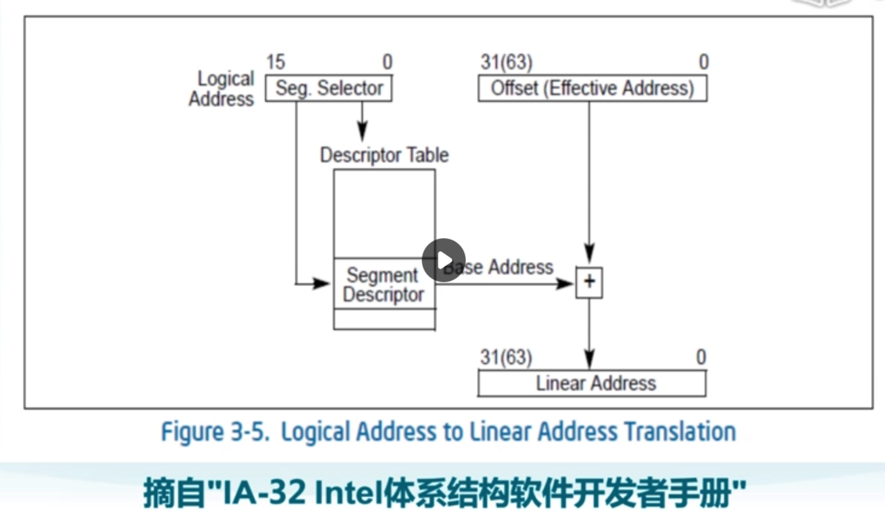

# Lab1 bootloader 启动 ucore os

## x86 启动顺序
* IA-32 Intel 体系结构软件开发者手册
  * 所有寄存器初始值
  * EIP + CS 决定启动地址
* 第一条指令
  * BIOS 的 EPROM 所在地
* 处于实模式的段
* 从 BIOS 到 Bootloader
  * BIOS 加载存储设备上的第一个扇区，的 512 字节到内存的 0x7c00
  * 然后跳转到 @ 0x7c00 的第一条指令
* 从 bootloader 到 OS
  * 切换到保护模式 protection mode，段机制 segment-level protection
  * 硬盘读取 kernl in ELF 个是的 ucore kernel，跟在 MBR 后面的扇区，并梵高内存中固定位置
  * 跳转到 ucore os 的入口点执行，此时控制权到了 ucore OS
* 段机制
  * 由于后面有页机制，段机制尽量简单
  * 4G
  * ucore 没有做到不同寄存器区分不同段
  * 页机制是基于段机制实现的
  * 
  * GDT 段表地址
  * Base 基址，Limit 长度
  * 16 位，高 13 位放 Index，后 3位放 RPL Requested Privilege Level 访问等级；
  * 使能保护模式
    * bootloader/OS 要设置 CRO 的 bit0 为 1
* 加载 ELF 格式的 ucore OS kernel
  * struct elfhdr 文件头
  * struct proghdr 代码地址，大小，偏移
  

## C 函数调用

* 理解 C 函数调用在汇编级是如何实现的
  * ESP, EBP 寄存器
  * 压栈
    * Caller's EBP
    * Return Address
    * Argument
    * local 
    * caller's  caller's EBP
  * 其它
    * 参数和函数返回值可以哦嗯国寄存器或位于内存中的栈来传递
    * 不许哟呵保存恢复所有寄存器
  * Understanding the Stack
    * cs.umd.edu
* 理解如何在汇编级代码中调用 C 函数
* 理解基于 ERP 寄存器的函数调用栈

gcc 内联汇编 inline assembly

* CC 內联汇编
  * Inline assemble，CC 对 C 语言的扩张
  * 调用 C 语言不支持的指令，手动优化；加载全局描述符表 LGDT
  * 用给定的模板和约束生成汇编指令
* 例子
  * asm 关键字
* 参考资料
  * GCC Manual
  * Inline assembly for x86 in Linux

x86-32 下的中断处理

* 中断源
  * 中断 Interrupts
    * 外部中断 External，串口，硬盘，网卡，时钟
    * 软件产生的中断 software generated interrupts，The INT n 指令，通常用于系统调用；
  * 异常 Exceptions
    * 程序错误
    * 软件产生的异常，INTO，INT3, BOUND
    * 机器检查出的异常 S
* 确定中断服务例程 ISR，Interrupt Service Routine
  * 每个中断或异常与一个中断服务例程关联，中断描述符表 Intrrupt Descriptor Table，IDT
  * IDT 的起始地址和大小保存在中断描述符表寄存器 IDTR
* 不同特权级的中断切换对堆栈的影响
  * CS 低两位 0 表示内核态，3 表示用户态
  * 内核态同一个栈，用户态要切换
  * Stack1
    * EFLAGS
    * CS
    * EIP
    * Error Code
  * Stack2 用户态到内核态
    * SS
    * ESP
    * EFLAGS
    * CS
    * EIP
    * Error Code
* 返回
  * iret, ret, retf
  * iret 弹出 EFLAGS 和 SS/ESP 根据是否改变特权等级
  * ret 弹出 EIP
  * retf 弹出 CS 和 EIP
* 系统调用
  * 指定中断号
  * 使用 Trap，软中断
  * 使用特殊指令 SYSENTER/SYSEXIT

# [实验目的](https://objectkuan.gitbooks.io/ucore-docs/content/lab1/lab1_1_goals.html)

操作系统是一个软件，也需要通过某种机制加载并运行它。在这里我们将通过另外一个更加简单的软件-bootloader来完成这些工作。为此，我们需要完成一个能够切换到x86的保护模式并显示字符的bootloader，为启动操作系统ucore做准备。lab1提供了一个非常小的bootloader和ucore OS，整个bootloader执行代码小于512个字节，这样才能放到硬盘的主引导扇区中。通过分析和实现这个bootloader和ucore OS，读者可以了解到：

    计算机原理
        CPU的编址与寻址: 基于分段机制的内存管理
        CPU的中断机制
        外设：串口/并口/CGA，时钟，硬盘

    Bootloader软件
        编译运行bootloader的过程
        调试bootloader的方法
        PC启动bootloader的过程
        ELF执行文件的格式和加载
        外设访问：读硬盘，在CGA上显示字符串

    ucore OS软件
        编译运行ucore OS的过程
        ucore OS的启动过程
        调试ucore OS的方法
        函数调用关系：在汇编级了解函数调用栈的结构和处理过程
        中断管理：与软件相关的中断处理
        外设管理：时钟

https://github.com/objectkuan/ucore_pub/blob/master/doc/lab1.pdf

# 练习1

1. ucore.img 是如何一步步生成的？
2. 一个被系统认为是符合规范的硬盘主引导扇区特征是什么

* 调试 Makefile
  * make V=
  * 详细查看 make 执行了哪些命令
* lab1_result/sign.c
  * 完成了特征标记
