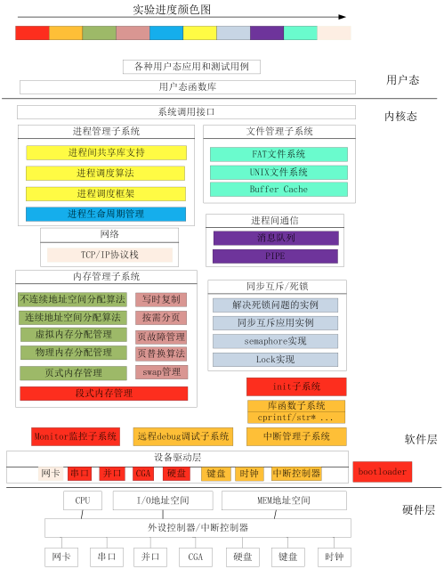

# [Ucore Github](https://github.com/kiukotsu/ucore/tree/master)

[实验指导书](https://objectkuan.gitbooks.io/ucore-docs/content/)

功能不全

## Lab0

### Ucore 系统结构图



##3 设置实验环境
Lab1~Lab8
https://github.com/chyyuu/os_kernel_lab

安装 Linux 实验环境

Ubunu 常用指令

控制流程
* 输入/输出
* 重定向
* 管道
* 后台进程

环境变量

获得软件包

    命令行获取软件 apt；
    配置升级源；
    查看帮助文件，man 是 manual 的缩写；

可能用到的软件


## 手动在物理 PC 中安装环境
安装 Ubuntu
```
sudo apt-get update
sudo apt-get upgrade
sudo apt-get install build-essential git qemu-system-x86 vim-gnome gdb cgdb eclipse-cdt make diffutils exuberant-ctags tmux openssh-server cscope meld qgit gitg gcc-multilib gcc-multilib g++-multilib
```
## 实验中的练习步骤
1. 学习源码，cd labX
2. 阅读，修改源码；可以用 understand 等软件
3. 修改完毕后，编辑软件；make
4. 如果编译无误，运行测试；
    ```
    make qemu
    ```
5. 如果需要调试
   1. 基于 cgdb 字符方式，lab1_ans 为例，make debug
   2. 基于 eclipse-CDT 的 debug view 进行调试
6. 查看自己得分，make grade

## 课程汇总
https://github.com/chyyuu/os_course_info

PPT https://learningos.cn/os-lectures/
