# [关于MIT各种数学 - 知乎 (zhihu.com)](https://zhuanlan.zhihu.com/p/108261050)

[MIT 18.06—线性代数笔记](https://zhuanlan.zhihu.com/p/45707832)

[MIT 补充课程—微分方程与线性代数笔记](https://zhuanlan.zhihu.com/p/46243135)

[MIT 18.01—单变量微积分笔记](https://zhuanlan.zhihu.com/p/46688904)

[MIT 18.03—微分方程笔记](https://zhuanlan.zhihu.com/p/53848566)

[线性代数的本质](https://zhuanlan.zhihu.com/p/110244610)

[MIT 18.065—机器学习中的矩阵方法](https://zhuanlan.zhihu.com/p/111510720)

# [MIT 18.06—线性代数笔记00 - 知乎 (zhihu.com)](https://zhuanlan.zhihu.com/p/45707832)

## [MIT—线性代数笔记01 行图像和列图像 - 知乎 (zhihu.com)](https://zhuanlan.zhihu.com/p/45708880)

行图像遵从解析几何的描述

在列图像中，我们将系数矩阵写成列向量的形式，则求解原方程变为寻找列向量的线性组合

## [MIT—线性代数笔记02 矩阵消元 - 知乎 (zhihu.com)](https://zhuanlan.zhihu.com/p/45717944)

消元法 **Method of Elimination**

消元法是计算机软件求解线形方程组所用的最常见的方法。任何情况下，只要是矩阵***A***可逆，均可以通过消元法求得***A\*x**=**b**的解。

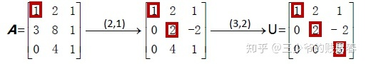

如果0出现在了主元位置上，并且下方没有对等位置为非0数字的行，则消元终止，并证明矩阵A为不可逆矩阵，且线性方程组没有唯一解。

**回代 Back-Substitution**

**消元矩阵 Elimination Matrices**

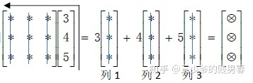

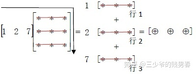

**置换矩阵 Permutation**

如果主元的位置出现了0，就需要进行“行交换”。我们可以通过左乘一个置换矩阵（Permutation Matrix）实现“行交换”的操作。

**逆矩阵 Inverse**

## [MIT—线性代数笔记04 矩阵的LU分解 - 知乎 (zhihu.com)](https://zhuanlan.zhihu.com/p/45784001)

从矩阵的角度理解高斯消元法，最后找到所谓的***L***矩阵，使得矩阵***A***可以转变为上三角阵***U。即完成***LU***分解得到***A**=**LU。

**矩阵乘积的逆矩阵 Inverse of a product**

**转置矩阵的逆矩阵 Inverse of a transpose**

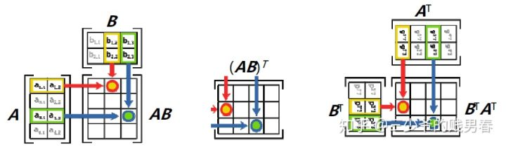

**矩阵的LU分解**

**消元法所需运算量**

在一些应用中我们需要处理超大型矩阵，即使用计算机来处理这一问题，也需要评估所需的计算量

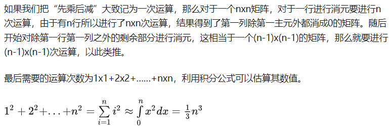

**行转换 Row exchange**

如果主元的位置出现了0，就需要进行“行交换”。我们可以通过左乘一个置换矩阵（Permutation Matrix）实现“行交换”的操作

对于nxn矩阵存在着n！个置换矩阵。

## [MIT—线性代数笔记05 转置、置换和空间 - 知乎 (zhihu.com)](https://zhuanlan.zhihu.com/p/45804907)

本节的将引入向量空间（vector spaces）和子空间（subspaces）。

**置换 Permutations**

LU分解由A=LU变为PA=LU。其中的 P 就是对 A 的行向量进行重新排序的置换矩阵

**向量空间 Vector spaces**

**R**2即为向量空间，它是具有两个实数分量的所有向量（二维实向量）的集合。

**R**3是向量空间，它是具有三个实数分量的所有向量的集合。

反例：**R**2中的第一象限则不是一个向量空间。

**子空间 Subspaces**

**列空间 Column spaces**

## [MIT—线性代数笔记07 求解Ax=0：主变量，特解 - 知乎 (zhihu.com)](https://zhuanlan.zhihu.com/p/45815011)

我们定义了矩阵的列空间和零空间，那么如何求得这些子空间呢？本节课的内容即从定义转到算法。

**计算零空间 Nullspace**

矩阵的秩（rank）就是矩阵的主元的个数。

矩阵中包含主元的列为主元列（pivot column），不包含主元的列称为自由列（free column）

**特解 Special solutions**

当我们将系数矩阵变换为上三角阵***U\***时，就可以用回代求得方程Ux**=**0的解

矩阵***A\***的零空间就是这些“特解”向量的线性组合所构成的向量空间

**行最简阶梯矩阵 Reduced row echelon form （rref）**

## [MIT—线性代数笔记08 求解Ax=b：可解性与结构 - 知乎 (zhihu.com)](https://zhuanlan.zhihu.com/p/45816772)

**可解的条件 Solvability conditions on b**

**通解 Complete solution**

**特解 A particular solution**

**与零空间进行线性组合 Combined with nullspace**

**秩 Rank**

秩决定了方程组解的数量。

## [MIT—线性代数笔记09 线性无关，基和维数 - 知乎 (zhihu.com)](https://zhuanlan.zhihu.com/p/45822595)

向量的线性无关意味着什么？如何用线性无关的概念来帮助我们描述包括零空间在内的子空间

**线性无关 Independence**

**张成空间 Spanning a space**

**基与维数Basis &Dimension**

**子空间的基 Basis for a subspace**

**列空间和零空间的基 Basis of a column space and nullspace**

实际上对于任何矩阵***A\***均有：矩阵的秩r=矩阵主元列的数目=列空间的维数

## [MIT—线性代数笔记10 四个基本子空间 - 知乎 (zhihu.com)](https://zhuanlan.zhihu.com/p/45826349)

**四个子空间 Four subspaces**

​	**列空间** Column space C(***A***)

​	**零空间**Nullspace N(***A***)

​	**行空间**Row space C( AT )

​	**左零空间**Left nullspace N( AT)

**新向量空间 New vector space**

再扯几句淡，如果去网上搜索“矩阵的行秩等于列秩究竟意味着什么”，那么你会发现很多看上去完完全全不同的说法，甚至完全不像是在讨论一个问题。之所以有这种感受，其中一个原因是对于秩的定义出发点不同，比如从行列式开始讲起的线代是用行列式来定义“秩”的；而另一个原因是，大家是在线代的不同层面在讨论这件事情。总体而言，G.Strang所讲的这套线代，是偏重于应用数学这个方向，希望通过深入理解矩阵运算，在工程应用的方面能走得更远，后面他引入马尔科夫链、傅里叶、微分方程的内容都是朝着这个方向努力，还有他开设的“计算科学与工程”的课程也是秉持这个理念；与之不同，还有一种讲解线性代数的思路是强调线性算子的核心作用，实际上它是在一个更加抽象的层面来进行讨论和推演，Sheldon Axler 的《Linear algebra done right》（中译本：线性代数应该这样学）就是以这个出发点来写作的书，引领我们走向线代更深入的部分，方便与其他数学分支建立联系。
其实数学的学习过程中，我们一直在做着“抽象”这件工作，我们从10个苹果、2头牛这种实际事物中，抽象出数字的概念放下了实物的概念，随后我们抽象出未知数x，y而放下了具体数字的概念，再后来到函数,连x，y的系数都已经被字母替代，到了微积分直接讨论函数之间的联系已经可以暂时放下函数的解析式，再到泛函……每前进一步我们都用一个更加抽象的概念替代一族具象的概念，使得一切操作变得更加简洁（但不一定就好懂），而结果更富普遍意义，但是对于理解能力就有更高的要求。
把话说回来，G.Strang讲的线性代数更low么（有人说GS的所讲的不是线性代数的核心而是matlab的核心-_-!）？显然不是的，他将线代的触角已经延伸出去很广的范围，在应用的领域做了非常细致有效的工作，开启了科学家和工程师对线代的正确理解方式。

## [MIT—线性代数笔记11 矩阵空间、秩1矩阵和小世界图 - 知乎 (zhihu.com)](https://zhuanlan.zhihu.com/p/45840821)

**新的向量空间 New vector spaces**

**3x3矩阵空间 3 by 3 matrices**

**微分方程 Differential equations**

**秩1矩阵 Rank one matrices**

**小世界图 Small world graphs**

介绍小世界图主要是引出图论和线性代数的联系。

所谓“六度分割理论”（six degrees of separation）猜想一个人和陌生人之间间隔的点不会超过六个。因此当陌生的两人聊起这种联系都会感叹：“世界真小啊！”这也是“小世界图”这个名字的由来。

## [MIT—线性代数笔记12 图、网络、关联矩阵 - 知乎 (zhihu.com)](https://zhuanlan.zhihu.com/p/45853245)

**图和网络 Graphs & Networks**

**关联矩阵（Incidence matrices）**

关于方程ATCAx=f的更多内容可以阅读G.Strang的书《Computational science and engineering》的第二章。

## 下半场

# [线性代数的本质00 序言-01 向量究竟是什么？ - 知乎 (zhihu.com)](https://zhuanlan.zhihu.com/p/110244610)

笔者：

在之前的笔记中，我也推荐过这套《线性代数的本质》视频课程，但当时我自己并没有看完，对它的印象就停留在前几集，仅只把它作为一个做的很好的图像化课外材料，觉得可以作为主流课程的一些补充。后来在与朋友交流一些观点的时候，被再次安利，所以又回过头来仔细学习，觉得其中还是很有一些可以划重点的内容。
创作者Grant Sanderson毕业于斯坦福大学，在可汗学院负责一些数学课程（好像是多变量微积分）。很感激他的创作，让我也补上了之前学习中的一些知识漏洞，还要感谢B站up主以及听译和制作字幕的朋友。
有的时候你自认为已经掌握的概念，可能依旧存在着盲区，所以任何时候都别放过自己的小困惑，也许钻研进去就能发现新的路径、新的认知。
数形结合的方法永远可以让你从多个角度来认知概念，同时也可以从多种方向去构架知识网络。

序言：

尽管一批教授和教科书编者用关于矩阵的荒唐至极的计算内容，掩盖了线性代数的简明性，但是鲜有与之相较更为初等的理论。

——让 迪厄多内（Jean Dieudonne）

线性代数是计算机科学、物理学、电子工程学、机械工程学等众多技术学科都需要掌握的基础科目之一。但现在很多初学者往往对它理解非常肤浅，学生在课堂中学到的仅仅是如何进行各种计算，例如矩阵乘法、行列式、叉积、特征值等。结果并没有真正理解：为什么矩阵乘法如此定义？为什么叉积与行列式有所关联？特征值又代表了什么？很多学生对于矩阵计算掌握得很好，但是对于它的几何意义却知之甚少。

在数值水平和几何水平上理解线性代数有着根本的差异。它们各自都有自己的意义，但在几何水平上的理解，会让你判断出解决特定问题需要怎样的工具；数值水平上的理解则是帮你完成实际的计算工作。对于几何直观的理解，并不妨碍你的课堂学习；但是缺乏几何理解，在实际的计算机科学、工程学、统计学或者经济学的应用中都会遇到很多问题。

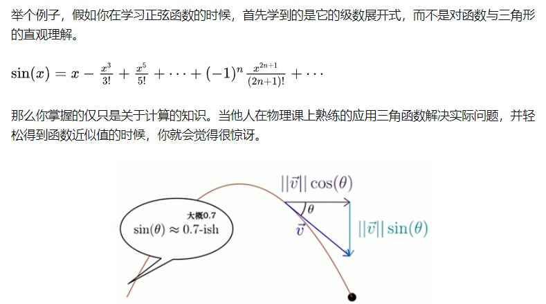

线性代数也是如此，它有很多隐藏的、可视化的直观理解。学会几何直观理解，并掌握数值计算的知识，就会在实际应用中得心应手。特别是当前，我们可以通过计算机来完成很多数值计算方面的工作，这就使得线性代数中的概念部分更显得尤为突出。

## **01 向量究竟是什么？**

线性代数中最基础最根源的组成部分就是向量。通常而言存在三种不尽相同但相互联系的概念来描述向量。

**物理层面**：向量是空间中的一个箭头。决定向量的是它的长度和方向。你可以自由移动一个向量，而保持它不变。

**计算机专业**：向量是有序的数字列表。

**数学家**试图去概括这两种观点。他们给出了一个抽象的概念，向量可以是任何东西，只要保证两个向量相加以及向量的数乘有意义即可。而这两种运算非常的重要，贯穿线性代数的始终。

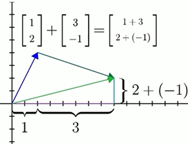

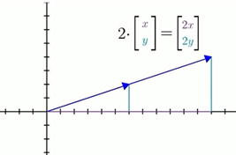

数学家最后将这两种操作进行抽象并独立出来，只要能满足这两种操作，不管选择什么来代表向量，都没有关系。（后面的课程会阐明）

线性代数为数据分析提供了一条将大量数据列表，概念化可视化的渠道，它让数据样式变得非常清晰，并让你大致了解特定运算的意义。

另一方面，线性代数给物理学家和计算机图形程序员提供了一种语言，让他们通过计算机能处理的数字来描述并操纵空间。

## [线性代数的本质02 线性组合、张成空间与基 - 知乎 (zhihu.com)](https://zhuanlan.zhihu.com/p/110250545)

**基向量**，空间中的所有向量都可以看做两个基向量进行缩放后的加和，而缩放倍率就是x轴和y轴坐标。

当我们用数字描述向量时，它都依赖于正在使用的基向量。

**张成空间**。大多数情况下，两个二维向量张成的空间就是所有二维向量的集合。当它们共线时，所张成的空间就是终点落在这条直线上的向量的集合。所以两个向量张成的空间，就是指两向量仅通过数乘和加和，所能获得的所有向量的集合。

在三维空间中，两个向量张成的空间就是三维中某个过原点的平面

多个向量，若移除其中一个，不会减小它们张成的空间，就称这些向量是“**线性相关**”的，或者说其中的向量可以表示为其他几个向量的线性组合。另一方面，如果所有的向量都给它们张成的空间添加了新的维度，那么就称这些向量是**线性无关**的

向量空间的一组**基向量**，就是张成该空间的一个线性无关的向量的集合

## [线性代数的本质03 矩阵与线性变换 - 知乎 (zhihu.com)](https://zhuanlan.zhihu.com/p/110299551)

线性变换的概念以及它和矩阵的关系是非常重要的，它不仅可以让线性代数的其它内容变得一目了然，又经常会被初学线代的人忽略。

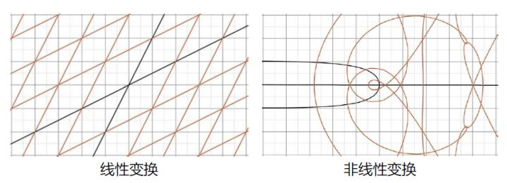

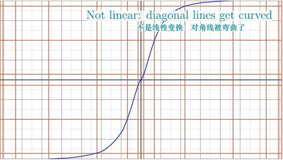

经线性变换后的向量，是“线性变换后的基向量”用同样的标量数乘并加和得到的线性组合：

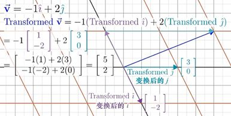

2x2矩阵的列向量若线性相关，则其所对应的线性变换就是将二维空间压缩成列向量所在的直线。

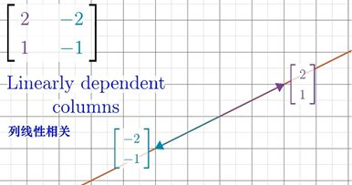

## [线性代数的本质04 矩阵乘法与线性变换 - 知乎 (zhihu.com)](https://zhuanlan.zhihu.com/p/110374281)

线性变换是将向量作为输入和输出的一类函数，可以将线性变换看作是对空间的压缩与伸展。

它保持网格线平行且等距分布，并且保持原点不变。

线性变换由它对空间基向量的作用而完全决定。

任意的向量可以表示为基向量的线性组合

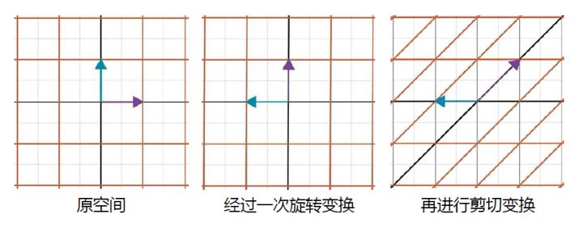

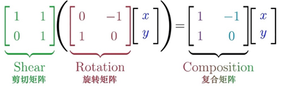

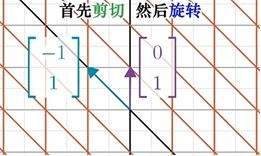

两个线性变换的操作顺序不同，则结果不同，例如旋转变换和剪切变换的复合变换

**04补充 三维空间中的线性变换**

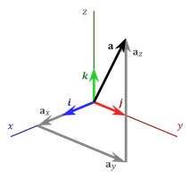

三个基向量在线性变换后的坐标记录在一个3x3矩阵中，则这个矩阵就完全描述了该线性变换

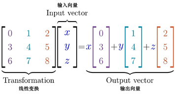

## [线性代数的本质05 行列式 - 知乎 (zhihu.com)](https://zhuanlan.zhihu.com/p/110497442)

线性变换可将空间向外拉伸，也可向内压缩，而对空间拉伸或压缩的程度是可以测量和计算的。在二维空间中，就是测量一个给定区域的面积随线性变换而增大或者减小的比例。

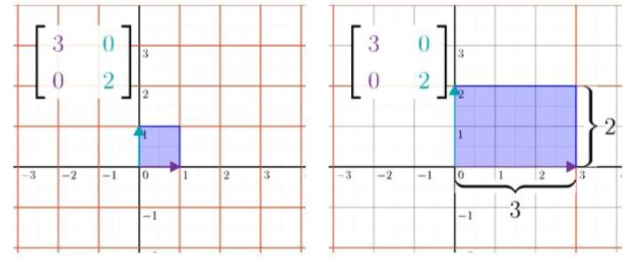

剪切矩阵，在变换后成为一个倾斜的平行四边形，尽管空间向右发生了挤压，但是面积没有发生变化。

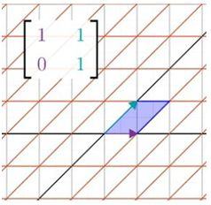

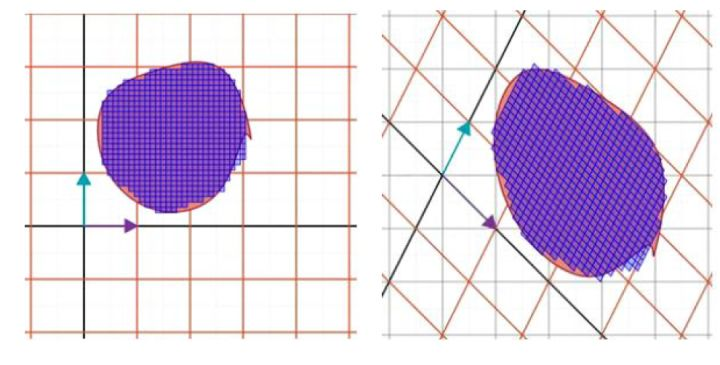

这个特殊的缩放比例，被称为这个线性变换矩阵的行列式的值

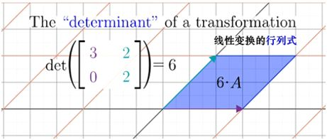

如果平面压缩到一条线甚至一个点上，其行列式等于0

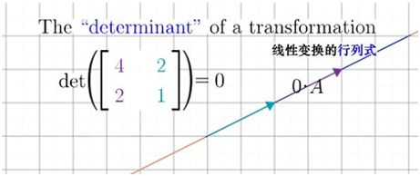

在行列式的概念中是可以出现负值的。这代表在线性变换的过程中，改变了空间的取向。这也可以从基向量的方向来进行判定

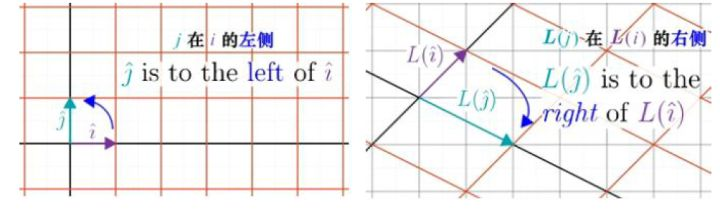

在三维空间中行列式的值代表的是体积的缩放

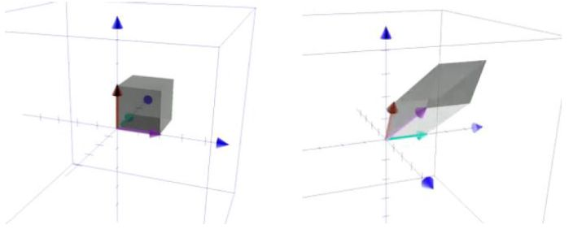

当行列式的值为零时，说明线性变换使得空间压缩降维，成为了平面、直线或甚至是一个点。而这个行列式中的列向量一定是线性相关的。

行列式取负值，代表着空间取向的变化，我们定义空间的方向是使用右手定则。（我自己比较习惯右手螺旋定则）

### 二维行列式

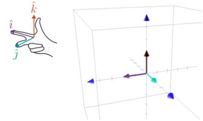

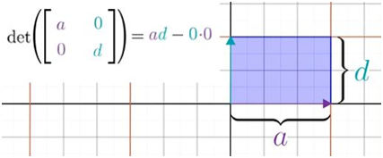

中的a和d分别告诉我们沿着x轴方向和y轴方向的拉伸压缩比例。b和c则告诉我们，在对角方向的拉伸或压缩比例。

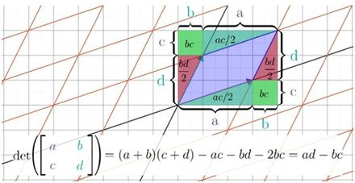

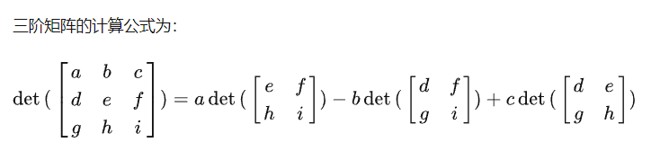

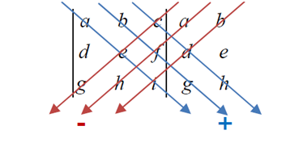

## [线性代数的本质06 逆矩阵、列空间、秩与零空间 - 知乎 (zhihu.com)](https://zhuanlan.zhihu.com/p/110563546)

线性代数的操作对于控制空间有很大的作用，这对计算机图形学和机器人学很有用。而线性代数的作用还体现在，它可以帮助我们求解特定的方程组——线性方程组。

二阶矩阵***A\***行列式的值为0与否，决定了这个线性操作是否把空间压缩成一条直线。若行列式不为0，空间未被挤压为零面积区域。这种情况下，有且仅有一个向量在经过线性变换后，与常数向量重合，可以通过逆向变换来找到这个向量。

当行列式为零的时候，该变换将空间压缩到了更低的维度上。这时不存在逆变换，无法把一个直线“解压缩”成一个平面空间。此时如果向量**v**恰好在这条直线上，那么方程有解。

在三维空间中，行列式为零也有不同的情况，一个变换将空间压缩成一个直线，比之压缩成一个平面，解向量的存在难度更高。

### 秩

线性变换的结果是一条直线时，维度为1，我们称该变换的“秩”为1。如果变换的结果是一个平面，称这个变换的秩为2。所以秩代表着线性变换之后的空间维数。对于一个2×2矩阵，它的秩的最大值为2。

在三维空间中，矩阵的秩为2意味着将三维空间压缩到了一个平面，但是与秩为1的情况相比，压缩不是那么严重。如果线性变化后仍可以充满三维空间，则矩阵的秩为3。

不管是一条直线，一个平面还是三维空间。所有可能的线性变换结果的集合，称为矩阵的列空间。它是矩阵的列向量张成的空间，而秩就是列空间的维数。

当秩达到最大时的时候，就与列数相等，称之为“满秩”。

零向量必须得包含在列空间中，因为线性变换保持零点不变。

对于非满秩的矩阵而言，它将空间压缩到一个更低的维度上，有一系列的向量在变换之后能够成为**0**向量。例如三维空间被线性变换压缩成一个平面，则会有一整条线的变量在变换后落在原点。

零空间就是方程所有的解。

**06补充 非方阵**

不同维度向量之间的变换是存在的，例如一个二维向量到三维向量的变换

同样的，如果能够满足网格线保持平行且等距分布，原点映射为自身，就称它是线性变换。

3x2矩阵，矩阵的列空间是三维空间中，一个过原点的二维平面。因为列空间的维数与输入空间的维数相等，这个矩阵仍旧是“满秩”的（列满秩）。

而一个2x3矩阵则表示，原空间是三维的，而线性变换之后落在二维空间中。同样的也可以将二维空间经过线性变换，压缩到一维空间即数轴上，其变换矩阵为1x2矩阵

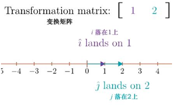

这是一类非常有意义的变换，它与“点积”紧密相关。

## [线性代数的本质07 点积与对偶性 - 知乎 (zhihu.com)](https://zhuanlan.zhihu.com/p/110720267)

传统教学中，“点积”是线性代数课程中很靠前的内容，只需要简单的向量概念就可以引入。但是深入这个概念，需要从线性变换的角度才能完成。

点积运算有其几何解释。向量**w**朝向量**v**所在的直线上投影，将投影的长度与向量**v**的长度相乘，就得到了二者的点积。

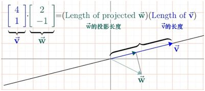

当两个向量方向大致接近的时候，它的点积是正的，当两个向量互相垂直时，它的点积为0，当它们的方向相反时，点积为负。

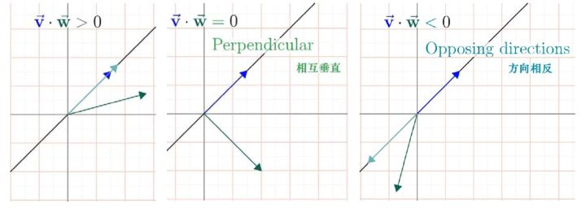

为什么点积与顺序无关？

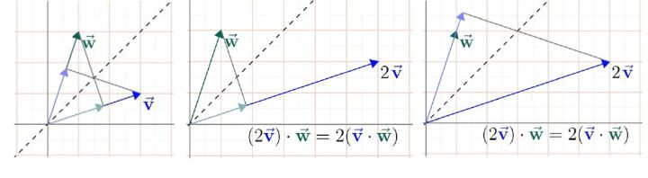

为什么坐标相乘结果相加，会和投影有所联系？给出一个满意的答案，并正视点积的重要性，需要挖掘更深层次的东西——对偶性。

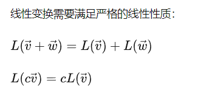

如果等距分布的点，变换后没有保持等距分布，那么它就不是线性变化，例如：

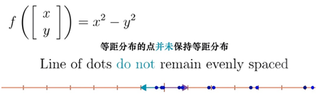

在二维空间中沿着某方向放置一条数轴，数轴的基向量设为**u**。我们将空间中的向量投影到这条直线上，可表明这个操作是线性的，因为它满足等距分布的点在投影之后仍是等距分布。

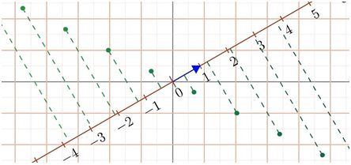

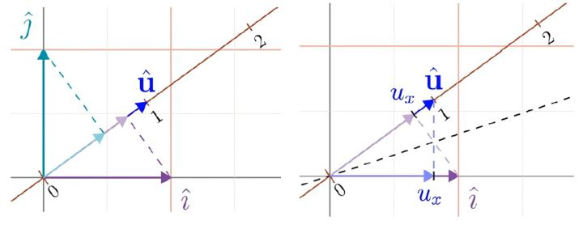

这就是为什么单位向量的点积可以解读为，向量投影到单位向量所在的直线上得到的投影长度。

点积是理解投影的有力几何工具，并且方便检验两个向量指向是否相同。

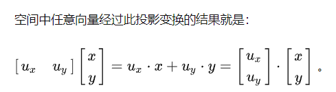

## [线性代数的本质08 叉积 - 知乎 (zhihu.com)](https://zhuanlan.zhihu.com/p/110820516)

二维空间两个向量**v**和**w**，叉积**v** x **w**等于它们所围成的平行四边形的面积。请注意这种叉积计算是有正负的，代表取向

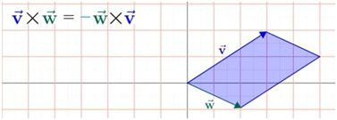

平行四边形的面积可以通过行列式来进行计算

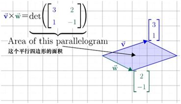

两个向量长度不变，互相垂直时所构成的平行四边形面积最大；其中一个向量放大3倍，所得平行四边形面积也同样放大3倍。

方向与平行四边形的面垂直，采用右手定则确定。

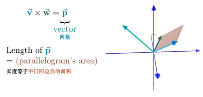

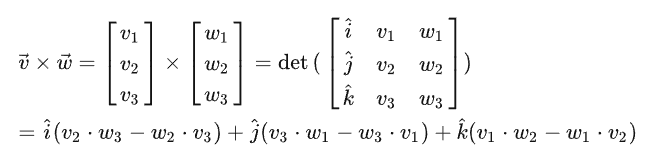

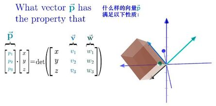

## [线性代数的本质09 基变换 - 知乎 (zhihu.com)](https://zhuanlan.zhihu.com/p/110975625)

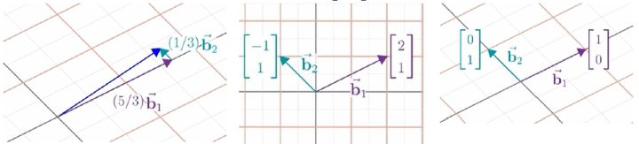

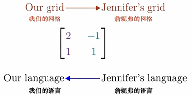

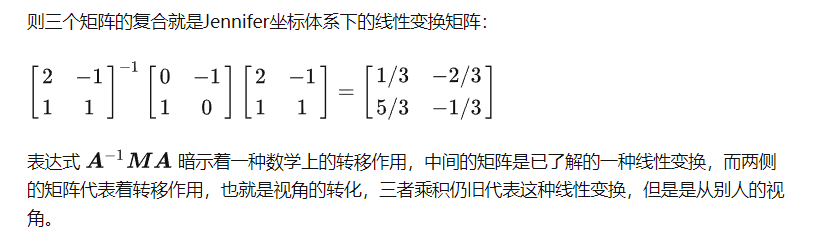

## [线性代数的本质10 特征向量和特征值 - 知乎 (zhihu.com)](https://zhuanlan.zhihu.com/p/111099659)

理解特征值和特征向量，需要对之前的很多概念有几何直观的理解，包括线性变换、行列式、线性方程组和基变换。

对特征值和特征向量理解偏弱的原因，往往是对以上概念并不清楚。

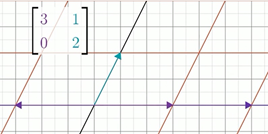

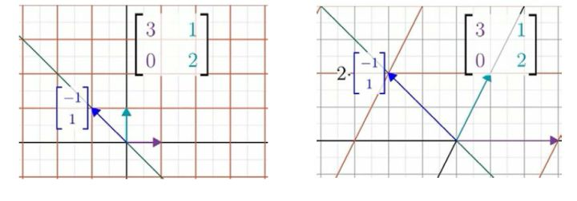

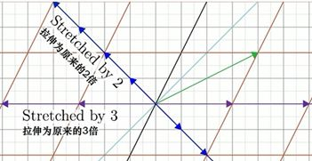

拥有“留在自己张成的空间”这个性质的特殊向量。其他的向量，在变换中都有或多或少的旋转。

这些向量就被称为这个线性变换的**特征向量**，衡量特征向量在变换中拉伸或压缩的比例因子就是它对应的**特征值**。如果特征向量为负值，比如-1/2，意味着这个向量被反向，并且压缩到原来的1/2。

但它仍旧停留在自身张成的直线上，没有发生旋转。

考虑一个三维空间中的旋转变换。如果能找到该变换的特征向量，那你找到的就是旋转轴。把一个三维旋转看成绕某个轴旋转一定角度，比考虑相应的3×3矩阵直观得多。在这种旋转变换中，特征值为1，因为空间只发生旋转，并不发生拉伸和压缩。

线性变换对应的矩阵，其列向量就是基向量变换后的坐标。但是理解线性变换作用的关键，往往较少依赖于特定的坐标系。最好的方法是求出它的特征向量和特征值。

我们的目标变成寻找一个非零的向量**v**，使得这个新矩阵与之相乘的结果为零向量。

当且仅当这个新矩阵所代表的线性变换将空间压缩到更低维度的时候，这个方程有非零解。而这个矩阵所对应的行列式等于0。求解的过程就变为找到一个λ使得行列式det(A-λI )=0。

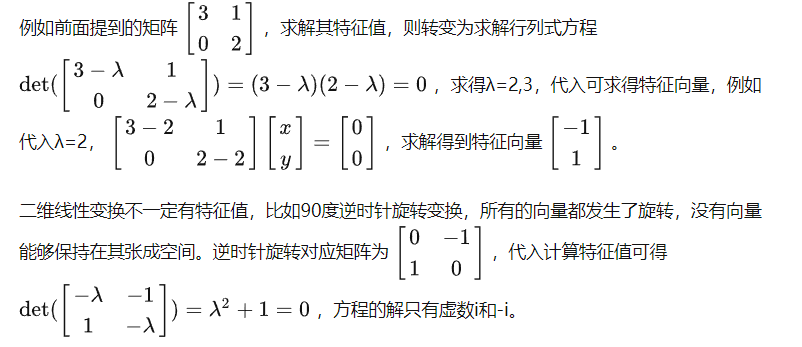

更多关于复数和欧拉公式的内容，可以参考这篇笔记：

[三少爷的贱男春：G.Strang的微分方程和线性代数（1.3）](https://zhuanlan.zhihu.com/p/21301779)

如果基向量是特征向量会发生什么？

**如果矩阵的特征向量足够多，可以张成整个空间那么可以通过变换坐标系，使得这些特征向量成为基向量。**

一组特征向量构成的基向量的集合，称为一组“特征基”。计算矩阵 [3102] 的100次幂，可以先变换到特征基，在那个坐标系中对对角阵计算100次幂，然后再转换回标准坐标系。

并不是所有的变换都可以完成以上过程，例如剪切变换，它的特征向量不够多，不能张成整个空间。

## [线性代数的本质11 抽象向量空间 - 知乎 (zhihu.com)](https://zhuanlan.zhihu.com/p/111287930)

二维平面内它是一个箭头，也是一个数组。但这两者只是某种更深刻的东西的表象。将向量表现为数组，给了高维空间更容易的理解方式，使得高维向量看上去像是一个可操作的真实具体的概念。

对于处理空间的人来说，坐标与选取的基向量相关。

而现在一些核心内容如行列式、特征向量等，它们不受所选坐标的影响。

行列式是一个变换对面积的缩放比例，特征向量则是在变换中留在它所张成空间中的向量，两者都暗含于空间中的性质，改变坐标系并不会改变他们最根本的值。

如果向量根本不是一个数组，他们的本质其实更具空间性。那么数学家所说的空间或空间性究竟是什么呢？

今天的课程将讨论一种既不是箭头也不是一组数字，但是同样具有向量特性的东西——函数。从某种意义上说，函数实际上是另一种向量。

函数可进行加和与数乘运算，而因为向量也不过只有相加和数乘两种运算，所以最初以空间中箭头为背景来建立的线性代数的合理概念和解决问题的手段，例如：线性变换，列空间、点积、特征值、特征向量等，应该能够直接应用于函数。

求导就是一种线性运算，他符合以上两个条件。

ddx(x3+x2)=ddx(x3)+ddx(x2)

ddx(4x3)=4ddx(x3)

乍一看矩阵向量乘法和求导是毫不相干的。但它们其实属于同一族概念。很多线性代数中的概念，在函数中都有直接类比。

数学中有很多类似向量的事物。只要所处理对象，具有合理的数乘和加和概念，不管是空间中的箭头、一组数还是函数集合，线性代数中所有关于向量、线性变换和其他的概念都应该适用于它。

这些类似向量的事物，它们构成的集合被称为向量空间。

如果要让已经建立好的线代理论和概念适用于一个空间，那么必须满足8条公理。

这8条公理保证新定义的向量，其加法和数乘符合你一直接受的状态。

在数学的表达中，我们倾向于得到用普适的概念，而普适的代价就是抽象。

## [线性代数的本质12 克莱姆法则 - 知乎 (zhihu.com)](https://zhuanlan.zhihu.com/p/111414818)

克莱姆法则并不是计算线性方程组最好的方法，高斯消元法会算得更快。

但是对它的研究，会帮助加深对线性方程组的理解。

PS 这里 [ 3, -1] 是不是写错了？

求解取决于矩阵变换是否降维。若矩阵行列式为0，要么无解，要么有无穷多解。

但在本课程中只讨论行列式不为零的情况，这意味着线性变换后维数不变，则每一个输入向量有且仅有一个输出向量。

有一种**“错误”的思路**是求向量的点积。由于变换后的坐标是已知的，所以可得到坐标x。**这并不成立，因为点积会随着线性变换而变化。**

不改变点积的线性变换称为“正交变换”，它使得基向量在变换后依然保持单位长度，且互相垂直。

正交变换对应的一般是旋转变换，没有拉伸、压缩变形。

用正交矩阵来求解非常简单，因为点积保持不变，所以已知的输出向量和矩阵列向量的点积，分别等同于未知输入向量和各基向量的点积。

这个思路对于大多数线性变换是不成立的，但给了我们一个方向。

有没有另一种对输入向量坐标值的几何解释，能在矩阵变换后保持不变。

