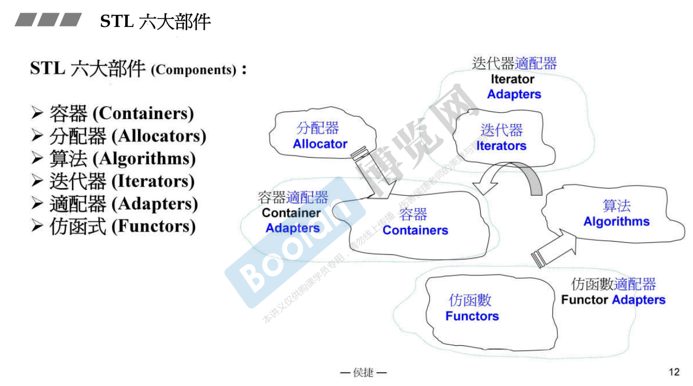
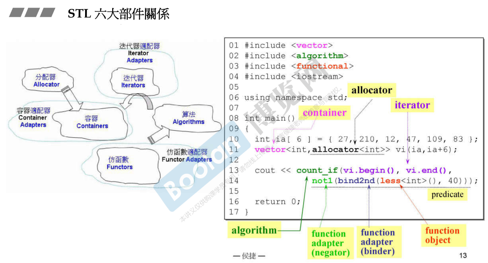
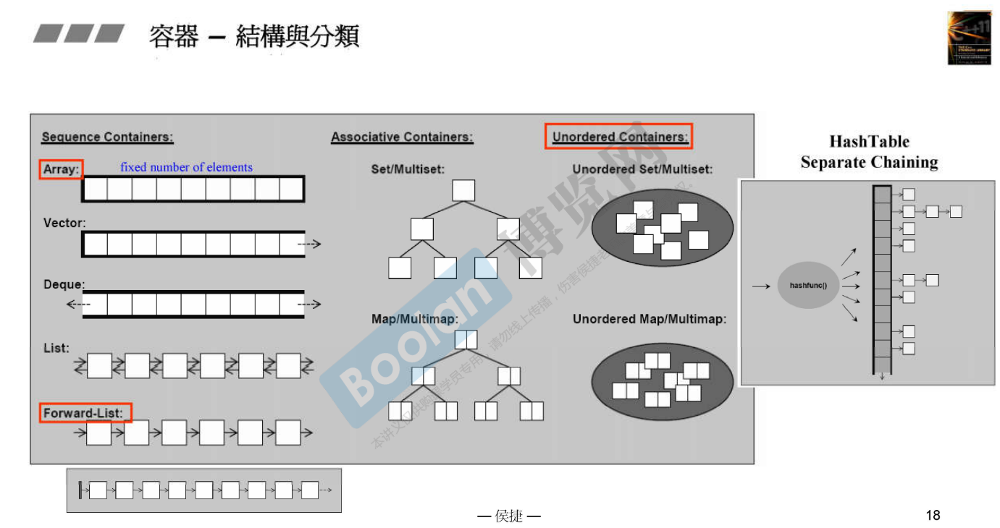
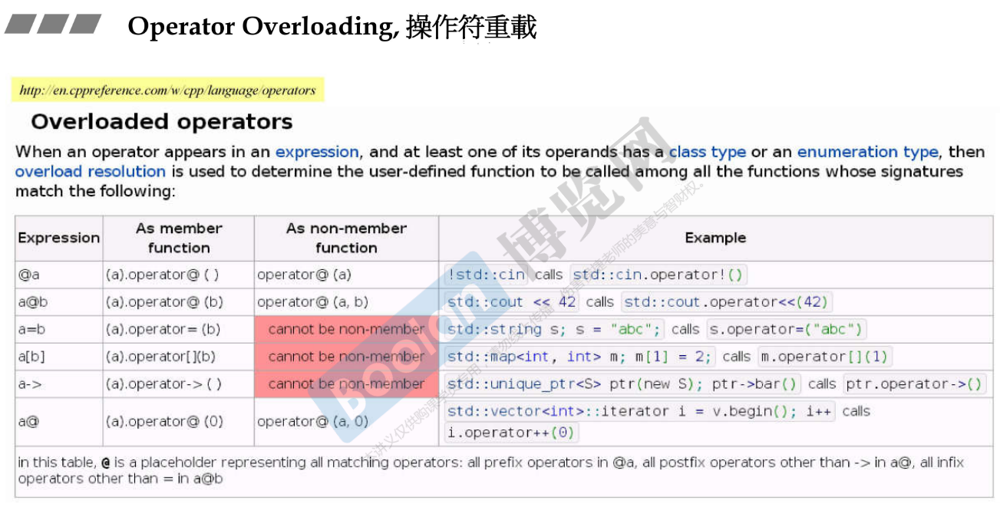
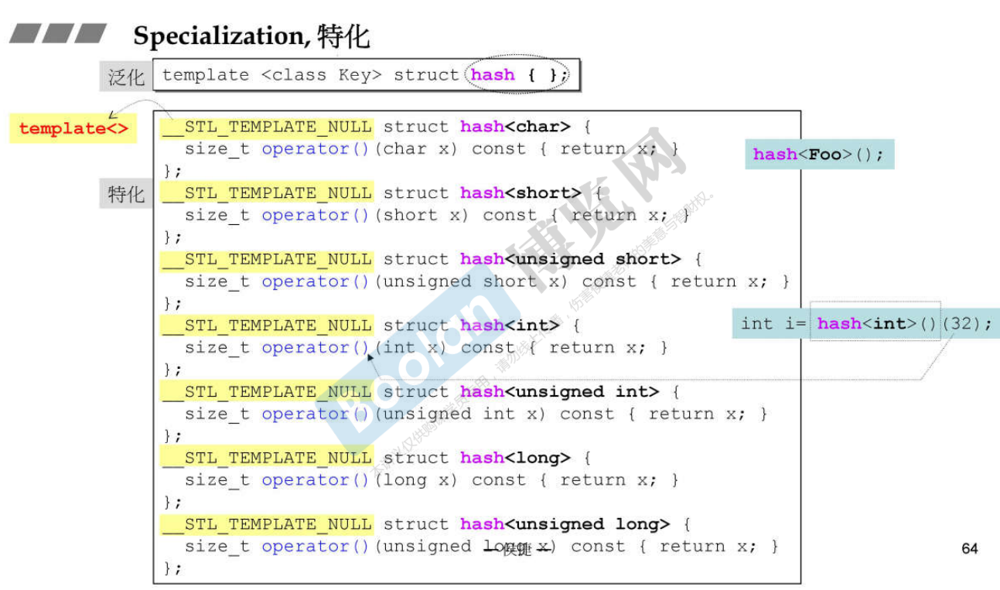
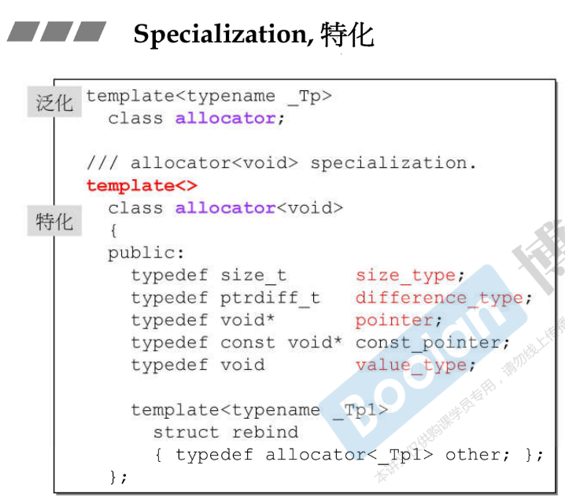
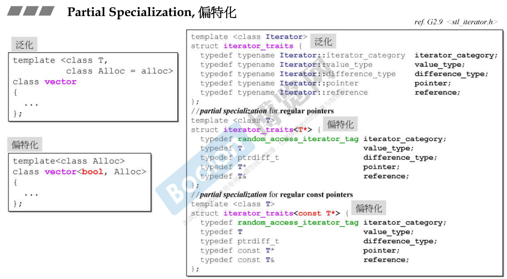
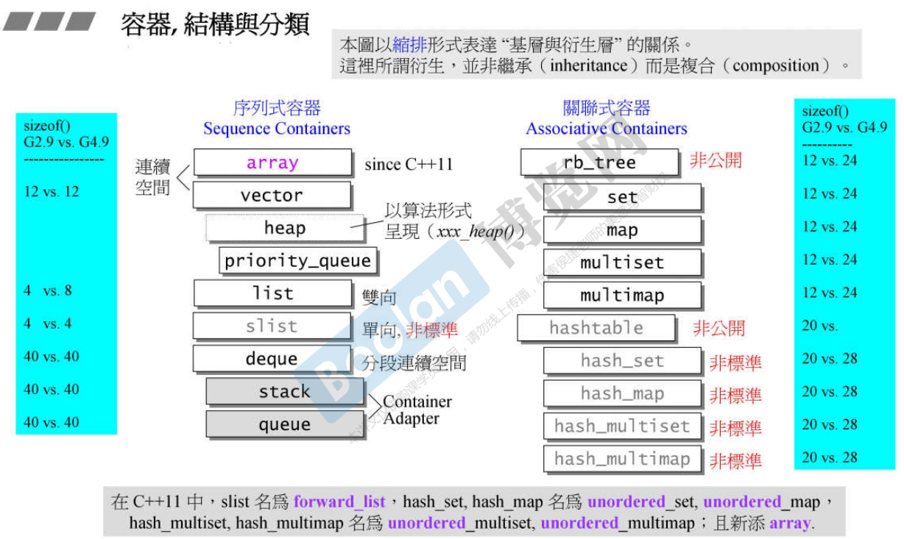
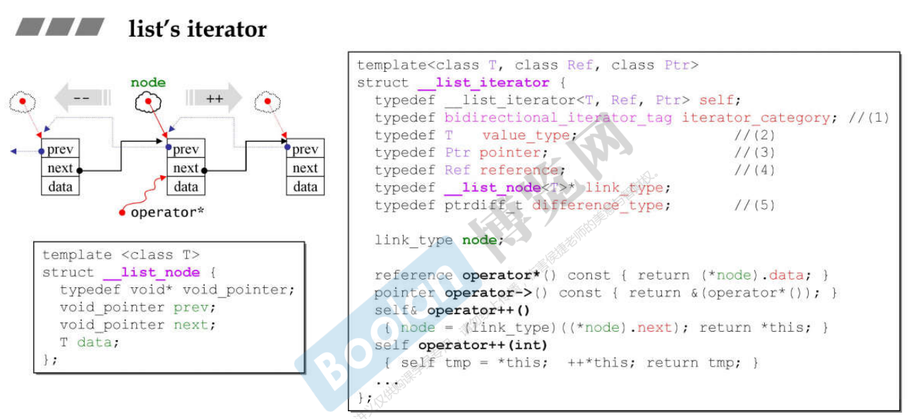
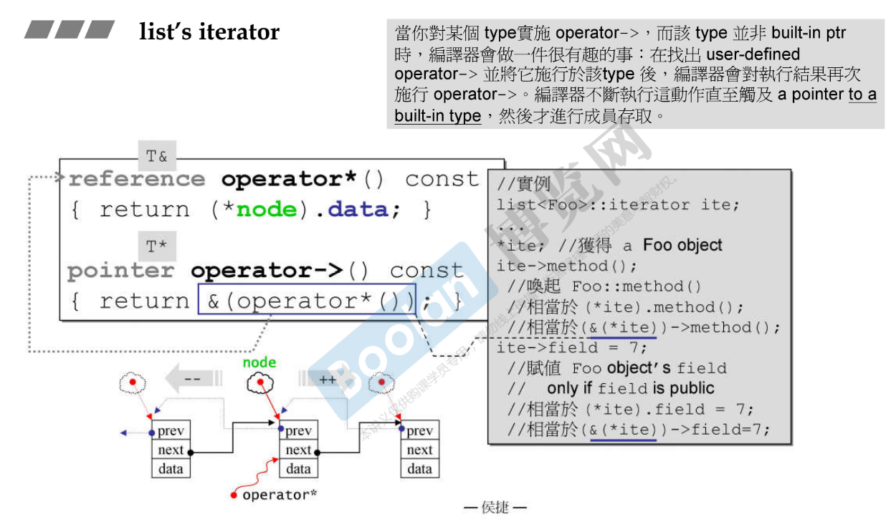

# C++ 标准库与泛型编程

* GP 使用 template 模板为工具来编写程序，STL 是 GP 最成功的作品。

# C++ Standard Library -- architecture & source

### C++ Standard Library vs. Standard Template Library

* STL 六大部件
  * 
* STL 六大部件关系
  * 
* 复杂度，Complexity，Big-oh
    |  标识符   | 含义  |
    |  ----  | ----  |
    | O(1) 或 O(c)  | 常数时间 constant time  |
    | O(n)  | 线性时间 linear time |
    | O(log2n) | 次线性时间 sub-linear time |
    | O(n2) | 平方时间 quadratic time |
    | O(n3) | 立方时间 cubic time |
    | O(2n) | 指数时间 exponential time|
    | O(nlog2n) | 介于线性及二次方成长的中间行为模式 |
* “前闭后开”区间，[ )
  * begin() 指向第一个，end() 是最后的下一个
* range-based `for` statement (since C++11)
* `auto` keyword (since C++11)
* 容器-结构与分类
  * 
  * array
  * vector
  * list
  * forwarlist
  * slist，GNU C 非标准
  * deque
  * stack，内部是 deque，容器适配器 container adpater
  * queue，内部是 deque，容器适配器 container adpater
  * multiset
  * multimap
  * unordered_multiset, hash_multiset
  * unordered_multimap, hash_multimap 
  * set
  * map
  * unorderd_set, hash_set
  * unorderd_map, hash_map
* 分配器 allocator
  * 不要单独使用，应该在容器内使用
* 标准库版本，Visual C++, GNU C++
* OPP vs. GP
  * OOP 将 Data 和 Methods 关联在一起
  * GP 将 Data 和 Methods 分开
  * 采用 GP: 
    * Containers 和 Algorithms 团队可以各自闭门造车，通过 Iterator 沟通即可
    * Algorithms 通过 Iterators 确定操作范围，并通过 Iterators 取用 Container 元素
  * list 不能使用 ::sort() 排序，因为没有随机存取的迭代器 Iterator
  * 所有 algorithms 其内最终`涉及元素本身`的操作，无非就是`比大小`
* Operator Overloading 操作符重载
  * 
* Class Templates 类模板
* Function Templates 函数模板
  * 编译器对函数模板进行实参推导 argument deduction
* Member Templates 成员模板
* Specialization 特化
  * 
  * 
* Partial Specialization 偏特化，个数偏，范围偏
  * 
* 分配器 allocators
  * allocate().Func 匿名类实例调用函数
* 容器，结构与分类
  * 
* 容器 list
  * GCC 2.9 更清晰，注意前闭后开（环状）
* list's iterator
  * 
  * 
* Iterator 组要遵循的原则
* 15

