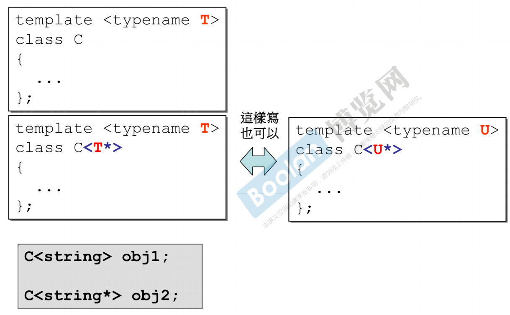
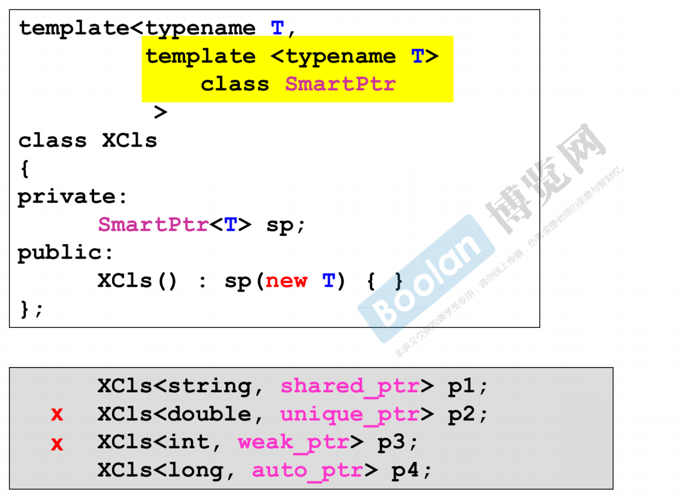
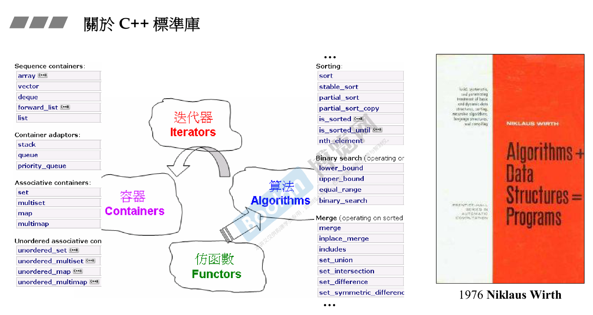
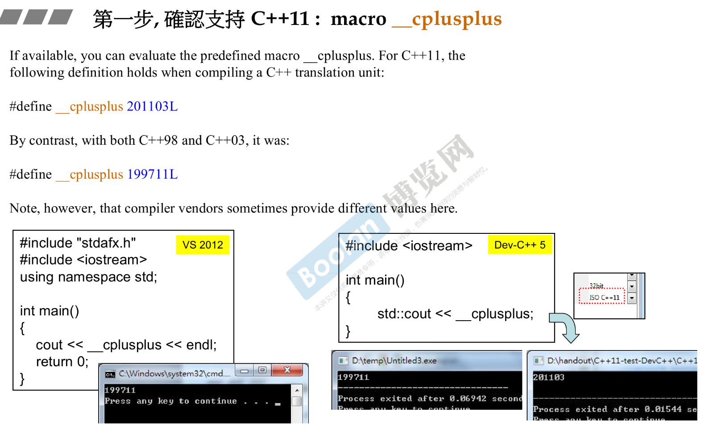
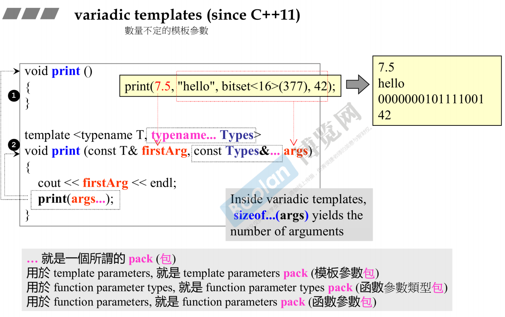
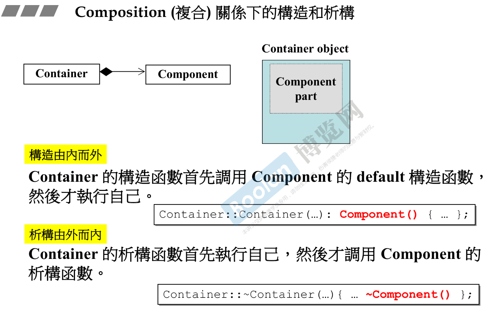
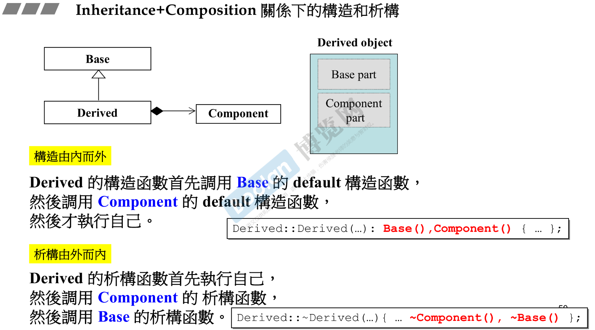
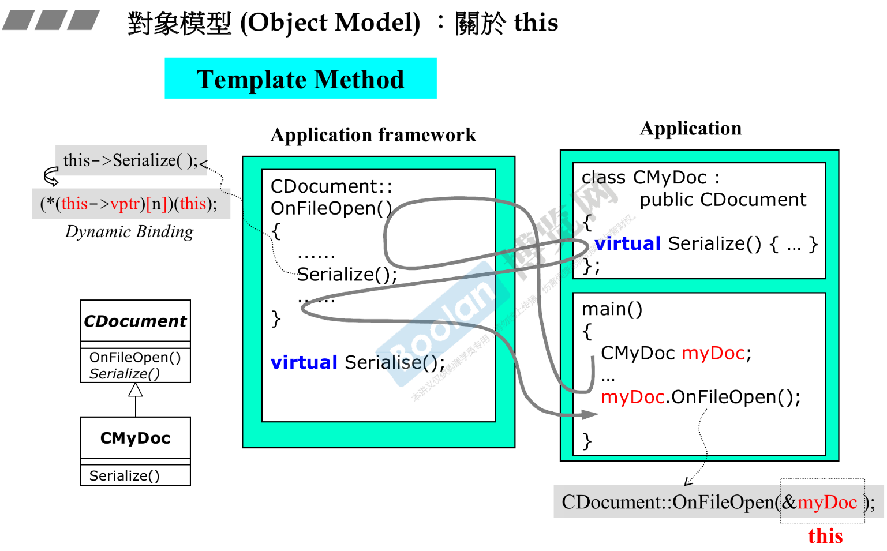
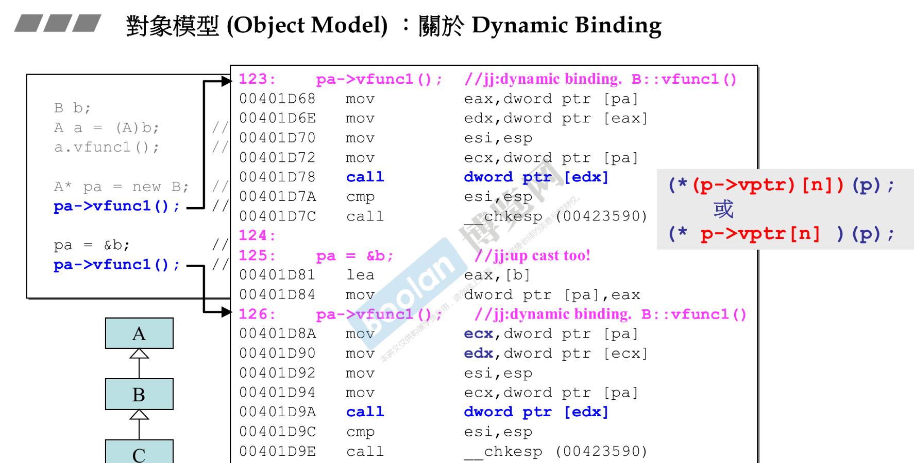
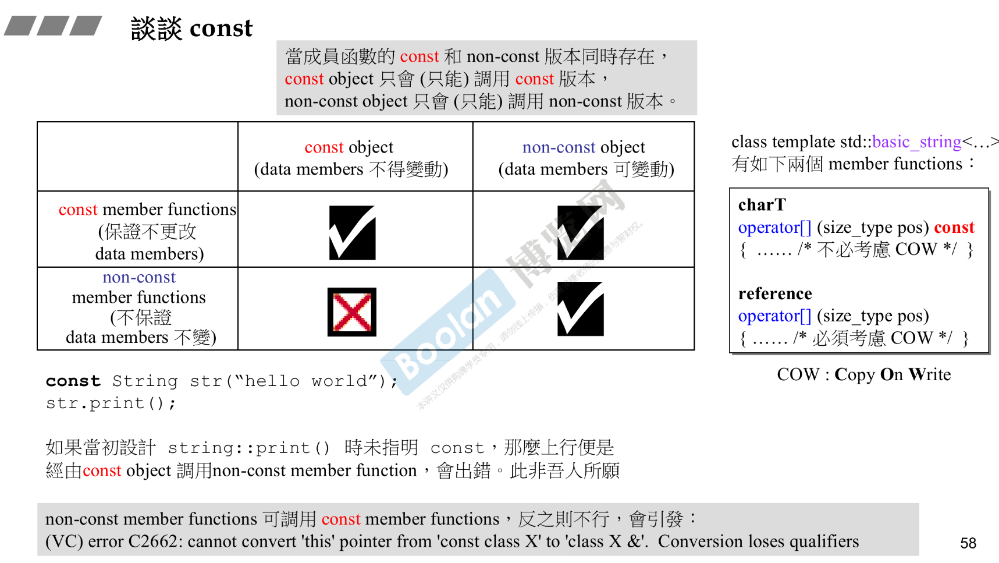

# Part II 

泛型编程也是 C++ 的主线
深入对象模型

* 緒論 
* Conversion function (轉換函數) 
  * 隐式转化为别的类型
  * Vector<bool, Alloc> 的实现里用了 Operator bool() const
* Non-explicit one-argument constructor 
  * 注意非显式的单变量构造函数
* Pointer-like classes, `關於智能指針 `
  * 重载 T& Operator*()
  * 重载 T* Operator->()
  * copy constructor
* Pointer-like classes, `關於迭代器 `
  * 重载 T& Operator*()
  * 重载 T* Operator->()
* Function-like classes, 所謂仿函數 
* 標準庫中的仿函數的奇特模樣 
* namespace 經驗談 
* class template, 類模板 
* function template, 函數模板 
* member template, 成員模板 
* specialization, 模板特化 
* partial specialization, 模板偏特化 —— 個數的偏 
  * 
* partial specialization, 模板偏特化 —— 範圍的偏 
  * 
* template template parameter, 模板模板參數 
  * 
* variadic templates (since C++11) 
  * 
  * 
  * 
* auto (since C++11) 
* ranged-base for (since C++11) 
* reference 
* Composition (複合) 關係下的構造和析構 
  * 
* Inheritance (繼承) 關係下的構造和析構 
  * 
* Inheritance+Composition 關係下的構造和析構 
  * 
* 對象模型 (Object Model) ：關於 vptr 和 vtbl 
  * 
* 對象模型 (Object Model) ：關於 this 
  * 
* 對象模型 (Object Model) ：關於 Dynamic Binding 
  * 
* 談談 const 
  * 
* 關於 new, delete 
  * new 先分配 memory，再调用 ctor
* 重載 ::operator new, ::operator delete 
* 重載 ::operator new[], ::operator delete[] 
* 重載 member operator new/delete 
  * 内存管理
* 重載 member operator new[] / delete[] 
* 示例 
* 重載 new(), delete() 
* 示例 
* basic_string 使用 new(extra) 擴充申請量