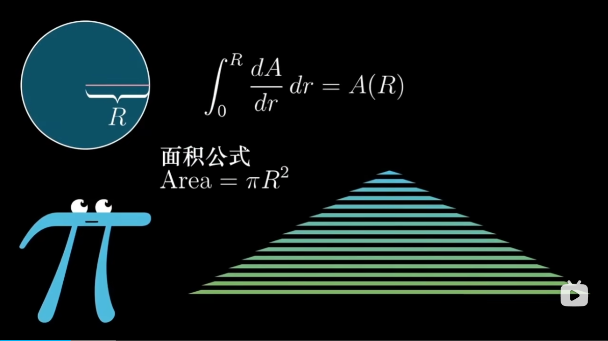
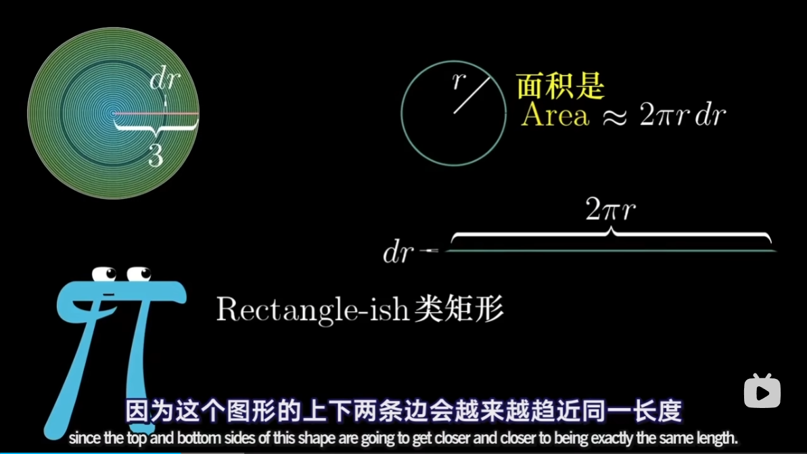
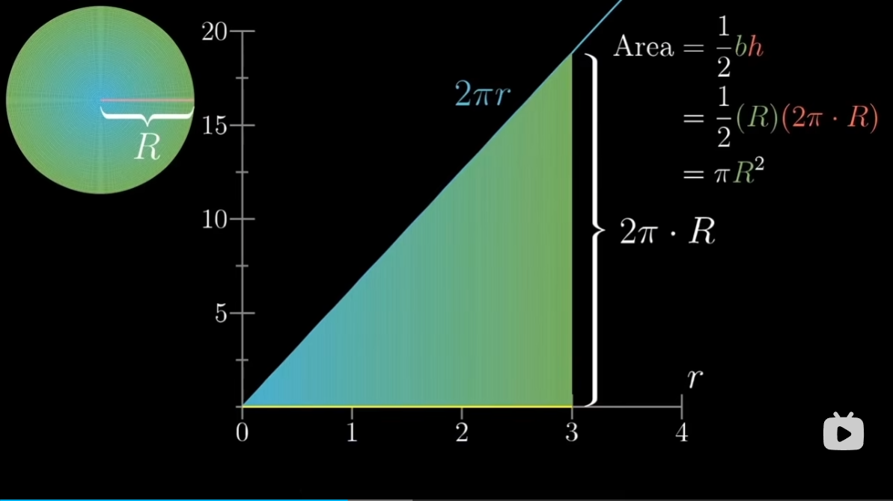
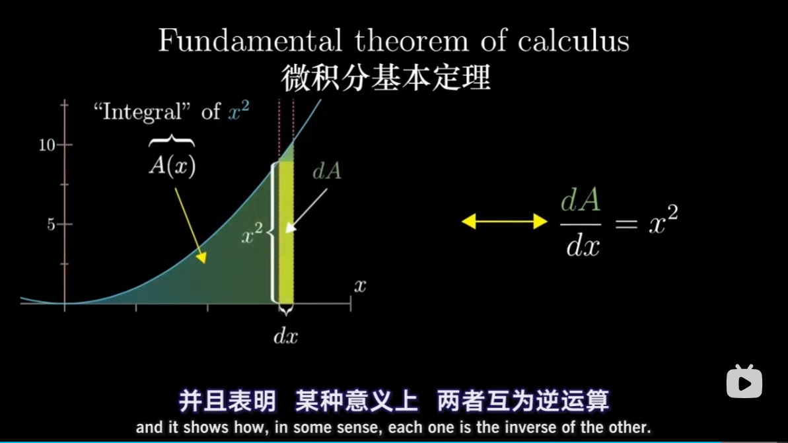

https://www.3blue1brown.com/topics/calculus

"The art of doing mathematics is finding that special case that contains all the germs of generality."
- David Hilbert

“数学之道在于找出一个这样的特例，它包含普遍原则的全部萌芽”
——大卫.希尔伯特

# 开篇
微积分有很多运算法则和公式，往往只是要人死记硬背：
* derivative formulas 求导公式；
* the product rule 乘积法则；
* the chian rule 链式法则；
* implicit differentiation 隐函数求导；
* the fact that integrals and derivatives are opposites 积分和微分的互逆关系；
* Taylor series 泰勒级数；

目标是看完后自己也能发明微积分：核心思想实际上从何而来，全面直观可视化，听人解释一件事情和真正从头开始实现出来是很不一样的；如果你是一位早期的数学家，思索想法画出正确的图形后，能否合理地撞见这些真理呢？

# 圆的面积
$$
\begin{array}{c}   
Area=\pi r^{2} 
\end{array}
$$

## 你和一个圆
你想找出圆的面积，浪费很多纸将面积剪开重新排列，剪成多个同心圆（保留了圆的对称性）
只要 dr 选的越来越小，就会越来越准确；

# 像数学家那样思考问题
要发展出能够解决一般问题的工具和技巧；

从近似过渡到精确的这种方式，相当精妙，直击微积分的要害；

Hard problem -> Sum of many small values

数学和科学中许多其它难题，都可以分解成求许多小数量之和；例如已知汽车再每个时间点的速度，求它跑的距离；

刚刚把一个问题转换成图像下的面积而找到答案（圆的面积运气好是个三角形），也许会开始思索怎么求其他图像下的面积（积分）；

很困难，当你碰上真的很难的数学问题时，上策就是别太执着于正面硬算答案，相反应该先不带明确目标地把玩这些概念，花点时间熟悉一下函数间的交互关系；
* 把 x 稍微增加 dx 那么一丢丢，看看面积变了多少；
* 虽然没有直接告诉我们怎么找到 A(x)，但它给了我们一个可以追踪的有力线索；

# Fundamental theorem of calculus
微积分基本定理

High-level view 微积分中出现的一些核心思想