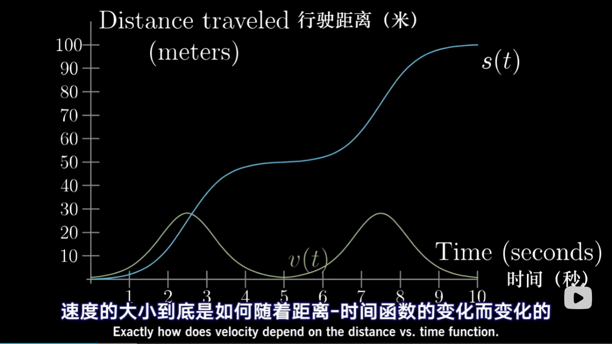
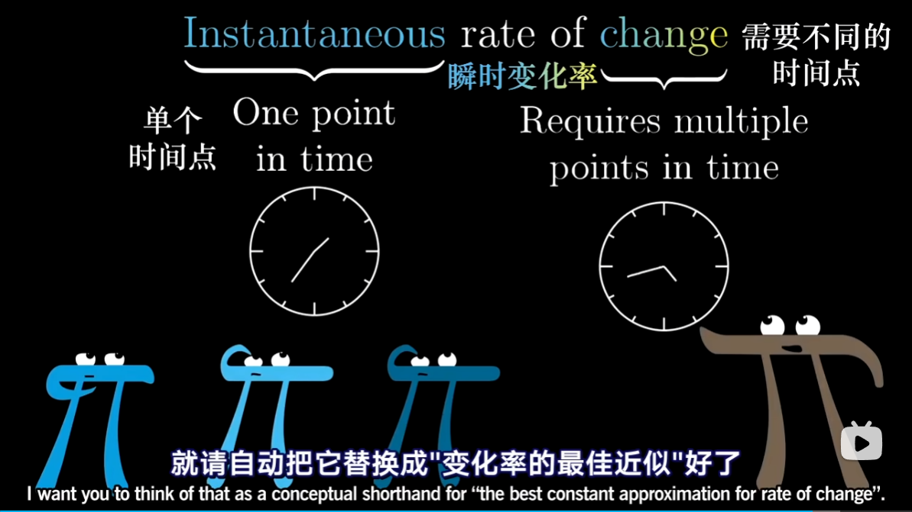

"So far as the theories of mathematics are about reality, they are not certain: so far as they are certain. they are not about reality"
—— Albert Einstein

“数学法则只要与现实有关，都是不确定的；若是确定的，都与现实无关。”
—— 阿尔伯特.爱因斯坦

# 开篇
Goals
* Learn derivatives 学习导数（有不少思维暗坑）；
* Avoid paradoxes 避免矛盾；

Instantaneous rate of change? 瞬时变化率？
这个说法其实自带矛盾，在不同时间点“之间”变化才能发生，限制在一个瞬间点也就没有变化的余地了；

## 微积分之父
Discovered it 发现微积分：
Barrow 巴罗, Newton 牛顿, Leibniz 莱布尼兹；

Made it rigorous 给出严格定义：
Cauchy 柯西, Weierstrass 魏尔施特拉斯；

# 汽车速度和距离

速度究竟代表什么，Speedometer 车速计；
Velocity in a moment 某一时刻的速度其实没有意义，一张汽车的照片看不出来跑得有多快，需要拿 2 个时间点来做比较；
$$
\begin{array}{c}   
 \frac{距离的变化}{时间的变化} = 单位时间内运动的距离
\end{array}
$$

回头看看之前的速度函数，只跟时间 t 有关一个孤零零的瞬间，有点诡异；
当年微积分的创始人也体验了同样的思维冲突；

# “变化率”的矛盾
若想进一步理解“变化率”的意义，理解如何将它应用于包括开车在内各式各样的科学情景；就需要一个解决矛盾的方案；

## 现实世界
车速表如如何显示车速，很小时间内 0.01 秒运动的距离；

不所以用 Instantaneous 瞬时变化率，用一小段时间 over a small time；

dt 可以想象成之前说的 0.01 秒，这段时间差的运动距离 ds，任意一点时的速度可以用 ds / dt 表示；

$$
\begin{array}{c}   
 \frac{ds}{dt}(t)= \frac{s(t + dt) - s(t)}{dt}
\end{array}
$$

## 纯数学
The ture derivative 导数的完全体

尽管车速表需要一个实际的时间差 0.01 秒来计算速度，绘制程序也会用到一个实际的时间差 dt；

但在纯数学领域，导数并不是 dt 为某个具体值时 ds 和 dt 的比值；

当 dt 越来越接近 0，ds / dt 越来越逼近 t 点切线的斜率；导数纯数学上真正的完全体，并不是沿图像两点间直线的斜率，而是经过图像上某一点的切线的斜率；
这里并没有说 dt 是“无限小” dt is not "infinitely small", dt is not 0; 更没有说把 0 代入 dt 就可以求导了，这个 dt 永远都是一个有限小的量，非零；

毕竟“瞬时的变化”没有意义，最好也别把求切线看做求“某一点的瞬时的变化率”；
Best constant approximation around a point 某一点附近的最佳直线近似；

这里的 dt 表示微小的变化量，有实际的大小；ds 也有实际大小；
但按照微积分的传统，只要你用了符号 "d"，就等于挑明了，你想求 dt 逼近 0 时的结果；

也许你觉得，当 dt 越来越小时，求 ds/dt 会变得愈加困难，其实相反变得更加简单；
$$
\begin{array}{c}   
 s(t)= t^{3} 
\end{array}
$$

$$
\begin{array}{c}   
 \frac{ds}{dt}(2)= \frac{s(2 + dt) - s(2)}{dt}
\end{array}
$$
$$
\begin{array}{c}   
 \frac{ds}{dt}(2)= \frac{(2 + dt)^{3} - (2)^{3}}{dt}
\end{array}
$$
$$
\begin{array}{c}   
 \frac{ds}{dt}(2)= \frac{2^{3} + 3(2)^{2}dt + 3(2)(dt)^{2} + (dt)^{3} - 2^3}{dt}
\end{array}
$$
$$
\begin{array}{c}   
 \frac{ds}{dt}(2)= \frac{2^{3} + 3(2)^{2}dt + 3(2)(dt)^{2} + (dt)^{3} - 2^3}{dt}
\end{array}
$$
$$
\begin{array}{c}   
 \frac{ds}{dt}(2)= 3(2)^{2} + 3(2)(dt) + (dt)^{2}
\end{array}
$$

当 dt 逼近于 0 时，时间差越来越小，后面两项可以完全忽略了
$$
\begin{array}{c}   
 \frac{ds}{dt}(2)= 3(2)^{2}
\end{array}
$$
$$
\begin{array}{c}   
 \frac{ds}{dt}(t)= 3(t)^{2}
\end{array}
$$

实际求导操作中，不用每次都这么推导一遍；学了微积分后大家立刻就能反应过来；
考虑一个具体的 dt 时间差内距离的变化量时，需要做一大坨计算；而当考虑让 dt 逼近 0 后，可以跳过麻烦的步骤，问题也确实变简单了；这也正是微积分（calculus）实用性的精华所在；

"Instantaneous rate of change" 瞬时变化率，"Paradoxes"矛盾；
考虑 t=0 一开始时车的运动，请问此时车是否在移动；求导为 0，明显没有在移动；但如果车在 0 秒时没有开始移动，那他是什么时候开始移动的，这个问题是没有意义的；

问题是基于一个不存在的概念“瞬时变化”，而且导数根本不是用来测量“瞬时变化”的；

导数在 0 秒等于 0 的真正含义是指在第 0 秒附近，车速的最佳近似是匀速 0 米每秒；

