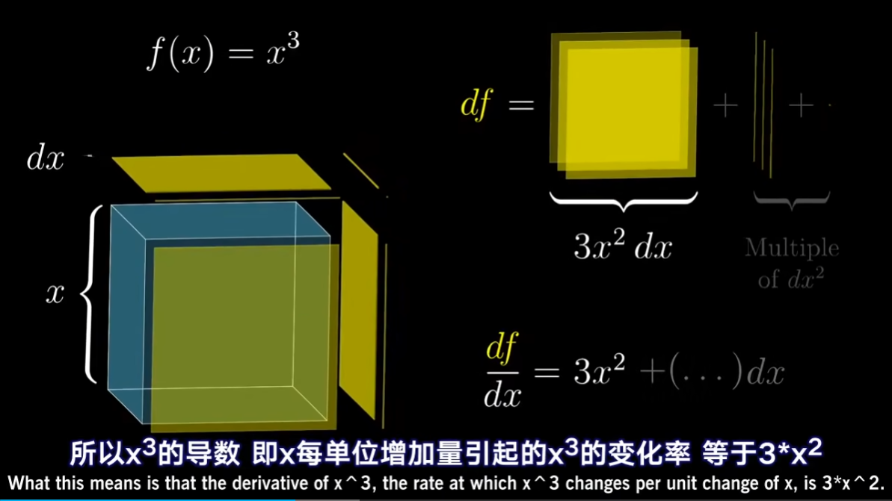
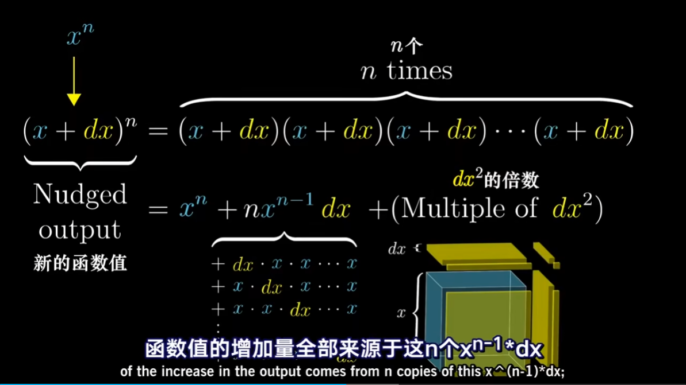
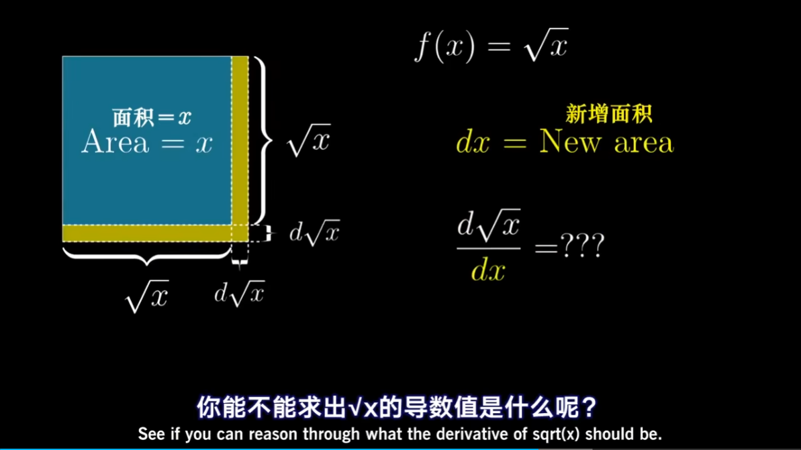
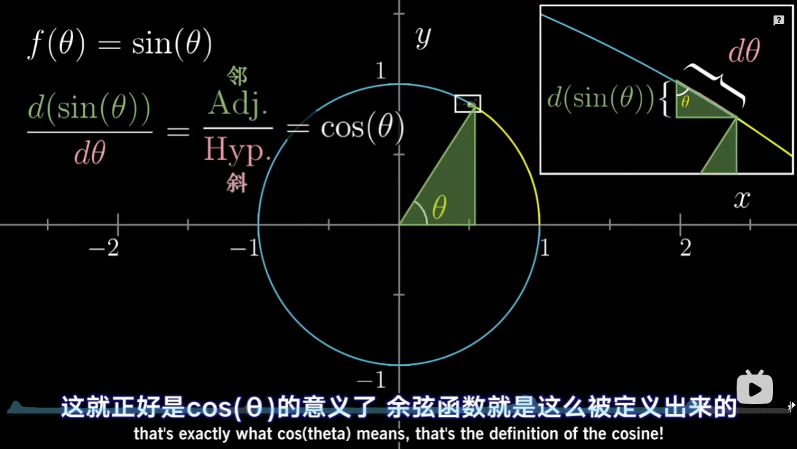

"You know, for a mathematician, he did not have enough imagination. But he has become a poet and now he is fine"
—— David Hilbert

“他曾没有足够的想象力来当数学家。不过他成为了一名诗人，现在过得挺好。”
—— 大卫.希尔伯特

# 开篇
上个视频里了解到导数的意义，以及它和变化率的关系；
下一步，学习如何计算它们；
给定一个特定的表达式函数，求出导数的表达式；

Why 为什么这种求导很重要

| Abstract functions | Applications |
|--------------------|--------------|
| 抽象函数 | 应用 |
|$f(x) = 2x^{2} - x^3$ | Velocity 速度 |
|$f(x) = \sin(x)$ | Oscillation 震动 |
|$f(x) = e^{x}$ | Population growth 人口增长 |

So if you build up some fluency with the ideas of rates of change for those kinds of pure abstract fucntions, it gives you a language to more readily talk ablout the rates at which things change in concrete situatins that you might be using calculus to model.

假如你能够熟练掌握这些抽象函数的变化率的思想，那你就学到了这门可以熟练精确地描述事物变化率的语言，并能在任何你需要用微积分来模拟的实际问题中使用它；

把这个过程说的像是记住一系列公式的话，就太小看它了；我们很容易忘记，导数的实质是要看某个量的微小变化，以及它和它所导致的另一个微小变化有什么关系；

微小变化量，才是导数的本质；

# 几何意义
## 正方形面积

## 立方体体积

# 幂函数求导公式 Power rule
$$
\frac{d(x^{n})}{dx} = nx^{n-1}
$$

花时间考虑一下为什么它也适用于 2 和 3 以外的指数；

## $\frac{1}{x}$ 推导

$$
\frac{\mathrm{d}}{\mathrm{d}x}x^{-1} = \frac{(x + \mathrm{d}x)^{-1} - x^{-1} }{\mathrm{d}x}
$$
$$
\frac{\mathrm{d}}{\mathrm{d}x}x^{-1} = \frac{x - (x + \mathrm{d}x)}{\mathrm{d}x(x)(x + \mathrm{d}x)}
$$
$$
\frac{\mathrm{d}}{\mathrm{d}x}x^{-1} = \frac{-1}{x^{2} + x\mathrm{d}x}
$$
$$
\frac{\mathrm{d}}{\mathrm{d}x}x^{-1} = -x^{-2}
$$

## $\sqrt{x}$ 推导

$$
(a + b)(a -b) = a^{2} - b^{2}
$$
$$
\frac{\mathrm{d}}{\mathrm{d}x}\sqrt{x} = \frac{\sqrt{(x + \mathrm{d}x)} - \sqrt{x}}{\mathrm{d}x}
$$
$$
\frac{\mathrm{d}}{\mathrm{d}x}\sqrt{x} =
    \frac{x + \mathrm{d}x- x}{\mathrm{d}x(\sqrt{x + \mathrm{d}x} + \sqrt{x})}
$$
$$
\frac{\mathrm{d}}{\mathrm{d}x}\sqrt{x} = \frac{1}{\sqrt{x + \mathrm{d}x} + \sqrt{x}}
$$
$$
\frac{\mathrm{d}}{\mathrm{d}x}\sqrt{x} = \frac{1}{2 \sqrt{x}}
$$
$$
\frac{\mathrm{d}}{\mathrm{d}x}\sqrt{x} = \frac{1}{2} x^{- \frac{1}{2}}
$$

# 三角函数 Trigonometric functions
