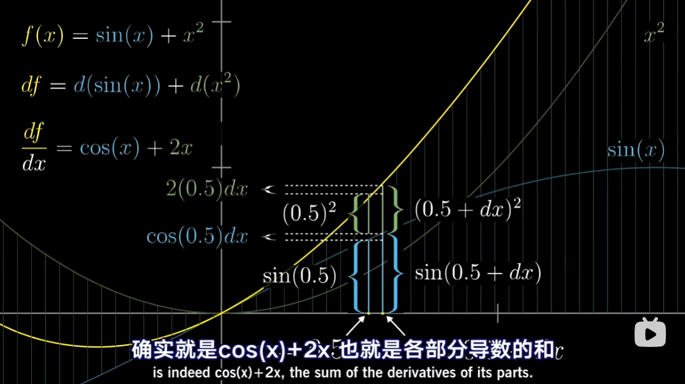
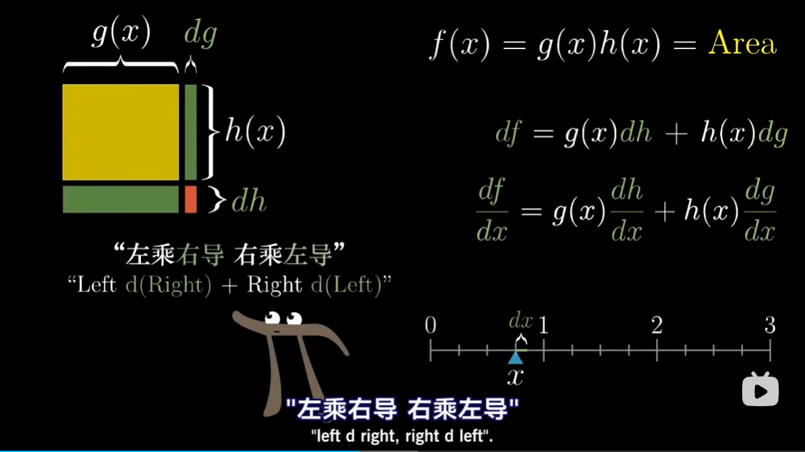
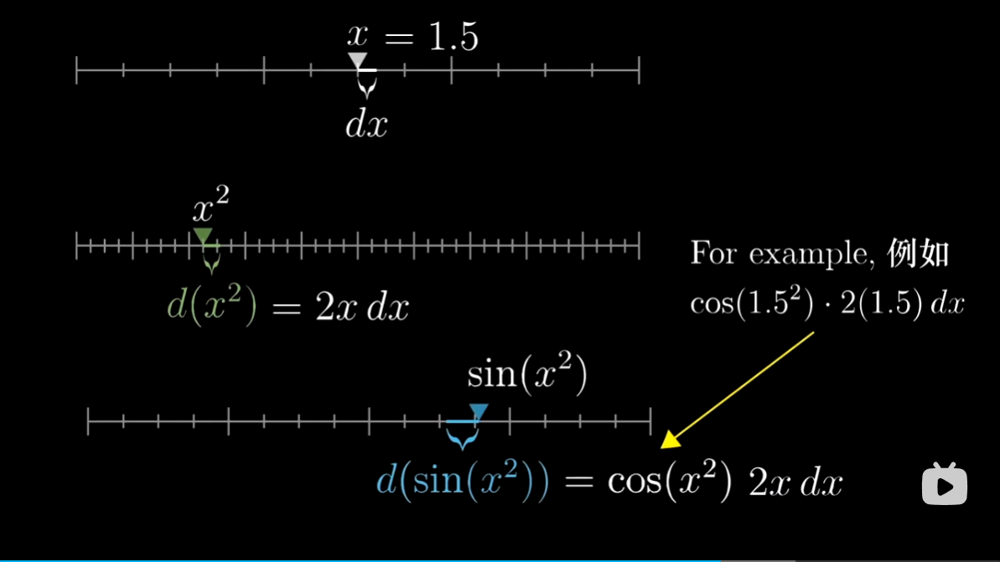
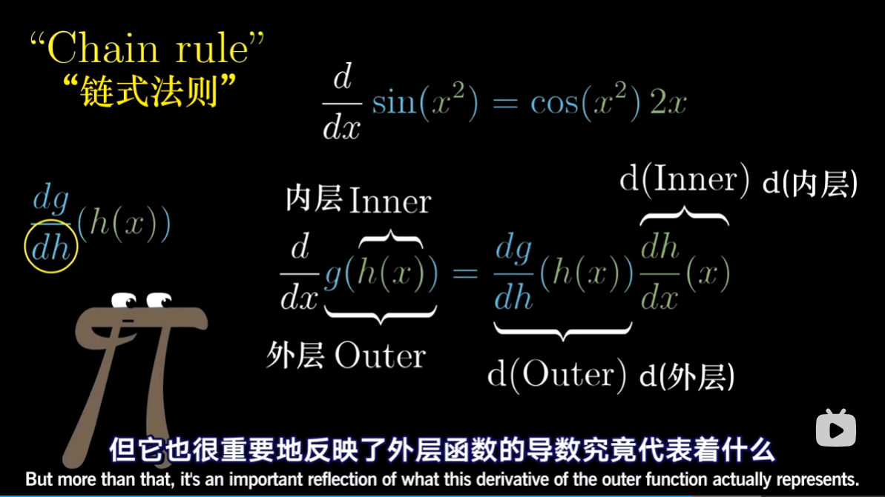
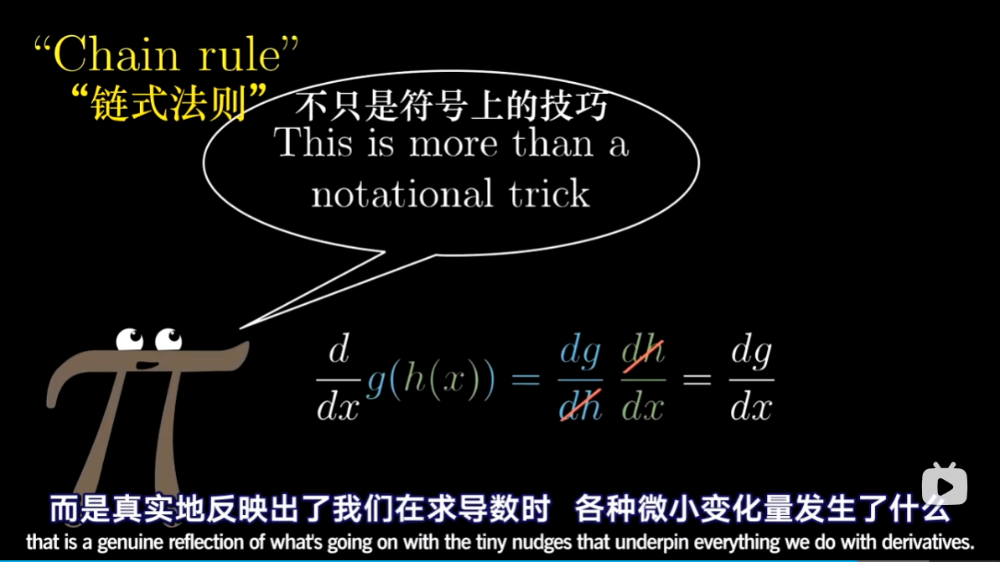

"Using the chain rule is like peeling an onion: you have to deal with each layer at a time, and if it is too big you will start crying"
-- Anonymous professor

“运用链式法则就好比剥洋葱：你得一层一层地剥开它的心，要是它的个头太大，你还会鼻酸流泪”
—— 某匿名教授

# 开篇
前面讨论了简单函数的求导，目标是解释这些公式的来源；将世界模型化的时候，大多数函数需要组合微调这些简单函数；
- 函数相加
- 函数相乘
- 函数套函数（复合）

# Sum rule 加法法则
$$
\frac{\mathrm{d}}{\mathrm{d}x}（g(x) + h(x)） = \frac{\mathrm{d}g}{\mathrm{d}x} + \frac{\mathrm{d}h}{\mathrm{d}x}
$$

# Product are a bit different
图像不是可视化的最佳方式 Not the best visualization，乘法通过面积来理解会有好处；

Left d(Right) + Right d(left) 左乘右导 + 右乘左导

# Function composition 函数复合

## Chain rule 链式法则

# 结束语
不管你看了多少讲微积分理论的视频，都不可能代替你自己去做联系，否则没法锻炼你自己做计算的能力；