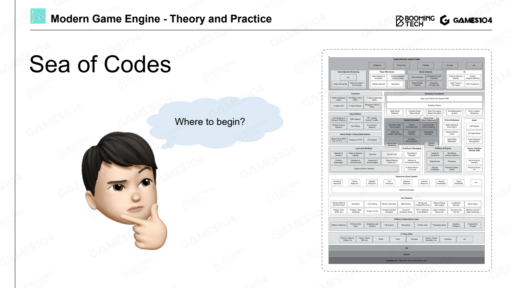
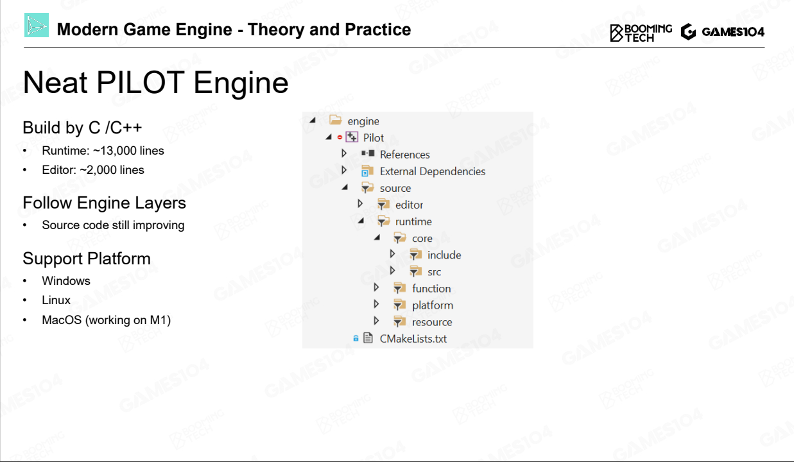

# Layered Architecture of Game Engine

# A Glance of Game Engine Layers

* Tool Layer
  * Chain of Editors

* Function Layer
  * make it Visible, Movable and Playable

* Resource Layer
  * Data and Files
* Core Layer
  * 内存管理数据结构，算法，垃圾回收，数学库，线程池
* Platform Layer
  * 操作系统，文件系统，图形 API，平台 SDK
  * PC，主机，输入设备，发行平台（Steam，Epic）
* Middleware and 3rd Party Libraries

五层 + 3rd

# Practice is the Best Way to learn

## build an animation system

### Resource

* Resource - How to Access My Data
  * 把软件的文件格式转化为引擎 Asset 资产，类似把 Word 格式变成 txt
  * 资产的引用关系
  * GUID 资产的唯一识别号
* Resource - Runtime Asset Manager
  * 虚拟文件系统控制 load/unload
  * Handle 系统管理资产的生命周期，及引用
* Resource - Manage Asset Life Cycle
  * GC，延迟加载

### Function

* Function - How to Make the World Alive
* Function - Dive into Ticks
  * Tick Logic
    * Tick Camera
    * Tick Motor
    * Tick Controller
    * Tick Animation
    * Tick Physics
  * Tick Render
    * Tick Render Camera
    * Culling
    * Rendering
    * Postprocess
    * Present
* Function - Heavy-duty Hotchpotch
  * 功能层很庞大
  * 会跟具体的游戏绑定
* Function - Multi-Threading
  * 多核 CPU，多线程（Logic，Render,  Simulate）, Advanced Job System

### Core

* Core - Math Library
  * 基本线性代数，矩阵运算，一个周末就能搞懂
  * 物理模拟比较高深复杂
* Core - Math Efficiency
  * 卡马克 Q_rsqrt
  * SIMD ，一个指令 ALU 把 4 个运算做掉
* Core - Data Structure and Containers
  * Vectors, maps, trees
  * 定义引擎自己的 STL
  * 避免内存碎片
* Core - Memory Management
  * 游戏引擎自己申请很大一块内存，自己精确管理
  * 图灵机
    * 把数据放到一起
    * 按顺序访问
    * 一整块申请和抹除
* Core - Foundation of Game Engine
  * 代码质量要求非常高
  * 一般轻易不要动
  * 能写 Core 的程序员都是非常非常资深的，绝对的安全，绝对的效率
  * 写到这一层应该就没头发了，笑

### Platform

* Platform - Target on Different Platform
  * 不同操作系统，连文件路径都不同
  * 在这一层，把所有平台的差异都掩盖掉
* Platform - Graphics API
  * Render Hardware Interface (RHI)
  * 把所有不同 GPU 架构和 SDK 重新用 virtual 虚函数翻译了一遍
  * DX11 跟 DX12 设计思路都完全不同，直接升级性能反而更差，头发又没了
* Platform - Hardware Architecture
  * PS3 还有协处理器 SPU
  * 如果游戏逻辑算法要针对硬件平台编写，那多平台怎么处理？

### Tool

* Tool - Allow Anyone to Create Game
  * 让创意人员来使用
  * 这一层的代码量是最大的，复杂度维护成本高
* Tool - Digital Content Creation
  * 别人软件做的，通过 Asset Conditioning Pipeline 管线，导入导出引擎
  * fbx
  * 业界也在推动更加统一的数据交换格式

## Why Layered Architecture?

对复杂度进行解耦，每一层只关注自己的东西。类比城市系统的分层，水电煤基础设施，食物垃圾

约底层的东西，越不要轻易改动

上面的功能层改来改去，工具层的代码几乎每天都在变

越上层越灵活，越下层越稳定

# Mini Engine - Pilot 领航员

https://github.com/BoomingTech/Pilot

