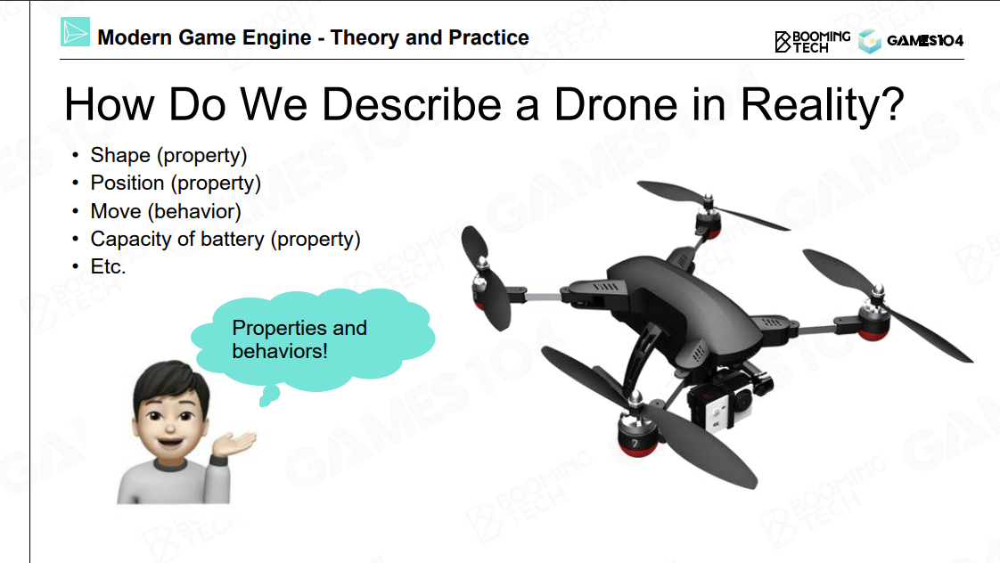
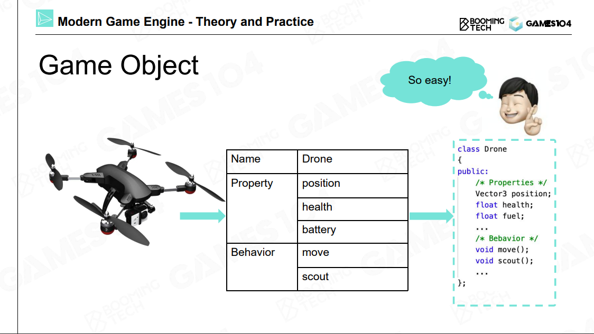
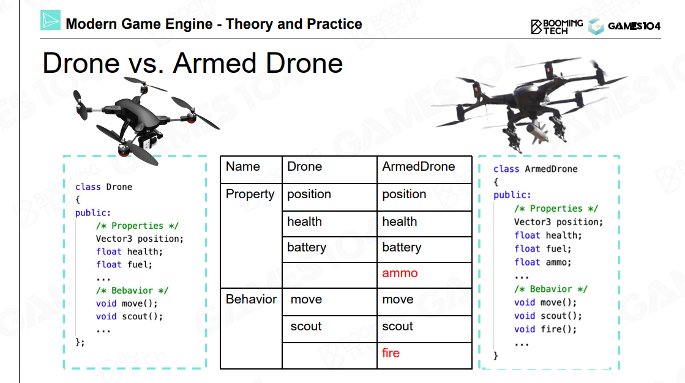
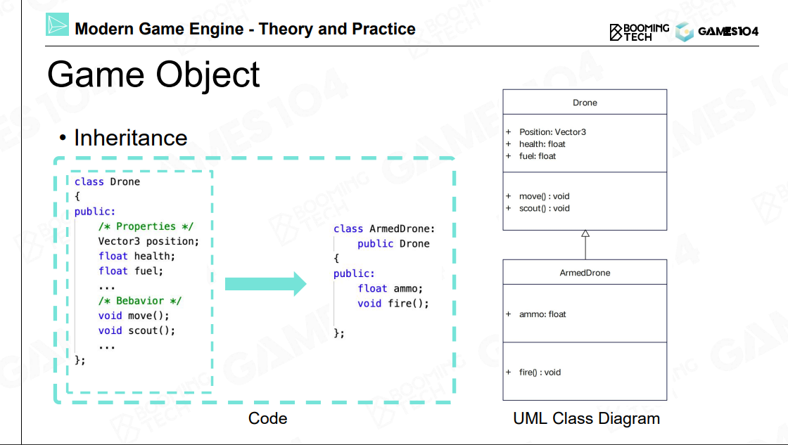
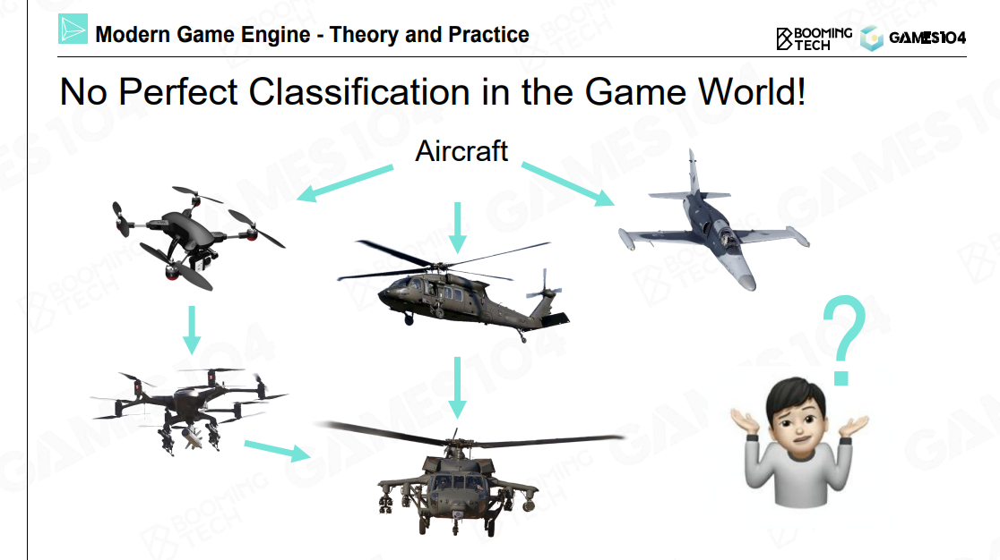
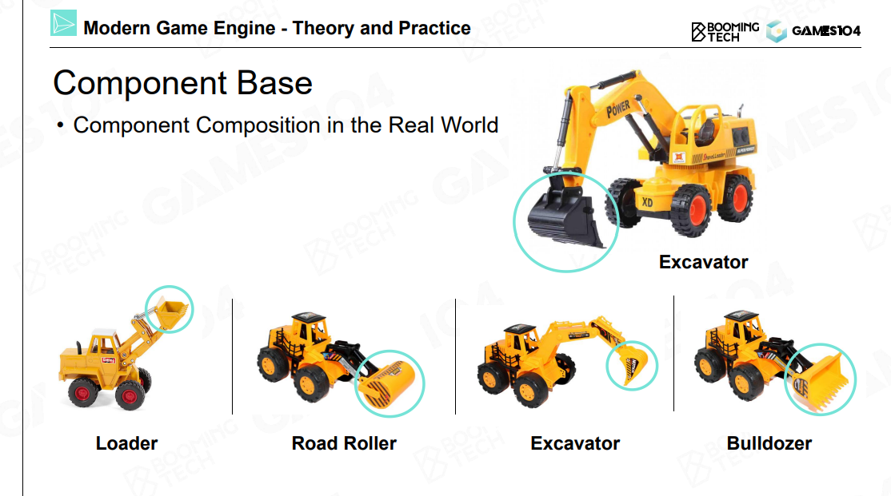
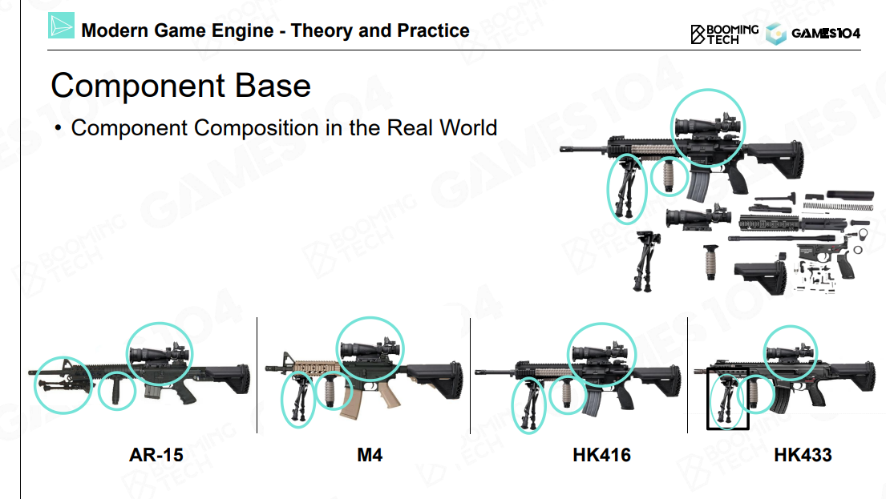
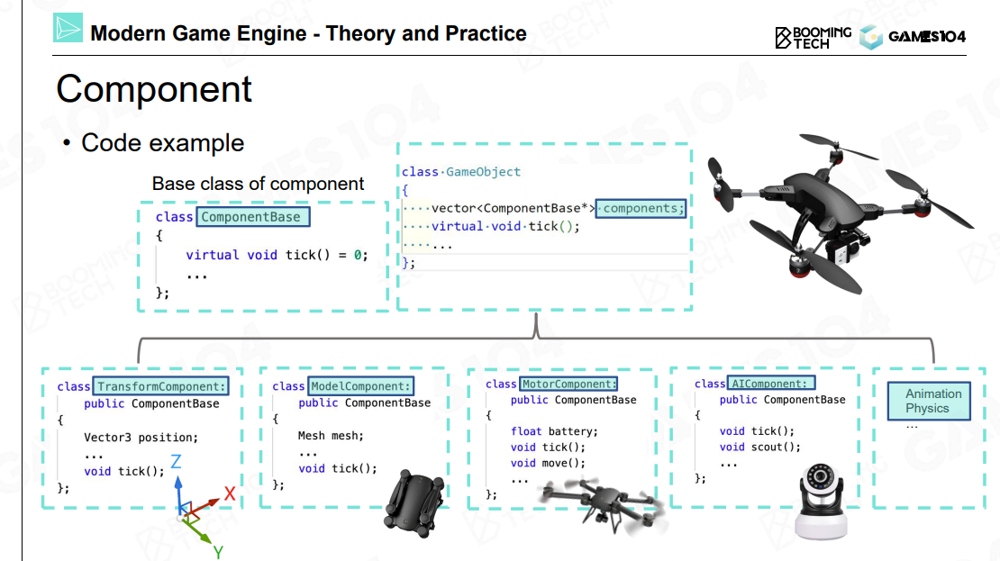

# How to Build a Game World

有了游戏引擎，如何制作一款游戏？

Static Game Objects ，是否可交互

Environments，天空，植被，地形

Other Game Objects，Trigger Area，空气墙，Navigation mesh

所有东西都是 Game Object

面向对象的经典问题：鸟，人，鸟人

## Component Base

