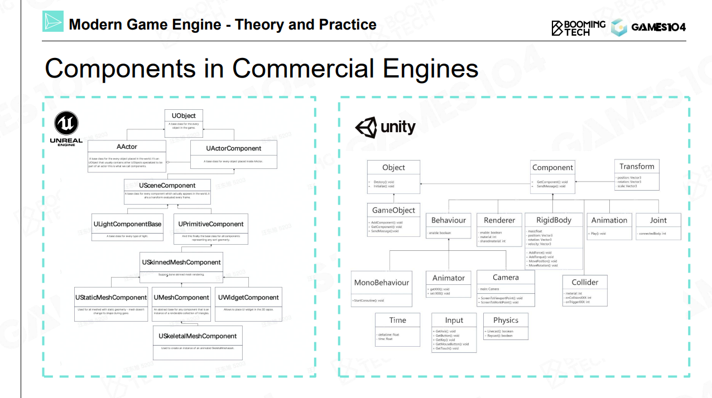
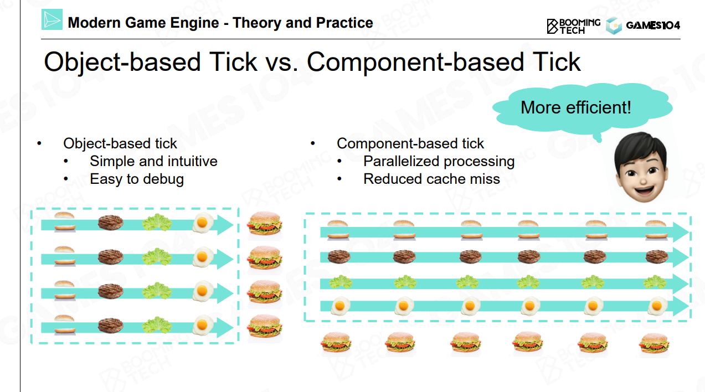
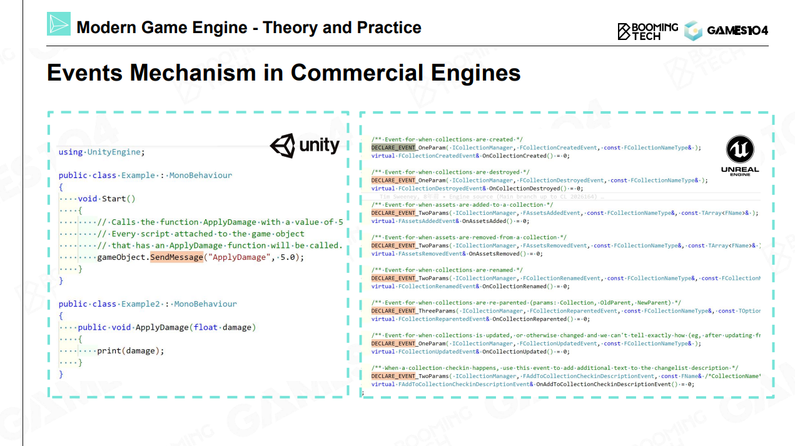
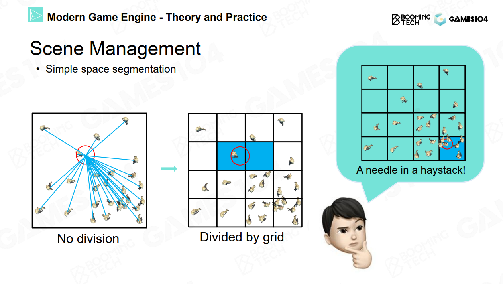
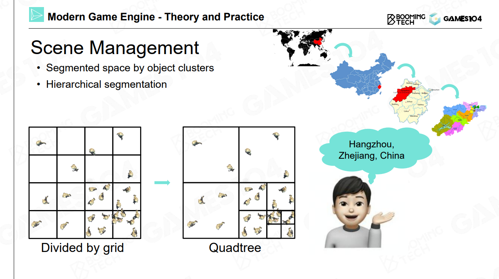
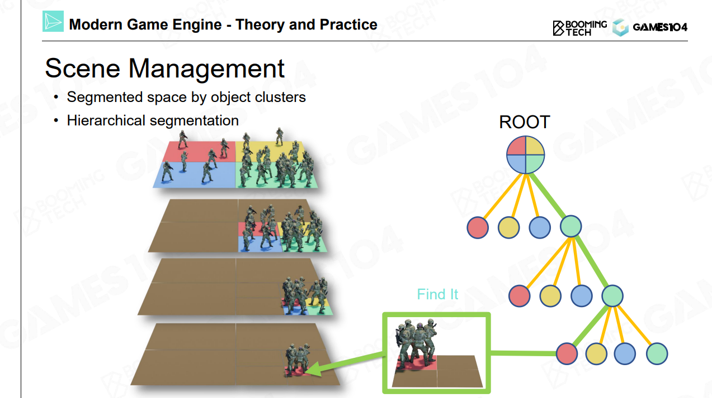
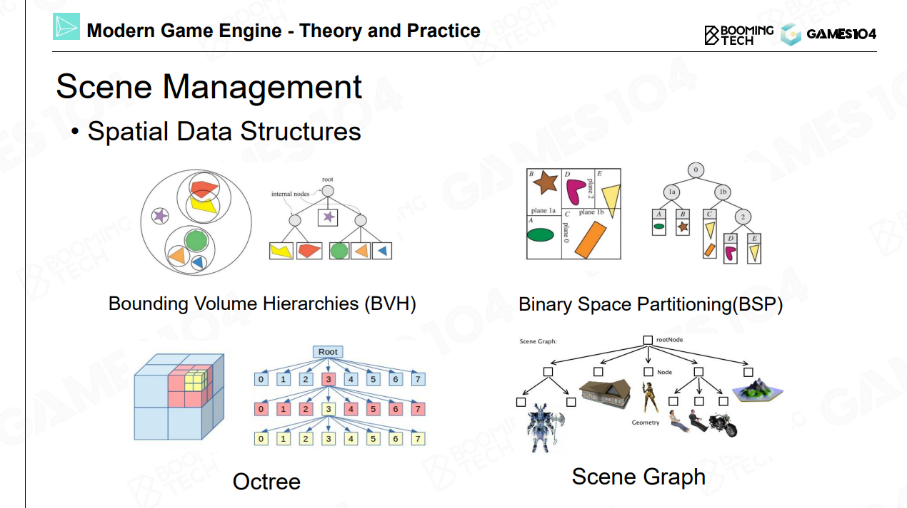
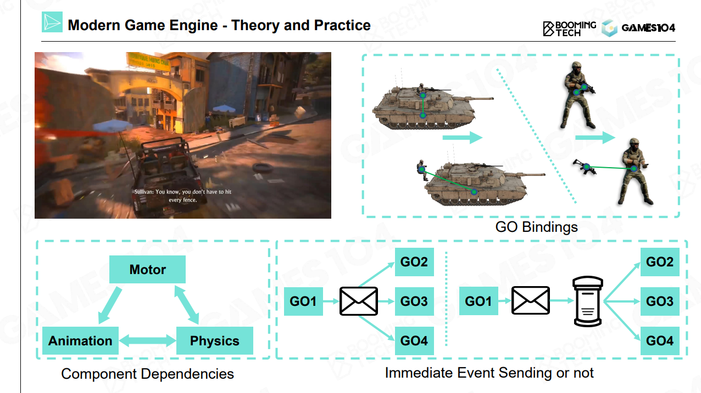

# How to Build a Game World

有了游戏引擎，如何制作一款游戏？

Static Game Objects ，是否可交互

Environments，天空，植被，地形

Other Game Objects，Trigger Area，空气墙，Navigation mesh

所有东西都是 Game Object

面向对象的经典问题：鸟，人，鸟人

## Component Base

## Takeaways

Everything is a game object in the game world

Game object could be described in the component-based way

# How to Make the World Alive?

Object-based Tick

Component-based Tick

# How to Explode an Ammo in a Game?

## Hardcode

## Events

Message sending and handing

Decoupling event  handling

# How to Manage Game Objects?

## Scene Management

* Game object query 
  * By Unique game object ID
  * By object position

# Takeaways

* Everything is an object
* Game object could be described in the component-based way
* States of game objects are updated in tick loops
* Game objects interact with each other via event mechanism
* Game objects are managed in a scene with efficient strategies

精彩回放：使用相同的输入，在多线程的情况下如何保证同样的结果。

采用第三方邮局，统一管理事件的时序。

除了 Tick，还有 Pre tick 和 Post Tick 来解决问题

循环依赖问题，速度影响动画，动画影响物理，物理又影响速度

# Q&A

* Tick 时间过长怎么办？
  * 采用步长，直接 Tick 2 帧（比较危险），一般来说要优化引擎设计
  * 如果一个爆炸产生了大量逻辑处理不过来，分帧处理（100 个分 5 帧，每批 20 个）
* 渲染线程和逻辑线程怎么同步？
  * Tick Logic 和 Tick Render
  * 做得不好的话，Render 比 Logic 慢一帧，FrameBuffer 交互又慢一帧。测试方法，做了输入后，看到画面要等多久
* 空间划分怎么处理动态的游戏对象？
  * 每帧都重新构建BVH，BSP，八叉树等等，消耗太大
  * 树的插入和删除操作，一般游戏引擎会选择更新起来比较轻量级的算法，开放世界用 BVH
* 组件模式有什么缺点？
  * 没有 Class 访问效率高，ECS 解决这个问题
  * 查询其它组件，非常高频调用的话对效率影响很大
* Event 怎么调试比较好
  * 挺难的，打 Log 或者 可视化
* 物理和动画互相影响的时候怎么处理
  * 比较复杂，受击布娃娃，先从动画驱动逐渐插值到物理。物理动画，把动画 Pose 作为物理的输入，再进行模拟。