# 地形概述

Terrain 游戏地形

# 地形的几何

## Simple Idea - Heightfield 高度图

数学规律：分形

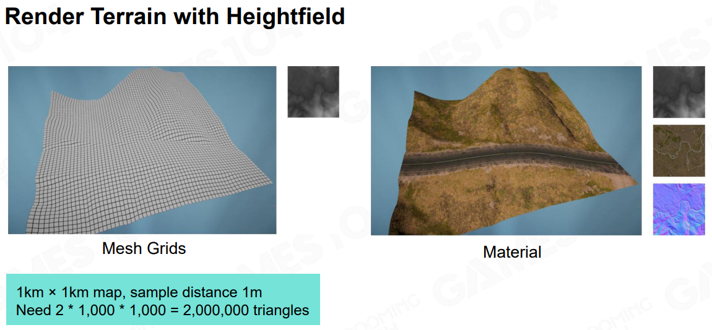

开放世界，需要优化。LOD 地形是一路连续的，不能硬切

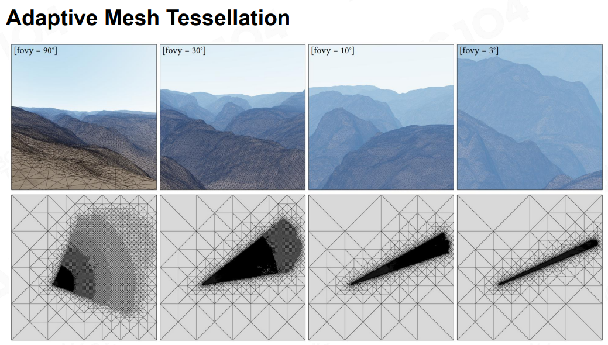

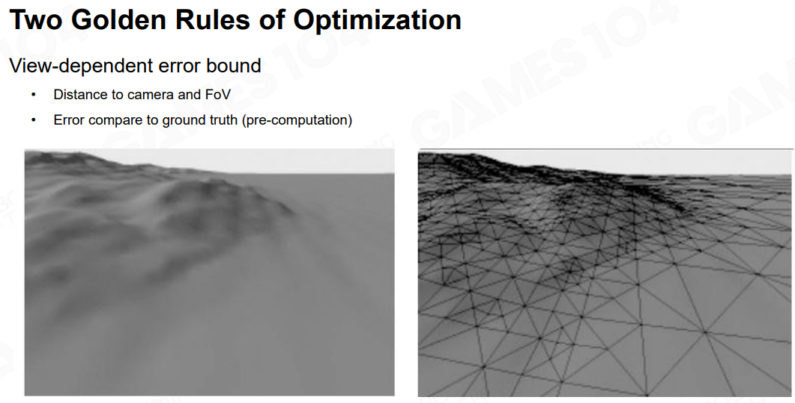

Triangle-Based Subdivision

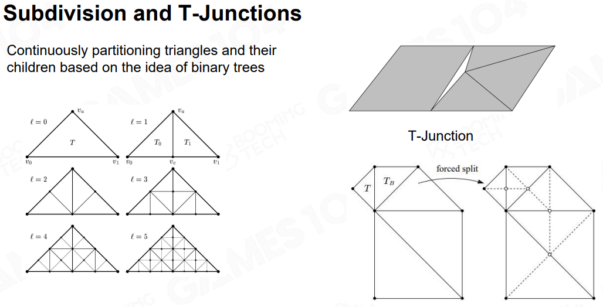

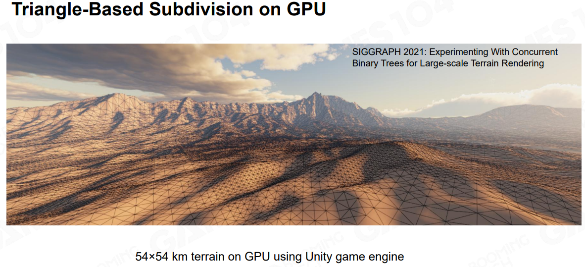

## 四叉树（更适合游戏引擎管理资源）

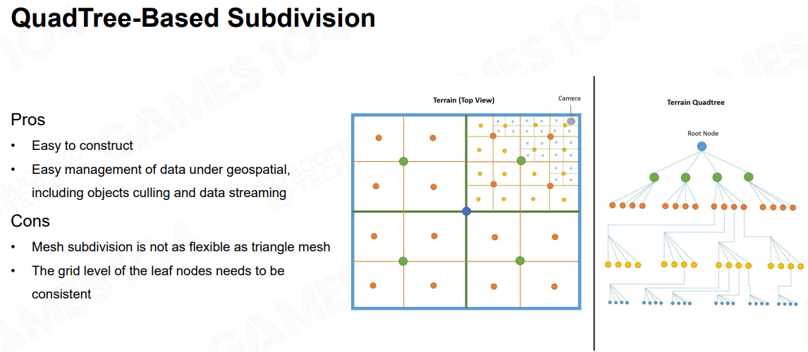

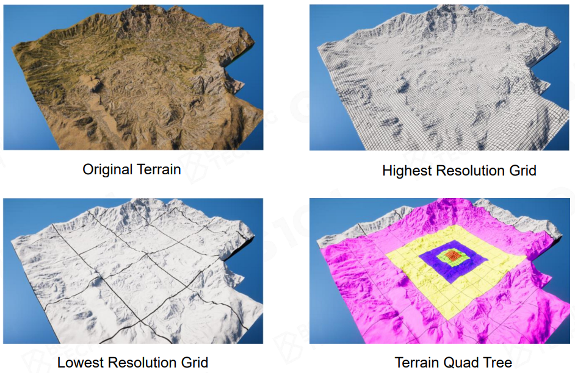

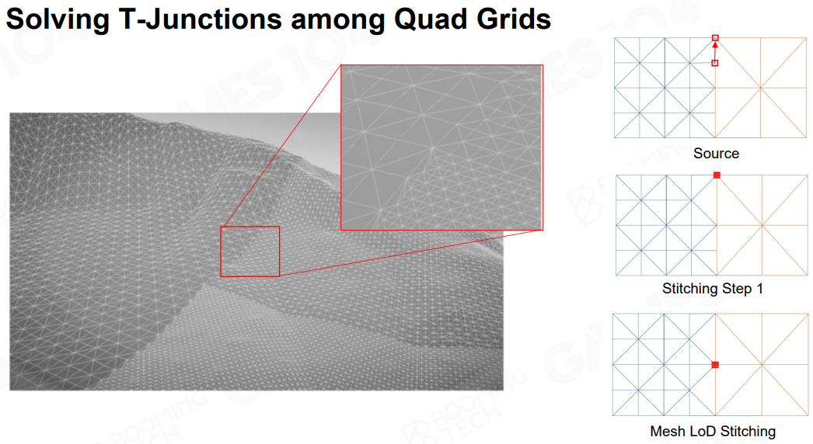

## Triangulated Irregular Network (TIN)

把不必要的顶点省掉

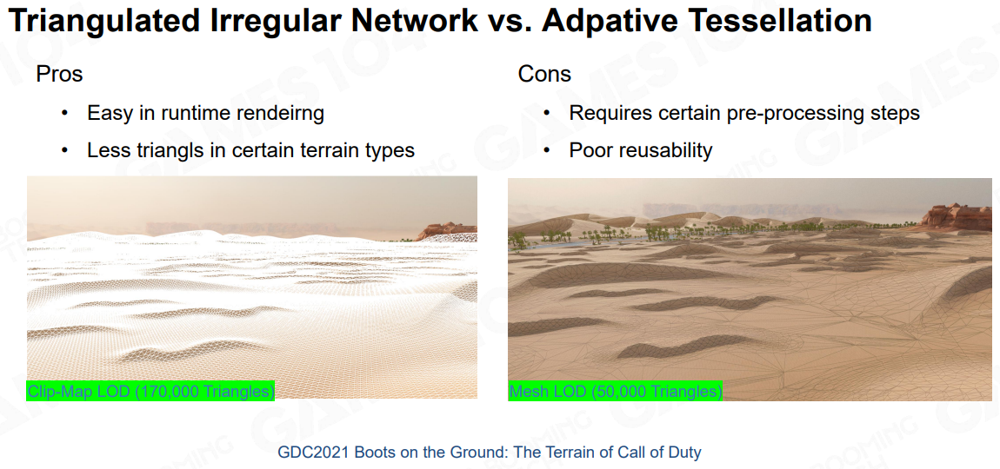

## GPU-Based Tessellation

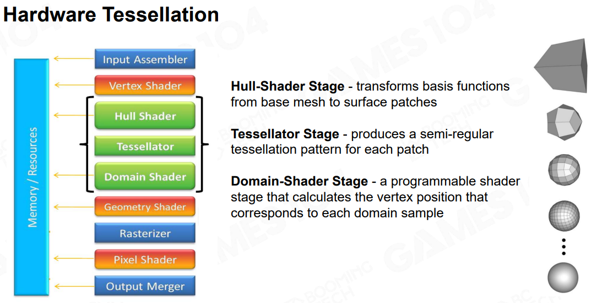

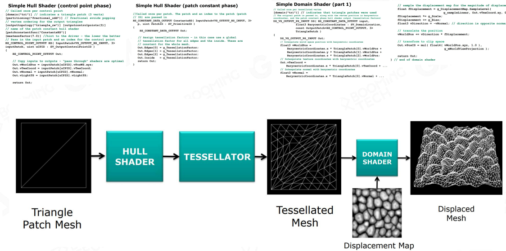

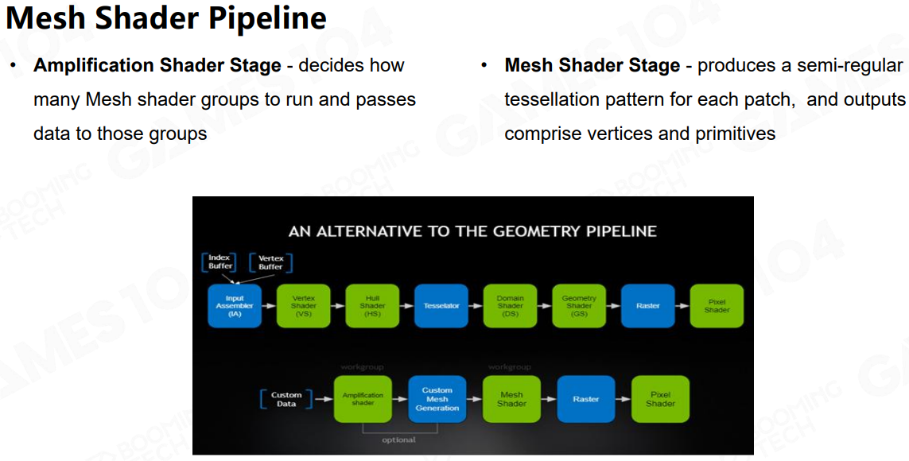

最新的 Mesh Shader 把前面 3 个 Stage 的活全部干完了。

需要 DX12 支持，密切关注 Steam Win10 用户比例

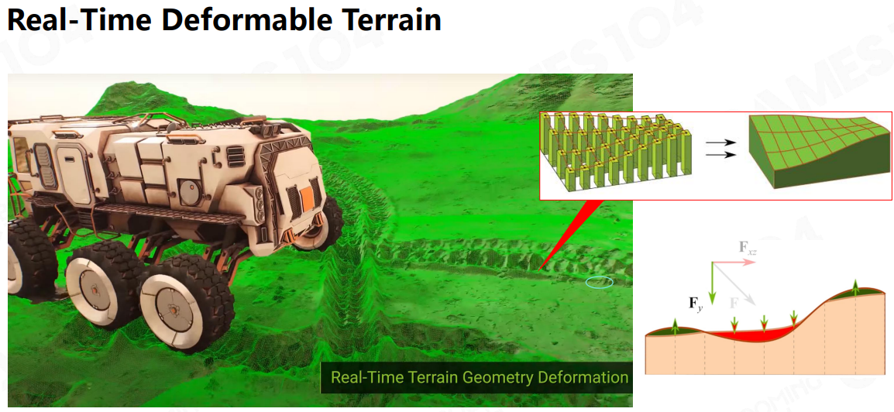

## Non-Heightfield Terrain

有洞，悬崖峭壁

## Crazy Idea - Volumetric Representation（私货）

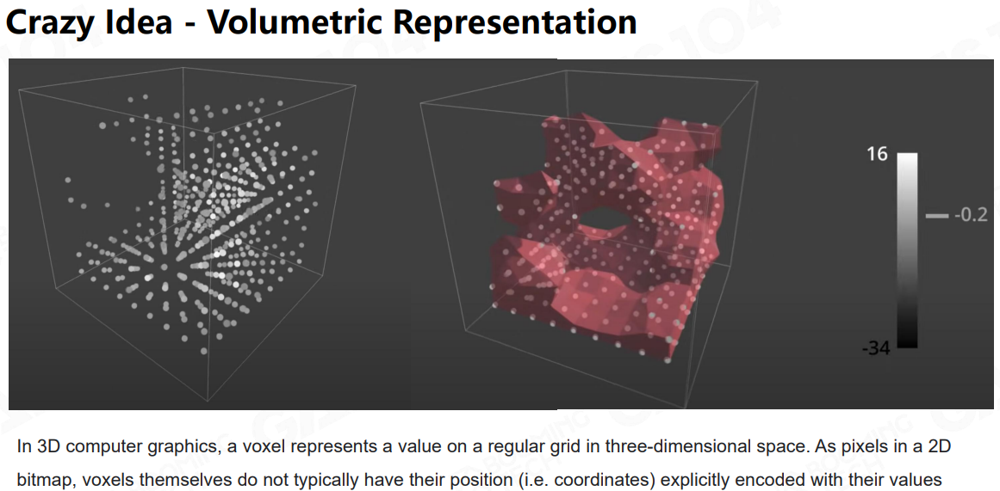

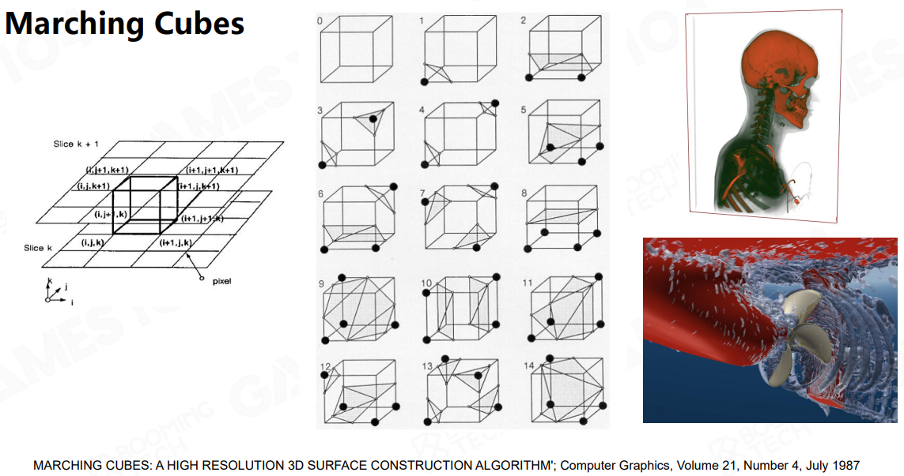

人体切片

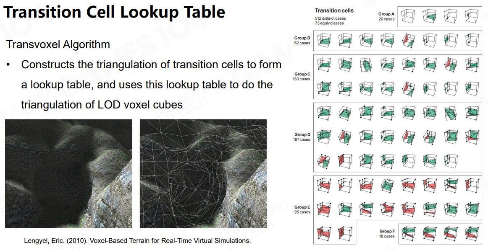

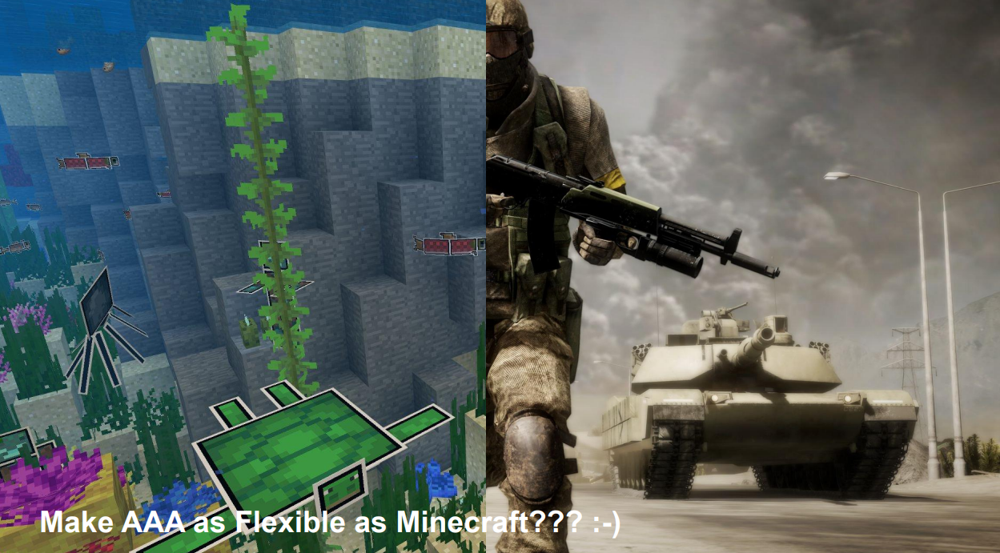

# 地形的材质

