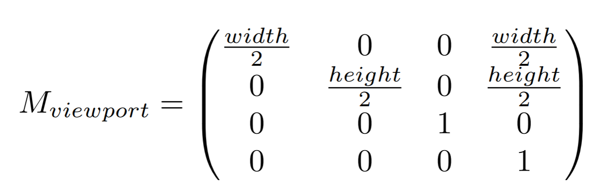
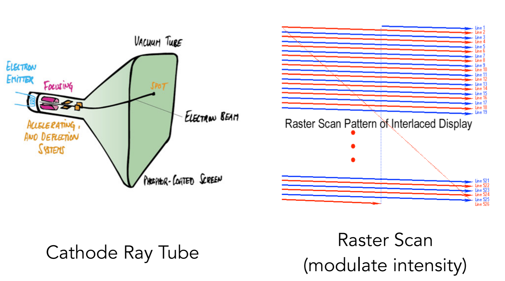
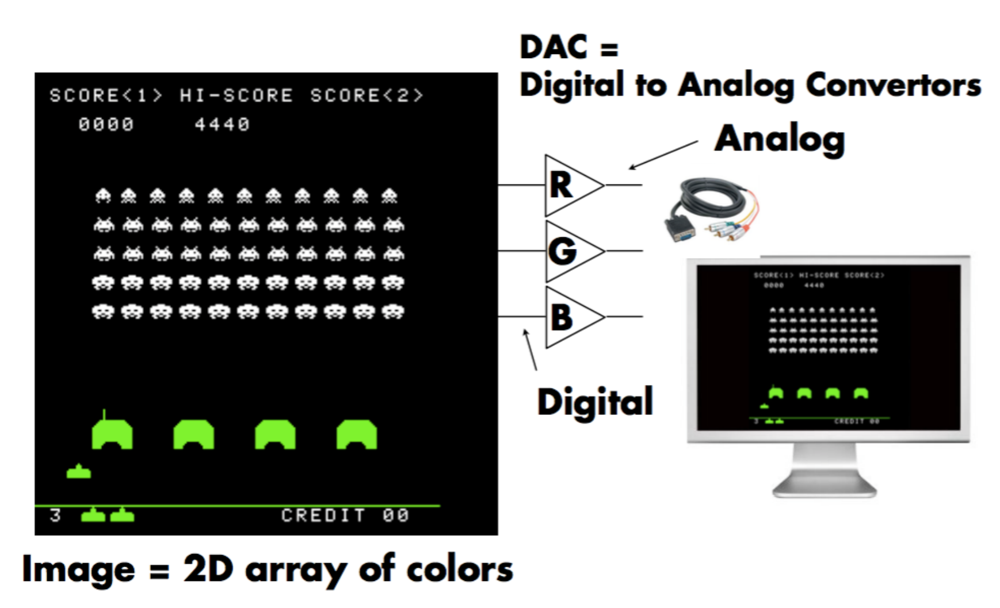
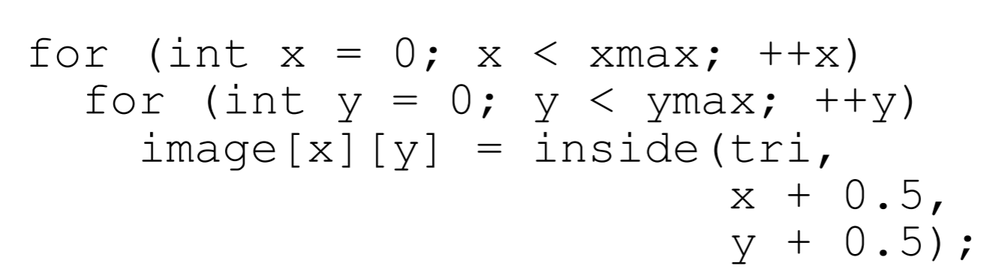
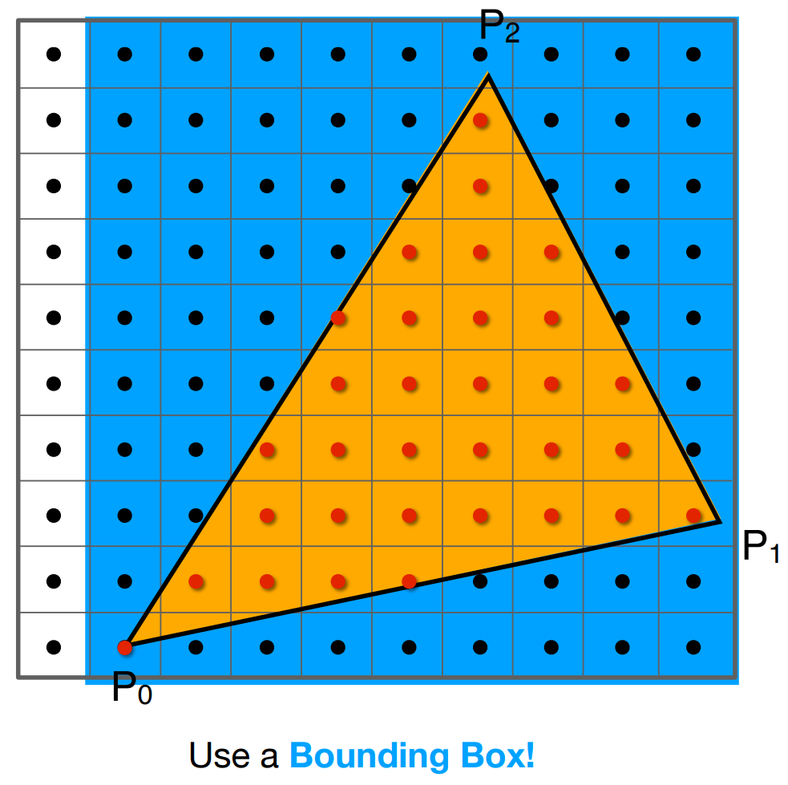

# Rasterization 1 Triangles

# Perspective Projection
* What's near plane's l, r, b, t then?
  * 
  * if explicitly specified, good
  * vetical `field-of-view` (fovY) and `aspect ratio`
  *  
* How to convert form fovY and aspect to l, r, b, t?
  * 

# What's after MVP?
* Model tranformation (placing objects)
* View transformation (placing camera)
* Projection transformation
  * Orthographic projection (cuboid to "canonical" cube[-1, 1]3)
  * Perspective projection (frustum to "cannonical" cube)
* Canonoical cube to ???

# Canonical Cube to Screen
* 
* What is a screen?
  * An array of pixels
  * Size of the array: resolution
  * A typical kind of raster display
* Raster == screen in German
  * Rasterize == drawing onto the screen
* Pixel (FYI, short for "picture element")
  * For now: A pixel is a little square with uniform color
  * Color is a mixture of (red, green, blue)
* 
* Defining the screen space
* 
* Irrelevent to z
* Transform in xy plane: [-1, 1]2 to [0, width] x [0, hight]
* Viewport transform matrix:
  * 

# Drawing Machines
* CNC Sharpie Draing Machine
* Laser Cutters
* Different Raster Displays
  * Oscilloscope 示波器
  * CRT
    * 
  * Frame Buffer: Memory for a Raster Display
    * 
* FLat Panel Displays 
* LCD (Liquid Crystal Display) Pixel
* LED Array Display
* Electrophoretic (Electronix Ink) Display

# Rasterization: Drawing to  Raster Displays

# Polygon Meshes
## Triangle Meshes
## Triangle - Fundamental Shape Primitives
* Why triangles?
  * Most basic polygon
    * Break up other polygons
  * Unique properties
    * Guaranteed to be planar
    * Well-defined interrior
    * Well-defined methed for interpolating values at vertices over triangle (barycentric interpolation)
* What Pixel Values Approximate a Triangle?
* 

# A Simple Approach: Sampling
## Sampling a Function
* Evaluating a function at a point is sampling
* We can `discretize` a function by sampling.
  * 
* Sampling is a core idea in graphics.
  * time, area, direction, volume ...

## Rasterization As 2D Sampling
* Sample If Each Pixel Center Is inside Triangle
  * 
* Define Binary Function: inside(tri, x, y)
* Rasterization = Sampling A 2D Indicator Function
  * 
* Inside? Recall: Three Cross Products!
  * 
* Edge Cases (Literally)
* Checking All Pixels on the Screen?
  * Use a `Bounding Box`! AABB
  * 
  * Incremental Triangle Traversal (Faster?)

## Rasterization on Real Displays
* 

## Aside: What About Other Display Methods?
* Color print

# The Display Physically Emits This Signal
* Jaggies! 锯齿
* Aliasing 走样

