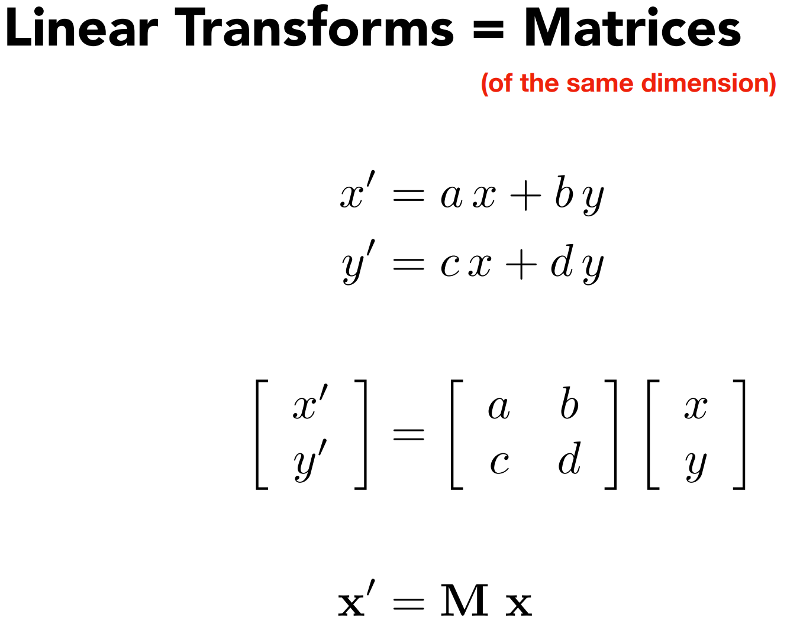

# 变换（二维与三维） Transformation

## Why TRansformation
* Modeling: translation
* Modeling: rotation
* Modeling: scaling
* Viewing: 3D to 2D projection

# Scale
## Scale Transform
## Scale Matrix
* 对角矩阵
## Scale (Non-Uniform)
## Reflection Matrix
* 镜像操作
## Shear Matrix
* 水平方向变换，垂直方向没有变化。
* 
# Rotation (about the origin(0, 0), CCW by default)
## Rotation Matrix
* 
* 
* 不是标志解法，这个是默认了能用矩阵表示旋转的推导。

# Linear Transforms = Matrices
* 
* 线性变换 = 矩阵

# Translation
## Why Homogenous Coordinates
* Unified way to represent all transformation.
* Trade off, 引入新的复杂度来统一。

## Solution: Homogenous Coordinates 齐次坐标系
* 
* 向量平移不变性

## Homogenous Coordinates 齐次坐标系
* Valid operation if w-coordinate of result is 1 or 0
* vector + vector = vector
* point - point  = vector
* point + vector = point
* point + point  = ??，在齐次坐标下，表示两个点的中点

## Affine Transformations 仿射变换
* Affine map = linear map + translation
* Using homogenous coordinates

## 2D Transformations
* Scale
* Rotaion
* Translation

## Inverse Transform 逆变换

# Composite Transform 复合
## Transform Ordering Matters
* Matrix multiplication is `not` commutative
* Note that matrices are applied right to left: `TRS`

## Composing Transforms
* Sequence of affine transforms A1, A2, A3 ...
* Compose by matrix multiplication 矩阵结合律（没有交换律，顺序从右到左）
  * Very important for performance!

## Decomposing Complex Transforms 分解复杂的变换
* How to rotate around a given point c?
* Translate center to orgin, Rotate, Translate back
* T(c).R(Alpha).T(-c)

# 3D Transforms
* Use homogenous coordinates again:

## 3D Transforamtions
* Use 4x4 matrices for affine transformations
* Order? Linear Transform first or Translation first?
* 先线性变换，后平移