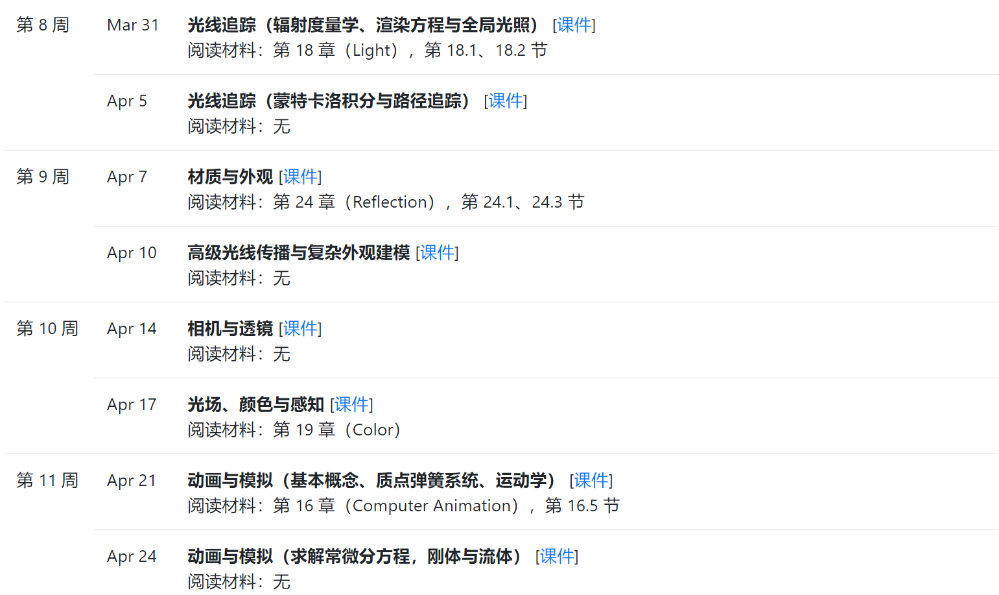

# [GAMES101: 现代计算机图形学入门](https://sites.cs.ucsb.edu/~lingqi/teaching/games101.html)

## 课程介绍：
* 现代计算机图形学的四大组成部分：
  * 光栅化成像
  * 几何表示
  * 光的传播理论
  * 动画与模拟
* 覆盖图形学的方方面面，完整的自上而下的全局把握。
* 现代化的知识，不讲 OpenGL，游戏引擎，三维建模软件
* 教材：Steve Marschner and Peter Shirley，“Fundamentals of Computer Graphics”
* 录像：https://www.bilibili.com/video/av90798049
* 作业：http://games-cn.org/forums/topic/allhw/
* PPT: http://games-cn.org/graphics-intro-ppt-video/

## 计算机图形学概述
  * What is Computer Graphics?
  * Why Study Computer Graphics?
  * Course Topics
  * Course Logistics
## 课程

## [向量与线性代数](./向量与线性代数.md)
## [变换（二维与三维）](./变换_二维与三维.md)
## [变换（模型视图投影）](./变换_模型_视图_投影.md)
## [光栅化(三角形的离散化)](./光栅化_三角形的离散化.md)

## [光栅化（深度测试与抗锯齿）](./光栅化_深度测试与抗锯齿.md)

## [着色（光照与基本着色模型）](./着色_光照与基本着色模型.md)

## [着色（着色频率、图形管线、纹理映射）](./着色_着色频率_图形管线_纹理映射.md)

## [着色（插值、高级纹理映射）](着色_插值_高级纹理映射.md)

## [几何（基本表示方法）](./几何_基本表示方法.md)

# [几何（曲线与曲面）](./几何_曲线与曲面.md)

# [几何（网格处理）、阴影图](./几何_网格处理_阴影图.md)

# 光线追踪（基本原理）

**光线追踪（加速结构）**

**光线追踪（辐射度量学、渲染方程与全局光照）**

**光线追踪（蒙特卡洛积分与路径追踪）**

**材质与外观**

**高级光线传播与复杂外观建模**

**相机与透镜**

**光场、颜色与感知**

**动画与模拟（基本概念、质点弹簧系统、运动学）**

**动画与模拟（求解常微分方程，刚体与流体）**

