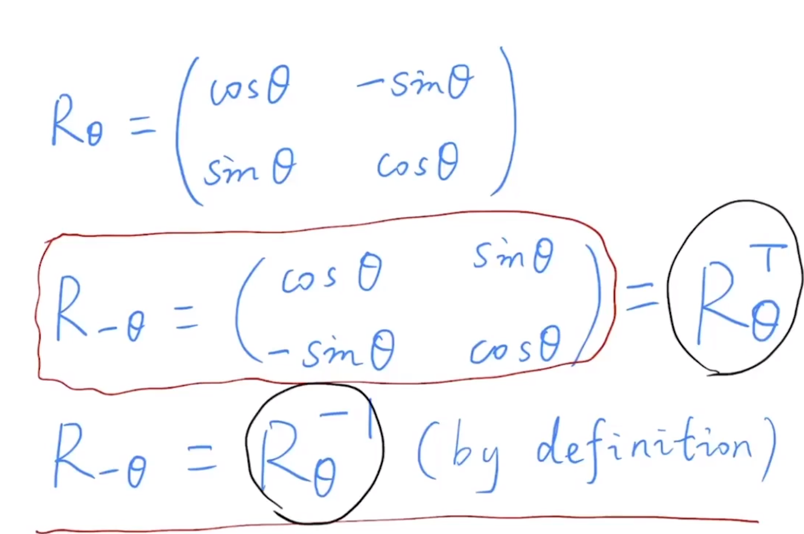
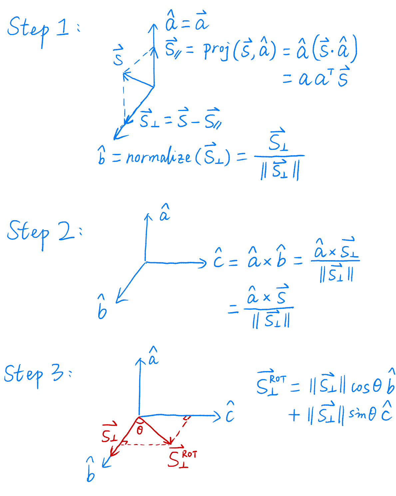
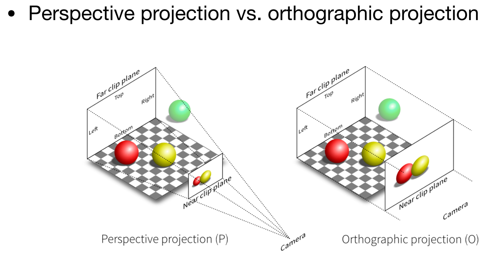
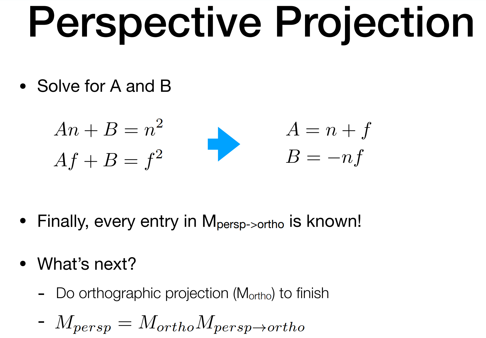

# Transformation Cont. 模型_视图_投影

## 补充
* 

## 3D TRansforamtins
* Scale
* Translation
* Rotation around x-, y-, or z-axis
  * 绕谁谁不变
  * 循环对称性质

# 3D Rotations
* Compose any 3D rotation from Rx, Ry, Rz ?
* So-called Euler angles
* Often used in flight simulators: roll, pitch, yaw 

## Rodrigues' Rotation Formula
* 
* How to prove this magic formula? 任意轴的情况
  * 原理和 2D 分解复杂变换类似：先平移到原点，旋转完，移回去
* 

## 补充：四元数，解决旋转矩阵插值问题。
* 2D 举例，旋转 15 度矩阵，旋转 25 度矩阵，相加取平均并不是旋转 20 度矩阵。不便于进行插值运算。

# View / Camera Transformation
* What is view transformation?
* Think about how to take a photo
  * Find a good place and arrange people(`model` transformation)
  * Find a good "angle" to put the camera (`view` transformation)
  * Cheese!(`projection` transformation)
  * `MVP` 变换
* Hoto perform view Transformation?
* Define the camera first 其实就是定义了一个坐标系
  * Position
  * Loot-at / gaze direction
  * Up dircection
* Key observation
* How about that we always transform the camera to 
  * The origin, up at y, look at -z
  * And transform the objects along with the camera
* Transform the camera by `Mview`
* `Mview` in math?
  * Mview = Rview Tview
  * 
  * 参考上文补充材料，逆矩阵容易写出来，正交矩阵转置矩阵等于逆矩阵。
* Summary
  * Transform objects together with the camera
  * Until camera's at the origin, up at Y, look at -Z
* Also known as Mode/View Transformation
* But why do we need this?
  * For projection transformation!

# Projection Transformation
* Projection in Computer Graphics
  * 3D to 2D
  * Orthographic projection 正交投影
  * Perspective projection 透视投影
  * 道理我都懂，但是鸽子为什么这么大，艹
* Perspective projection vs. Orthographic projection
  * 

## Orthographic Projection
* A simple way of understanding
  * Camera located at origin, looking at -Z, up at Y(looks familiar?)
  * Drop Z coordinate
  * Translate and scale the resulting rectangle to [-1, 1]2
* In general 实际做法
  * We want to map a cuboid to the "canonical" cube[-1, 1]3
* Slightly different orders (to the "simple" way)
  * Center cuboid by translating
  * Scale into "canonical" cube
* Transformation matrix?
  * 
* Caveat
  * Looking at/ along -Z is making near and far not intuitive(n > f)
  * FYI: that's why OpenGL uses left hand coords.

## Perspective Projection
* Most common in Computer Graphics, art, visual system
  * Further objects are smaller
  * Parallel lines not parallel; converge to simgle point
* Before we move on
  * Racall: property of homogeneous coordinates
  * Simple, but useful
* How to do perspective projection
  * 口语化：将视锥体远平面挤小，变成长方体，做正交投影
  * 
* 