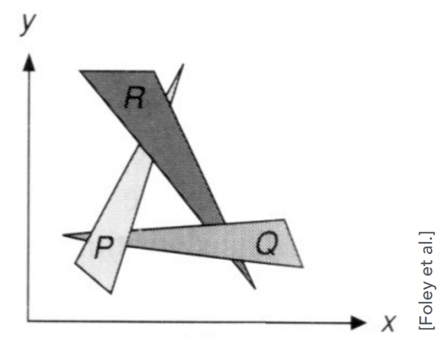
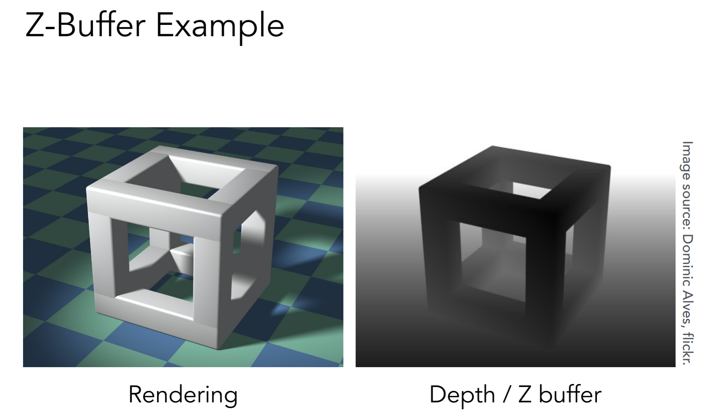
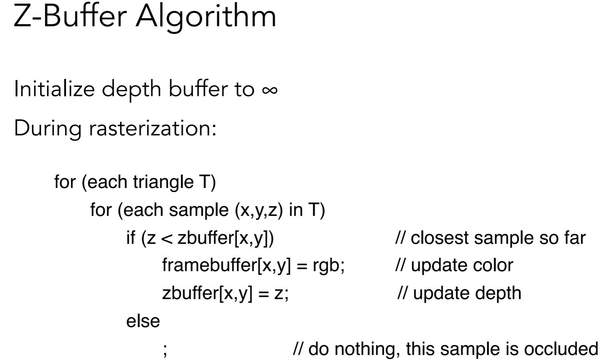
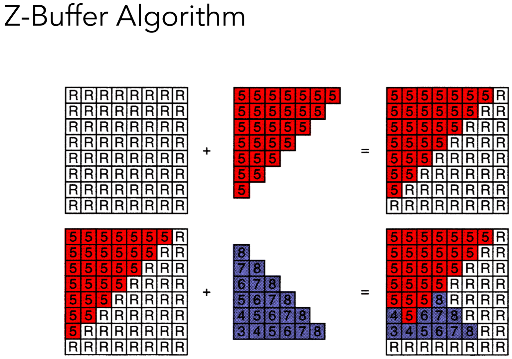

# Shading 1 Illuminatin, Shading and Graphics Pipeline

## Todday
* Visibility / occlusion
  *  - Z-buffering
* Shading
  *  Illumination & Shading
  *  Graphics Pipeline
  
## Painter's Algorithm
* 受到画家油画作画思想
* 先画远景，再画近景，近处的覆盖远处
* Requires sorting in depth O(nlogn) for n triangles
  * Can have unresolvable depth order 无法处理互相遮挡的情况
  * 

## Z-Buffer
* 广泛采用的算法
* Idea:
  * Store current min.z-value for each sample (pixel)
  * Needs an additional buffer for depth values
    * - frame buffer stores color values
    * - depth buffer (z-buffer) stores depth
  * IMPORTANT: For simplicity we suppose
    * Z is always positive
    * smaller Z -> closer, larger z-> further)
* Z-Buffer Example
  * 
* Z-Buffer Algorithm
  * 
  * 
* Z-Buffer Complexity
  * O(n) for n triangles (assuming constant coverage)
  * How is it possible to sort n triangle in linear time?
  * 这里并没有排序，遍历只取最小值
  * Drawing triangles in different orders?
    * 和顺序无关 Implemented in hardware for all GPUS
    * depth fighting

## Shading