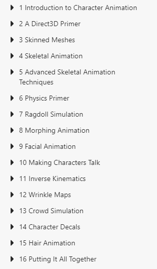

# 1 Introduction to Character Animation

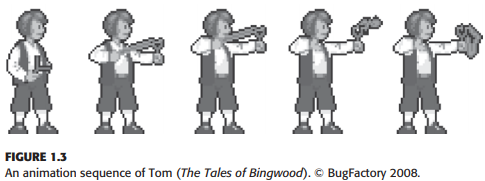

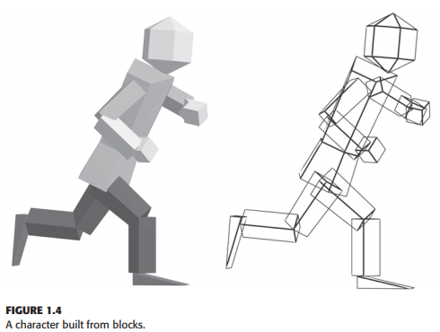

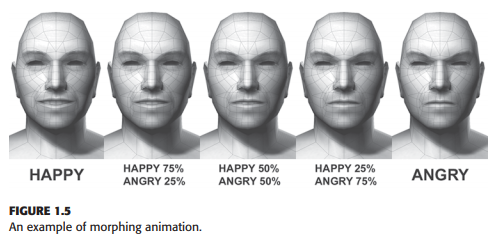


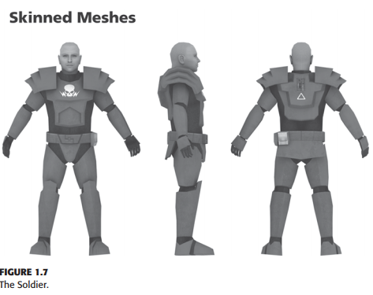

# 2 A Direct3D Primer

DirectX 9 太过时了，简单了解。

可以用 DirextX 12 搭建 VisualStudio 的开发环境。

* 创建窗口
* 加载 StaticMesh

# 3 Skinned Meshes

## 骨架树对应到 StaticMesh 上

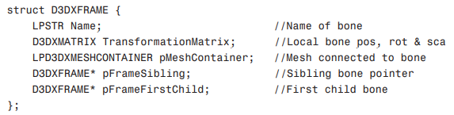

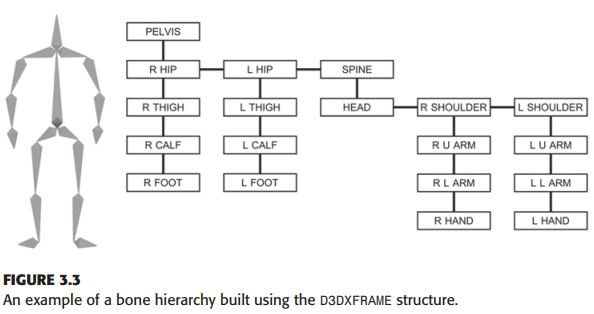

DirectX 加载骨架树，将 Mesh 应用到骨架树

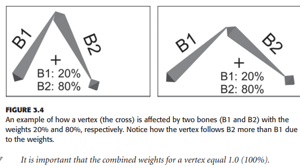

## Software Skinning 概述使用 CPU 蒙皮

With software  skinning, it also doesn’t matter how many bones are influencing a vertex. 使用 CPU 蒙皮，一个骨骼可以影响任意数量的顶点。

 If you were making a first-person shooter (FPS) game, you might want to test to see whether or not a bullet you fired hit one of the enemy soldiers. With software  skinning, this would be easy to test using a simple mesh–ray intersection test. 碰撞检测查询也更加容易

## Hardware Skinning 概述使用 GPU 蒙皮

With hardware skinning, you can, of course, also do shadow casting, picking, etc., but then it requires a little more effort to get it to work. Hardware skinning also has some limits as to how many bones can influence a vertex as well as how many bones you can have per character without having to split up the mesh into several parts.  也能计算阴影，但是单个骨骼能影响的顶点数量有限制。

## 实现 Software Skinning

```
1. (Optional) Overload D3DXFRAME
2. (Optional) Overload D3DXMESHCONTAINER
3. Implement the ID3DXAllocateHierarchy interface
4. Load a bone hierarchy and associated meshes, skinning information, etc.,
with the D3DXLoadMeshHierarchyFromX() function
5. For each frame, update the skeleton pose (i.e., the SkinnedMesh::
UpdateMatrices() function)
6. Update the target mesh using ID3DXSkinInfo::UpdateSkinnedMesh()
7. Render the target mesh as a common static mesh
```

## 实现 HardWare Skinning

```
1. (Optional) Overload D3DXFRAME
2. (Optional) Overload D3DXMESHCONTAINER
3. Implement the ID3DXAllocateHierarchy interface
4. Load a bone hierarchy and associated meshes, skinning information, etc.,
with the D3DXLoadMeshHierarchyFromX() function
5. Convert the mesh to an Index Blended Mesh
6. For each frame, update the skeleton pose (i.e., the SkinnedMesh::
UpdateMatrices() function)
7. Upload the Matrix Palette (bone matrices) to the vertex shader
8. Render the Index Blended Mesh using the vertex shader
```

大部分步骤和 CPU 蒙皮类似，2个新的概念：The Matrix Palette, an Index Blended Mesh。

### The Matrix Palette

其实就是骨骼 Transform 的数组

不像 CPU 数组大小是几乎无限的，GPU 的硬件的 vertex shader constants 支持决定了 Matrix Palette 的大小

```
3DCAPS9 caps;
d3d9->GetDeviceCaps(D3DADAPTER_DEFAULT, D3DDEVTYPE_HAL, &caps);
int approxNumBones = caps.MaxVertexShaderConst / 4;
```

除此之外，world， view， projection matrices and textures，etc  剩下的才是给 the Matrix Palette 使用。

如果骨架的骨骼数量过多，模型 Mesh 将会拆分成不同的部分，rendered in several passes

Vertex Shader 2.0 支持 256 vertex constants，大多数情况下够用

### Index Blended Meshes

将 mesh 转换成 Index Blended Mesh

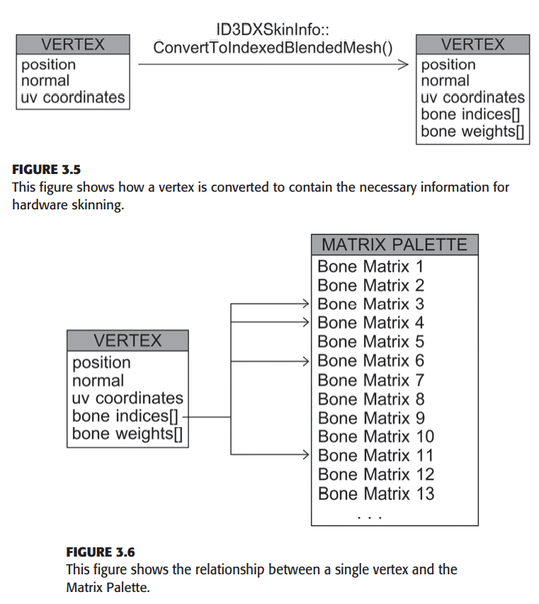

### The Skinning Vertex Shader

High Level Shading Langeuage （HLSL）

## Rendering Static Meshes In Bone Hierarchies

不是所有角色都需要蒙皮，机器动画就是一个例子，没有柔软的部分。

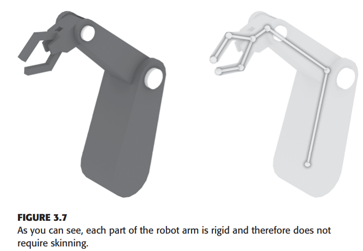

```
HRESULT BoneHierarchyLoader::CreateMeshContainer(...)
{
//Create new Bone Mesh
...
//Get mesh data here
...
//Copy materials and load textures (like with a static mesh)
...
68 Character Animation with Direct3D
FIGURE 3.7
As you can see, each part of the robot arm is rigid and therefore does not
require skinning.
if(pSkinInfo != NULL)
{
//Store Skin Info and convert mesh to Index Blended Mesh
...
}
//Set ppNewMeshContainer to newly created boneMesh container
...
}
```

如果 pSkinInfo 参数为 Null 的话，就不进行 Index Blended Meshes 转换。

# 4 Skeletal Animation

## Key Frame Animation

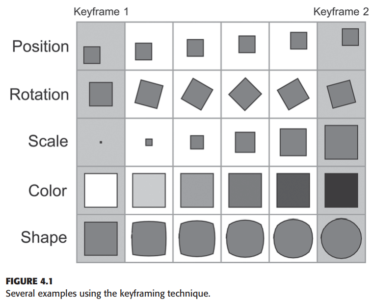

## Animation Sets 数据结构

## The ID3DXAnimationContorller Interface

### Loading The Animaiton Data

## Multiple Animation Controllers

优化方案，同一个模型使用不同的动画。

```
0. CloneAnimationController(...)

1. Call AdvanceTime() for the active animation controller.
2. Calculate the world matrix for this character instance.
3. Update the combined transformation matrices for the skinned mesh with
the world matrix.
4. Render the skinned mesh.
5. Repeat with the next character instance
```


# 5 Advanced Skeletal Animation Techniques

## The Track structure

### Animation Track Properties

Position, Weight, Speed 之外，还有 priority 表示离 Player/camera 的距离。

关掉 Tick，优化性能

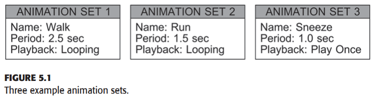

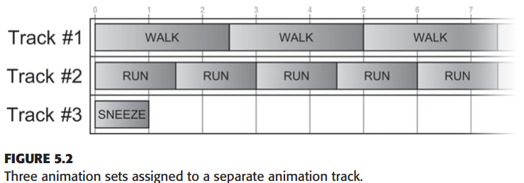

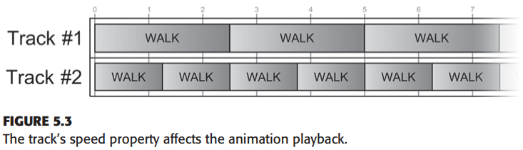

## Blending Multiple animations

```c++
//Assign them to two different tracks
m_animController->SetTrackAnimationSet(0, anim1);
m_animController->SetTrackAnimationSet(1, anim2);
//Set random weight
float w = (rand()%1000) / 1000.0f;
m_animController->SetTrackWeight(0, w);
m_animController->SetTrackWeight(1, 1.0f - w)
```

## Compressing animation sets 

```c++
ID3DXKeyframedAnimationSet* animSet = NULL;
// ...
//Create or load the animation set you want to convert here...
// ...
//Compress the animation set
ID3DXBuffer* compressedData = NULL;
animSet->Compress(D3DXCOMPRESS_DEFAULT, 0.5f, NULL, &compressedData);
// Create the compressed animation set
ID3DXCompressedAnimationSet* compressedAnimSet = NULL;
D3DXCreateCompressedAnimationSet(animSet->GetName(), 
animSet->GetSourceTicksPerSecond(),
animSet->GetPlaybackType(), 
compressedData,
Chapter 5 Advanced Skeletal Animation Techniques 91
0, NULL, 
&compressedAnimSet);
//Release the compressed data
compressedData->Release();
```

## Animation callbacks 

与动画同步的事件，例如播放脚步声音

```c++
D3DXKEY_CALLBACK CreateACallBackKey(float time)
{
D3DXKEY_CALLBACK key;
key.Time = time;
key.pCallbackData = (void*)&userData;
return key;
}

class CallbackHandler : public ID3DXAnimationCallbackHandler
{
    public:
    HRESULT CALLBACK HandleCallback(THIS_ UINT Track, 
    LPVOID pCallbackData)
    {
        //Access the user defined data linked to the callback key
        A_USER_DEFINED_STRUCT *u;
        u = (A_USER_DEFINED_STRUCT*)pCallbackData;
        if(u->m_someValue == 0)
        {
       	 //Do something
        }
        else
        {
        	//Do something else...
        }
        return D3D_OK;
    }
};
```

## Motion capture (Mocap)

optical, magnetic, and mechanical. 光学、磁性和机械。都很贵，而且需要大量校准

### Optical Motion Capture Systems

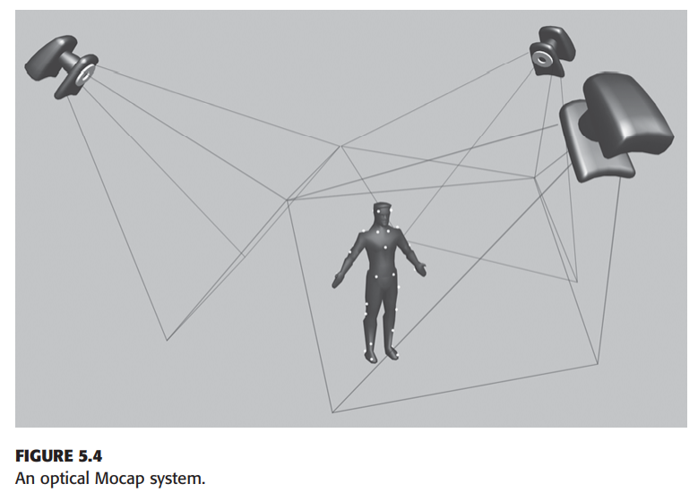

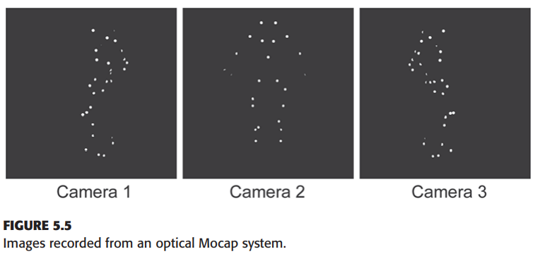

#### Marker-Less Motion Capture

利用图像识别算法，无需标记点，专注于身体某些部位，轮廓检测等等。特别适合面部动画

### Magnetic Motion Capture Systems

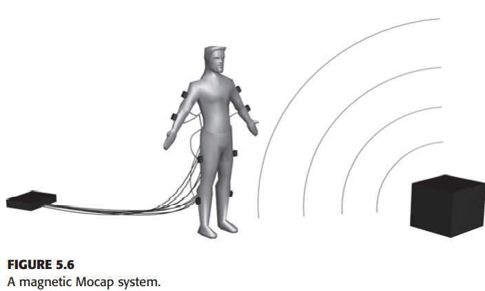

传感器测量位置和方向信息，非常适合实时东部的场景 TV shows 直播

### Mechanical Motion Capture System

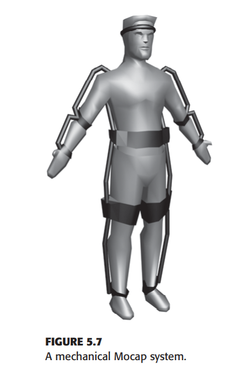

无法记录位置信息，jumping ，真实的 running。

外骨骼往往相当笨重，会限制演员。机械 Mocap 系统不会受到干扰，遮挡等类似问题。

# 6 Physics Primer

## Introduction to Rigid Body Physics 

### NewTon's Laws of Motion

$$
F = ma
$$

$$
a =  \frac{F}{m}
$$

$$
F_G = G \frac{m_1 * m_2}{d^2}
$$

### The Effect of Forces On A Rigid Body

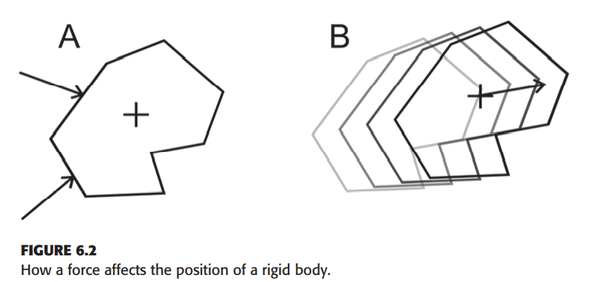

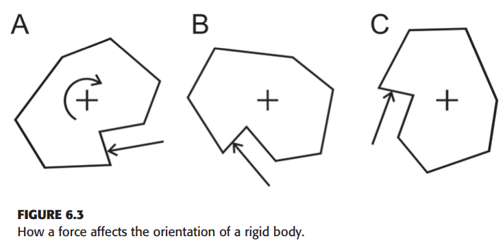

描述物体方向朝向的 3 种方法，Euler angles， Rotation matrix， Quaternions

### Quaternions 

$$
q = [w, x, y, z]
$$

爱尔兰数学家 Sir William Hamilton 200 多年前

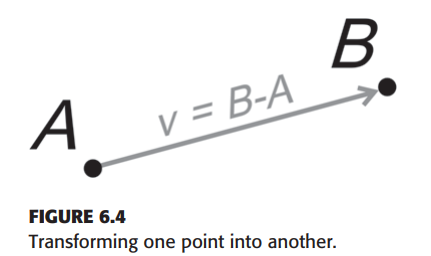


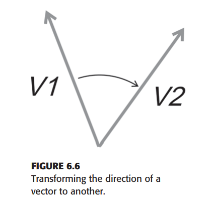

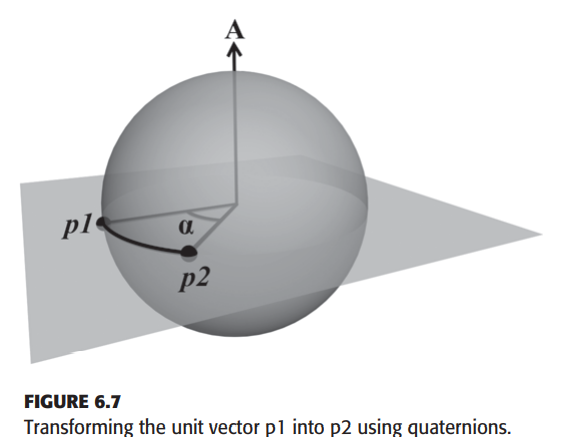
$$
q = [cox(a/2), x*sin(a/2), y*sin(a/2), z*sin(a/2)]
$$

```c++
//Previous example in code
D3DXVECTOR3 A(0.2f, 0.6f, -0.3f); //Any arbitrary axis
D3DXVec3Normalize(&A, &A); //Normalized
float angle = 0.342f; //Arbitrary angle
//Quaternion is then defined as
D3DXQUATERNION q; 
q.w = cos(angle * 0.5f);
q.x = sin(angle * 0.5f) * A.x;
q.y = sin(angle * 0.5f) * A.y;
q.z = sin(angle * 0.5f) * A.z
```

## Describing The World

Axis-Aligned Bounding Box (AABB), Orientd Bounding Boxes (OBB)

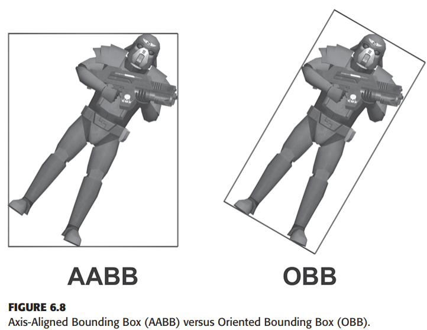

### The Oriented bounding box  Class

```C++
class OBB
{
    public:
        OBB();
        OBB(D3DXVECTOR3 size);
        bool Intersect(D3DXVECTOR3 &point);
        bool Intersect(OBB &b);
    public:
        D3DXVECTOR3 m_size, m_pos;
        D3DXQUATERNION m_rot;
};

class AABB
{
	public:
        AABB(D3DXVECTOR3 max, D3DXVECTOR3 min)
        {
        m_max = max;
        m_min = min;
        }
    
        bool Intersect(D3DXVECTOR3 &p)
        {
            if(p.x < m_min.x || p.x > m_max.x)return false;
            if(p.y < m_min.y || p.y > m_max.y)return false;
            if(p.z < m_min.z || p.z > m_max.z)return false;
            return true;
        }
    
    public:
    	D3DXVECTOR3 m_max, m_min;
};
```

## Physics Simulation

```C++
class PHYSICS_OBJECT
{
    public:
        virtual void Update(float deltaTime) = 0;
        virtual void Render() = 0;
        virtual void AddForces() = 0;
        virtual void SatisfyConstraints(vector<OBB*> &obstacles) = 0;
};

class PHYSICS_ENGINE
{
    public:
        PHYSICS_ENGINE();
        void Init();
        void Update(float deltaTime);
        void AddForces();
        void SatisfyConstraints();
        void Render();
        void Reset();
    private:
        vector<PHYSICS_OBJECT*> m_physicsObjects;
        vector<OBB*> m_obstacles;
        float m_time;
};
```

```
1. Add forces (gravity, wind).
2. Update position.
3. Satisfy constraints (check for collisions, and move object to a legal position).
```

### Position, Velocity, And Acceleration

$$
p_n = p + v*\delta t
$$

$$
v_n = v + a*\delta t
$$

$$
a = \frac{f}{m}
$$

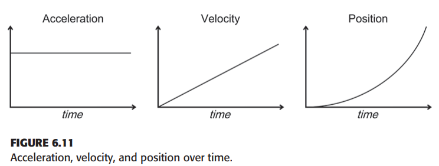

### The Particle

粒子可以有质量，但是没有体积和朝向。不记录速度，而是记录目前位置和之前的位置，称为 Verlet integration
$$
p_n= 2P_c- p_o + a\delta t
$$

$$
p_o = p_c
$$

```C++
D3DXVECTOR3 temp = m_pos;
m_pos += (m_pos - m_oldPos) + m_acceleration * deltaTime * deltaTime;
m_oldPos = temp
```

### The spring

Hooke's Law 胡克定律
$$
F = -kx
$$
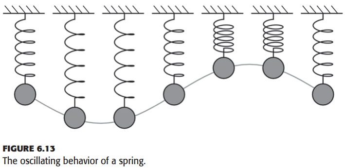

```C++
class SPRING : public PHYSICS_OBJECT
{
    public:
        SPRING(PARTICLE *p1, PARTICLE *p2, float restLength);
        void Update(float deltaTime){}
        void Render();
        void AddForces(){}
        void SatisfyConstraints(vector<OBB*> &obstacles);
    private:
        PARTICLE *m_pParticle1;
        PARTICLE *m_pParticle2;
        float m_restLength;
};
void SPRING::SatisfyConstraints(vector<OBB*> &obstacles)
{
    D3DXVECTOR3 delta = m_pParticle1->m_pos - m_pParticle2->m_pos;
    float dist = D3DXVec3Length(&delta);
    float diff = (dist-m_restLength)/dist;
    m_pParticle1->m_pos -= delta * 0.5f * diff;
    m_pParticle2->m_pos += delta * 0.5f * diff;
}
```


# 7 Ragdoll Simulation

Ragdoll animation is a procedural animation，布娃娃动画是程序驱动动画

## Bullet Physics Engine

## Constraints 约束

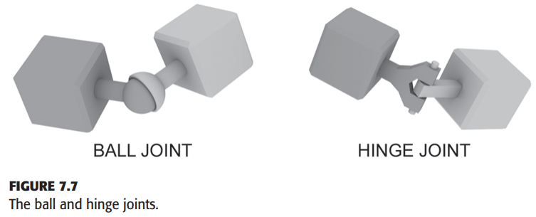

```
Point-to-point constraint (a.k.a. ball joint)
Hinge constraint
Twist cone constraint
6 degrees of freedom (DoF) constraint 
```

## Constructing The Rigdoll

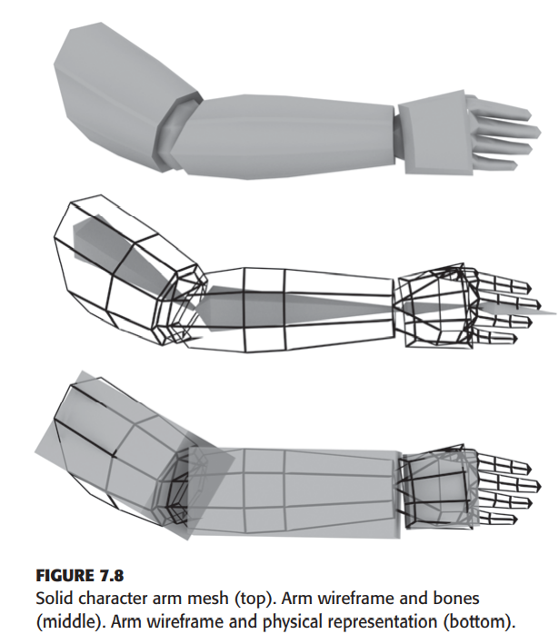

```C++
class RagDoll : public SkinnedMesh
{
    public:
        RagDoll(char fileName[], D3DXMATRIX &world);
        ~RagDoll();
        void InitBones(Bone *bone);
        void Release();
        void Update(float deltaTime);
   		void Render();
 	    void UpdateSkeleton(Bone* bone);
    	OBB* CreateBoneBox(Bone* parent, Bone *bone, D3DXVECTOR3 size, D3DXQUATERNION rot);
  		void CreateHinge(Bone* parent, OBB* A, OBB* B, 
    	float upperLimit, float lowerLimit, D3DXVECTOR3 hingeAxisA, D3DXVECTOR3 hingeAxisB, bool ignoreCollisions=true);
    	void CreateTwistCone(BONE* parent, OBB* A, OBB* B, 
    	float limit, D3DXVECTOR3 hingeAxisA, D3DXVECTOR3 hingeAxisB, bool ignoreCollisions=true);
    private:
    	vector<OBB*> m_boxes; //Boxes for physics simulation
};
```

## Updating The Character Mesh from The Ragdoll

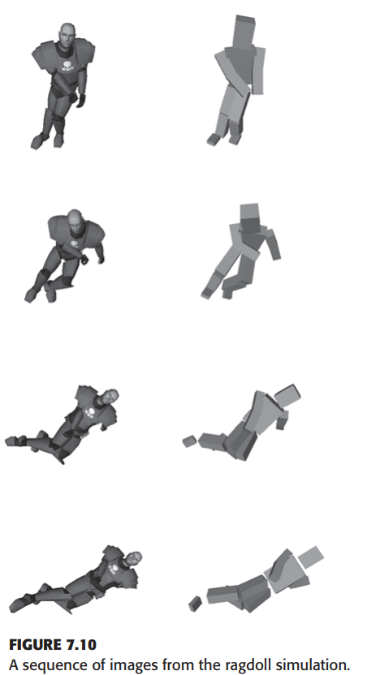

# 8 Morphing Animation

第一代 Quake 雷神之锤使用了 morphing animation 来驱动角色动画。

```
Introduction to morphing animation
Morphing animation on the GPU with vertex shaders
Combining morphing animation with skeletal animation
```

## Basics of Morphing Animation

线性插值 linear interpolation (LERP)
$$
v_1 = [x_1, y_1, z_1]
$$

$$
v2 = [x_2, y_2, z_2]
$$

$$
v = v_2 * p + v_1*(1-p)
$$


类似 Vertex 的位置，normal，UV coordinates 也是可以动画驱动。

A morphed mesh 是由 2 个 Target mesh 进行 Blend 插值得出

```C++
BYTE *target01, *target02, *face;
//Lock morph target vertex buffers
m_pTarget01->LockVertexBuffer(D3DLOCK_READONLY, (void**)&target01);
m_pTarget02->LockVertexBuffer(D3DLOCK_READONLY, (void**)&target02);
//Lock destination vertex buffer
m_pFace->LockVertexBuffer(0, (void**)&face);
//Blend the morph targets and store in the destination mesh
for(int i=0; i<m_pFace->GetNumVertices(); i++)
{
    //Get position of the two target vertices
    D3DXVECTOR3 t1 = *((D3DXVECTOR3*)target01);
    D3DXVECTOR3 t2 = *((D3DXVECTOR3*)target02);
    D3DXVECTOR3 *f = (D3DXVECTOR3*)face;
    //Perform morphing
    *f = t2 * m_blend + t1 * (1.0f - m_blend);
    //Move to next vertex
    target01 += m_pTarget01->GetNumBytesPerVertex();
    target02 += m_pTarget01->GetNumBytesPerVertex();
    face += m_pFace->GetNumBytesPerVertex();
}
//Unlock all vertex buffers
m_pTarget01->UnlockVertexBuffer();
m_pTarget02->UnlockVertexBuffer();
m_pFace->UnlockVertexBuffer();
```

## Using Multiple Morph Targets


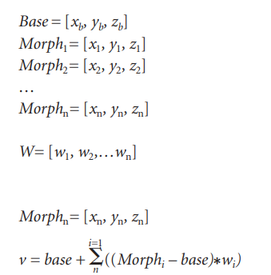

```C++
ID3DXMesh *pBaseMesh;
ID3DXMesh *pDestMesh;
vector<ID3DXMesh*> morphTargets;
vector<float> weights;
//Load base mesh, morph target meshes, and set weights
//Also create the destination mesh as a clone of the base mesh
//For each vertex in the base mesh
for(int vertex = 0; vertex < pBaseMesh->GetNumVertices(); vertex++)
{
    //Get vertex position
    D3DXVECTOR3 pos = GetVertexPosition(pBaseMesh, vertex);
    //Create a new position 
    //(which will be the final blended vertex position)
    D3DXVECTOR3 newPos = pos;
    //For each active morph target (it’s weight != zero)
    for(int target = 0; target < morphTargets.size(); target++)
    {
        If(weights[vertex] == 0.0f)
        continue;
        //Get morph targets vertex position
        D3DXVECTOR3 targetPos;
        targetPos = GetVertexPosition(morphTargets[target], vertex);
        //Add the weighted difference to the final position
        newPos += (targetPos – pos) * weights[vertex];
    }
//Assign the new position to the destination mesh
SetVertexPosition(pDestMesh, vertex, newPos);
}
```

## Morphing Animation On The GPU

大量的 meshes 使用大量的 morph targets，CPU 会出现瓶颈。

GPU 原理，每个 vertex shader 只在每个 vertex 运行一次。必须在每个 vertex 上处理多个 position，基础 base 的位置再加上每个 active morph target 的位置信息。vertex normal 和 UV 也是如此。

传统的 vectex 结构

```c++
struct Vertex
{
    D3DXVECTOR3 position;
    D3DXVECTOR3 normal;
    D3DXVECTOR2 uv;
    static const DWORD FVF;
};
...
const DWORD Vertex::FVF = D3DFVF_XYZ | D3DFVF_NORMAL | D3DFVF_TEX1;
```

### Custom Vertex Formats

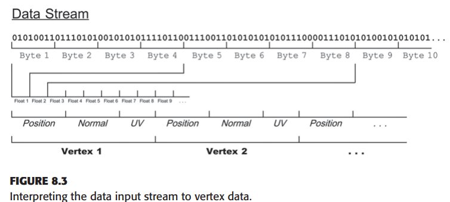

```C++
struct D3DVERTEXELEMENT9 {
    WORD Stream; //Stream No
    WORD Offset; //Start of this element in bytes
    BYTE Type; //Element type (float1 ... float4, D3DCOLOR, etc.)
    BYTE Method; //Tesselation method 
    BYTE Usage; //Usage of element (position, normal, color, etc.)
    BYTE UsageIndex; //Suffix number used in the vertex shader
};
```

### Creating The Morph Vertex Declaration

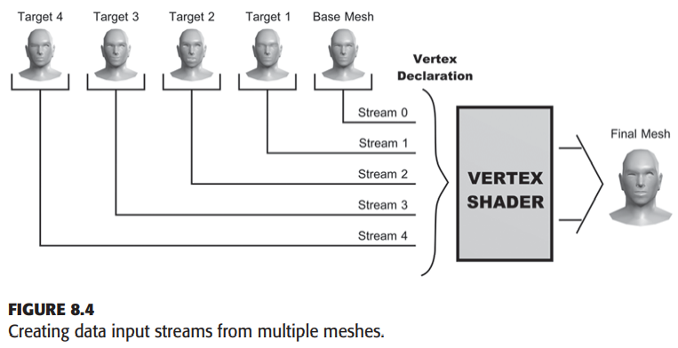

```C++
//The morph vertex format
D3DVERTEXELEMENT9 morphVertexDecl[] = 
{
    //Stream 0: Base Mesh
    {0, 0, D3DDECLTYPE_FLOAT3, D3DDECLMETHOD_DEFAULT, D3DDECLUSAGE_POSITION, 0},
    {0, 12, D3DDECLTYPE_FLOAT3, D3DDECLMETHOD_DEFAULT, D3DDECLUSAGE_NORMAL, 0},
    {0, 24, D3DDECLTYPE_FLOAT2, D3DDECLMETHOD_DEFAULT, D3DDECLUSAGE_TEXCOORD, 0},
    //Stream 1: 1st Morph Target
    {1, 0, D3DDECLTYPE_FLOAT3, D3DDECLMETHOD_DEFAULT, D3DDECLUSAGE_POSITION, 1},
    {1, 12, D3DDECLTYPE_FLOAT3, D3DDECLMETHOD_DEFAULT, D3DDECLUSAGE_NORMAL, 1},
    {1, 24, D3DDECLTYPE_FLOAT2, D3DDECLMETHOD_DEFAULT, D3DDECLUSAGE_TEXCOORD, 1},
    //Stream 2: 2nd Morph Target
    {2, 0, D3DDECLTYPE_FLOAT3, D3DDECLMETHOD_DEFAULT, D3DDECLUSAGE_POSITION, 2},
    {2, 12, D3DDECLTYPE_FLOAT3, D3DDECLMETHOD_DEFAULT, 
    D3DDECLUSAGE_NORMAL, 2},
    {2, 24, D3DDECLTYPE_FLOAT2, D3DDECLMETHOD_DEFAULT, D3DDECLUSAGE_TEXCOORD, 2},
    //Stream 3: 3rd Morph Target
    {3, 0, D3DDECLTYPE_FLOAT3, D3DDECLMETHOD_DEFAULT, D3DDECLUSAGE_POSITION, 3},
    {3, 12, D3DDECLTYPE_FLOAT3, D3DDECLMETHOD_DEFAULT, D3DDECLUSAGE_NORMAL, 3},
    {3, 24, D3DDECLTYPE_FLOAT2, D3DDECLMETHOD_DEFAULT, D3DDECLUSAGE_TEXCOORD, 3},
    //Stream 4: 4th Morph Target
    {4, 0, D3DDECLTYPE_FLOAT3, D3DDECLMETHOD_DEFAULT, D3DDECLUSAGE_POSITION, 4},
    {4, 12, D3DDECLTYPE_FLOAT3, D3DDECLMETHOD_DEFAULT, D3DDECLUSAGE_NORMAL, 4},
    {4, 24, D3DDECLTYPE_FLOAT2, D3DDECLMETHOD_DEFAULT, D3DDECLUSAGE_TEXCOORD, 4},
    D3DDECL_END()
};
```

在使用 Custom vertex element array 前，需要将其编译到一个 vertex delaration

```C++
//The Custom Vertex Declaration
IDirect3DVertexDeclaration9 *m_pDecl = NULL;
//Create the vertex declaration using the D3DVERTEXELEMENT9 array
pDevice->CreateVertexDeclaration(morphVertexDecl, &m_pDecl);

//Get size per vertex in bytes 
DWORD vSize = D3DXGetFVFVertexSize(m_pBaseMesh->GetFVF());
//Set base stream
IDirect3DVertexBuffer9* baseMeshBuffer = NULL;
m_pBaseMesh->GetVertexBuffer(&baseMeshBuffer);
pDevice->SetStreamSource(0, baseMeshBuffer, 0, vSize);
//Set target streams
for(int i=0; i<4; i++)
{
    IDirect3DVertexBuffer9* targetMeshBuffer = NULL;
    m_pTargets[i]->GetVertexBuffer(&targetMeshBuffer);
    pDevice->SetStreamSource(i + 1, targetMeshBuffer, 0, vSize);
}
//Set index buffer
IDirect3DIndexBuffer9* ib = NULL;
m_pBaseMesh->GetIndexBuffer(&ib);
pDevice->SetIndices(ib);

//Create some weights as a D3DXVECTOR4
D3DXVECTOR4 weights((rand()%1000) / 1000.0f,
(rand()%1000) / 1000.0f,
(rand()%1000) / 1000.0f,
(rand()%1000) / 1000.0f);
//Upload weights to shader
m_pEffect->SetVector("morphWeights", &weights);
```

### The Morphing Vertex Shader

* Note that it is very important that the vertex shader input structure matches the vertex declaration (data types + usage index). Otherwise, you’ll most likely  experience a blue-screen crash that requires a hard reboot of your computer.

```C++
//Vertex Input
struct VS_INPUT
{ 
    float4 basePos : POSITION0;
    float3 baseNorm : NORMAL0;
    float2 baseUV : TEXCOORD0;
    float4 targetPos1 : POSITION1;
    float3 targetNorm1 : NORMAL1;
    float4 targetPos2 : POSITION2;
    float3 targetNorm2 : NORMAL2;
    float4 targetPos3 : POSITION3;
    float3 targetNorm3 : NORMAL3;
    float4 targetPos4 : POSITION4;
    float3 targetNorm4 : NORMAL4;
};
//Vertex Output / Pixel Shader Input
struct VS_OUTPUT
{
    float4 position : POSITION0;
    float2 tex0 : TEXCOORD0;
    float shade : TEXCOORD1;
};

//Vertex Shader
VS_OUTPUT vs_lighting(VS_INPUT IN)
{
    VS_OUTPUT OUT = (VS_OUTPUT)0;
    float4 pos = IN.basePos;
    float3 norm = IN.baseNorm;
    //Blend Position
    pos += (IN.targetPos1 - IN.basePos) * weights.r;
    pos += (IN.targetPos2 - IN.basePos) * weights.g;
    pos += (IN.targetPos3 - IN.basePos) * weights.b;
    pos += (IN.targetPos4 - IN.basePos) * weights.a;
    //Blend Normal
    norm += (IN.targetNorm1 - IN.baseNorm) * weights.r;
    norm += (IN.targetNorm2 - IN.baseNorm) * weights.g;
    norm += (IN.targetNorm3 - IN.baseNorm) * weights.b;
    norm += (IN.targetNorm4 - IN.baseNorm) * weights.a;
    //Getting the position of the vertex in the world
    float4 posWorld = mul(pos, matW);
    float4 normal = normalize(mul(norm, matW));
    //Transforming to screen space
    OUT.position = mul(posWorld, matVP);
    OUT.shade = max(dot(normal, normalize(lightPos - posWorld)), 0.2f);
    OUT.tex0 = IN.baseUV;
    return OUT;
}
```

### Combining Skeletal And Morphing Animation

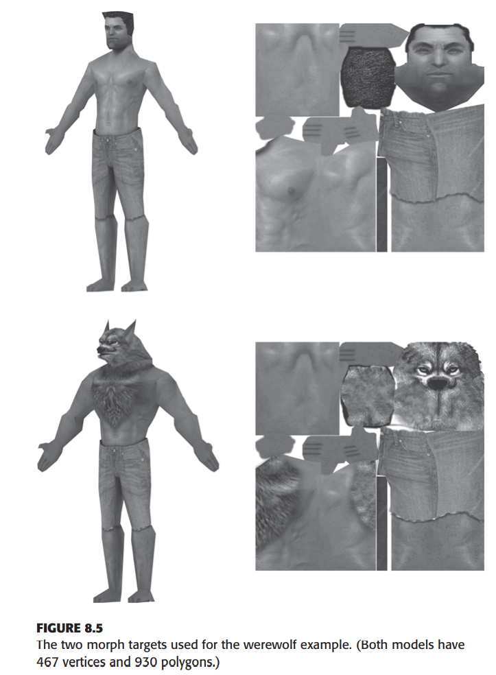

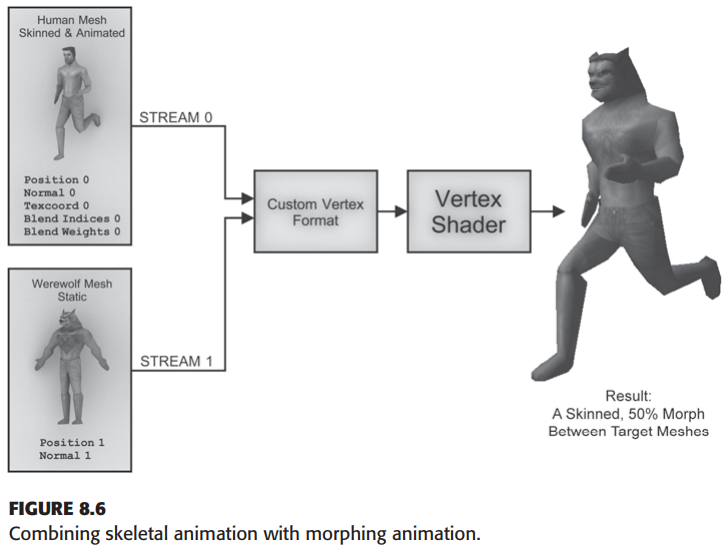

```c++
...
```

# 9  Facial Animation

```
Adding eyes to the character
Loading multiple facial morph targets from a single .x file
The Face and the FaceController classes
A face factory system for generating faces in runtime
```

## Overview

NPC facial expresions 可以大大提高沉浸感，担忧，害怕，开心，其它各种情绪。

### Facial Expressions


Speech，Emotion， Eye movements

## The Eye of The Beholder

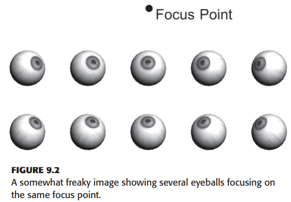

## The Face Class

```
Base mesh
Blink mesh
Emotion meshes (smile, frown, fear, etc.)
Speech meshes (i.e., mouth shapes for different sounds; more on this in the
next chapter)
```

### Loading Multiple Targets form One .X File

### Extracting Meshes From a D3DXFrame Hierarchy

### Implementing the Face Class

```C++
class Face
{
    public:
        Face(string filename);
        ~Face();
        void TempUpdate();
        void Render();
        void ExtractMeshes(D3DXFRAME *frame);
    public:
        ID3DXMesh *m_pBaseMesh;
        ID3DXMesh *m_pBlinkMesh;
        vector<ID3DXMesh*> m_emotionMeshes;
        vector<ID3DXMesh*> m_speechMeshes;
        IDirect3DVertexDeclaration9 *m_pFaceVertexDecl;
        IDirect3DTexture9 *m_pFaceTexture;
        ID3DXEffect *m_pEffect;
        D3DXVECTOR4 m_morphWeights;
        Eye m_eyes[2];
};
```

## The Face Controller Structure

### Animation Channels

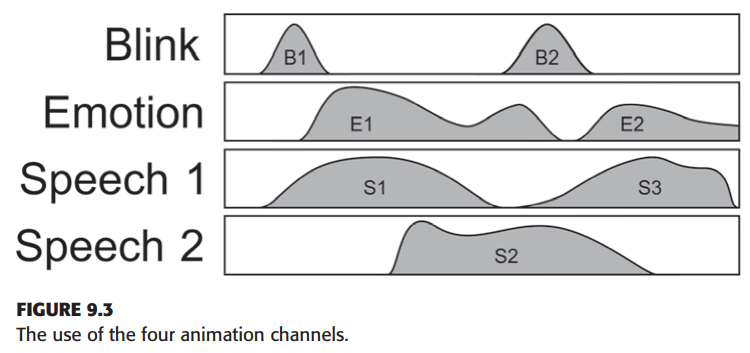

```C++
class FaceController
{
    friend class Face;
    public:
        FaceController(D3DXVECTOR3 pos, FACE *pFace);
        void Update(float deltaTime);
        void Render();
    public:
        Face *m_pFace;
        int m_emotionIndex;
        int m_speechIndices[2];
        D3DXVECTOR4 m_morphWeights;
        D3DXMATRIX m_headMatrix;
        Eye m_eyes[2];
};
```

### Face Factory

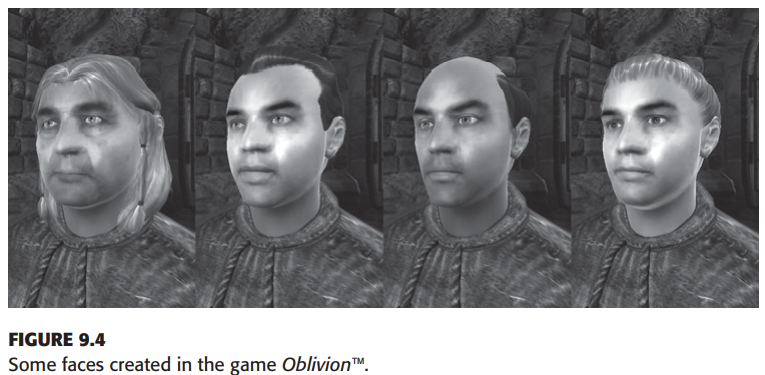

```
Nose width, height, length, and shape
Mouth width, position, and shape
Eye position and size
Ear shape and position
Jaw shape
Head shape
```

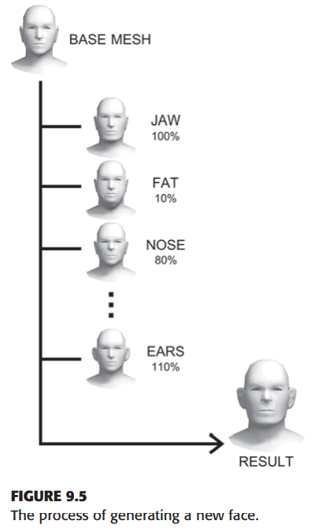

```C++
class FaceFactory
{
    public:
        FaceFactory(string filename);
        ~FaceFactory();
        FACE* GenerateRandomFace();
    private:
        void ExtractMeshes(D3DXFRAME *frame);
        ID3DXMesh* CreateMorphTarget(ID3DXMesh* mesh, 
        vector<float> &morphWeights);
    public:
        ID3DXMesh *m_pBaseMesh;
        ID3DXMesh *m_pBlinkMesh;
        ID3DXMesh *m_pEyeMesh;
        vector<ID3DXMesh*> m_emotionMeshes;
        vector<ID3DXMesh*> m_speechMeshes;
        vector<ID3DXMesh*> m_morphMeshes;
        vector<IDirect3DTexture9*> m_faceTextures;
};

Face* FaceFactory::GenerateRandomFace()
{
    //Create random 0.0f - 1.0f morph weight for each morph target
    vector<float> morphWeights;
    for(int i=0; i<(int)m_morphMeshes.size(); i++)
    {
    float w = (rand()%1000) / 1000.0f;
    morphWeights.push_back(w);
	}
    //Next create a new empty face
    Face *face = new Face();
    //Then clone base, blink, and all emotion and speech meshes
    face->m_pBaseMesh = CreateMorphTarget(m_pBaseMesh, morphWeights);
    face->m_pBlinkMesh = CreateMorphTarget(m_pBlinkMesh, morphWeights);
    for(int i=0; i<(int)m_emotionMeshes.size(); i++)
    {
        face->m_emotionMeshes.push_back(
        CreateMorphTarget(m_emotionMeshes[i], morphWeights));
    }
    for(int i=0; i<(int)m_speechMeshes.size(); i++)
    {
        face->m_speechMeshes.push_back(
        CreateMorphTarget(m_speechMeshes[i], morphWeights));
    }
    //Set a random face texture as well
    int index = rand() % (int)m_faceTextures.size();
    m_faceTextures[index]->AddRef();
    face->m_pFaceTexture = m_faceTextures[index];
    //Return the new random face
    return face;
}

ID3DXMesh* FaceFactory::CreateMorphTarget(ID3DXMesh* mesh, vector<float> &morphWeights)
{
    if(mesh == NULL || m_pBaseMesh == NULL)
   		return NULL;
    //Clone mesh
    ID3DXMesh* newMesh = NULL;
    if(FAILED(mesh->CloneMeshFVF(D3DXMESH_MANAGED, mesh->GetFVF(), pDevice, &newMesh)))
    {
        //Failed to clone mesh
        return NULL;
    }
    //Copy base mesh data
    FACEVERTEX *vDest = NULL, *vSrc = NULL;
    FACEVERETX *vMorph = NULL, *vBase = NULL;
    mesh->LockVertexBuffer(D3DLOCK_READONLY, (void**)&vSrc);
	newMesh->LockVertexBuffer(0, (void**)&vDest);
    m_pBaseMesh->LockVertexBuffer(D3DLOCK_READONLY, (void**)&vBase);
    for(int i=0; i < (int)mesh->GetNumVertices(); i++)
    {
        vDest[i].m_position = vSrc[i].m_position;
        vDest[i].m_normal = vSrc[i].m_normal;
        vDest[i].m_uv = vSrc[i].m_uv;
    }
    mesh->UnlockVertexBuffer();
    //Morph base mesh using the provided weights
    for(int m=0; m<(int)m_morphMeshes.size(); m++)
    {
        if(m_morphMeshes[m]->GetNumVertices() == mesh->GetNumVertices())
        {
            m_morphMeshes[m]->LockVertexBuffer(D3DLOCK_READONLY, (void**)&vMorph);
            for(int i=0; i < (int)mesh->GetNumVertices(); i++)
            {
                vDest[i].m_position += (vMorph[i].m_position - vBase[i].m_position) * morphWeights[m];
                vDest[i].m_normal += (vMorph[i].m_normal - vBase[i].m_normal) * morphWeights[m];
            }
            m_morphMeshes[m]->UnlockVertexBuffer();
        }
    }
    newMesh->UnlockVertexBuffer();
    m_pBaseMesh->UnlockVertexBuffer();
    return newMesh;
}
```


# 10 Making Character Talk

## Phonemes 音素

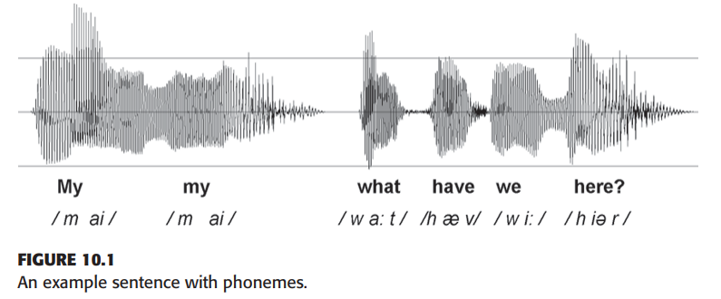

## Visemes 

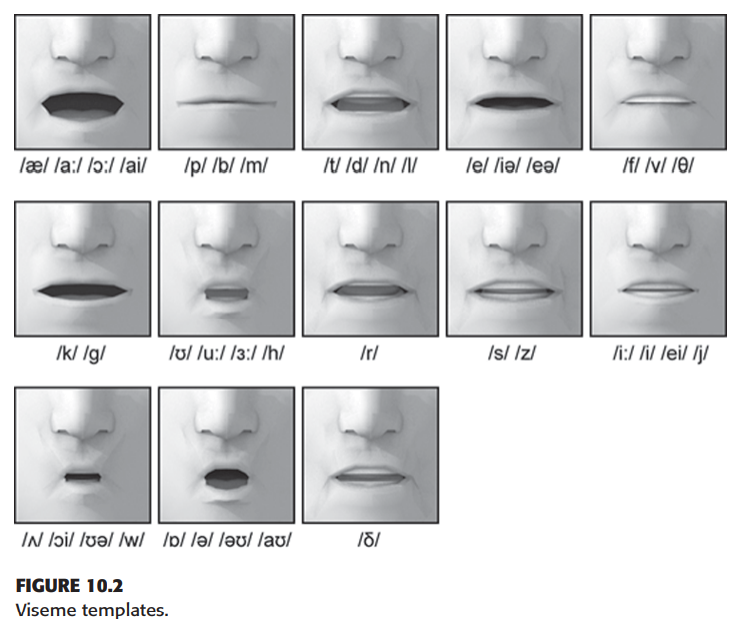

## Basics of Speech Analysis

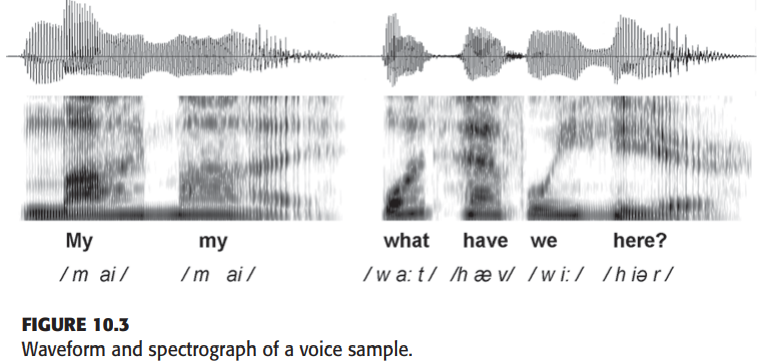

### The Wave Format

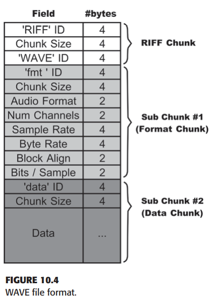

## Automatic Lip-Syncing

```C++
short WAVE::GetAverageAmplitude(float startTime, float endTime)
{
    if(m_pData == NULL)
    return 0;
    //Calculate start & end sample
    int startSample = (int)(m_sampleRate * startTime) * m_numChannels;
    int endSample = (int)(m_sampleRate * endTime) * m_numChannels;
    if(startSample >= endSample)
    return 0;
    //Calculate the average amplitude between start and end sample
    float c = 1.0f / (float)(endSample - startSample);
    float avg = 0.0f;
    for(int i=startSample; i<endSample && i<m_numSamples; i++)
    {
    	avg += abs(m_pData[i]) * c;
    }
    avg = min(avg, (float)(SHRT_MAX - 1));
    avg = max(avg, (float)(SHRT_MIN + 1));
    return (short)avg;
}

void FaceController::Speak(WAVE &wave)
{
    m_visemes.clear();
    //Calculate which visemes to use from the WAVE file data
    float soundLength = wave.GetLength();
    //Since the wave data oscillates around zero, 
    //bring the max amplitude down to 30% for better results
    float maxAmp = wave.GetMaxAmplitude() * 0.3f;
    for(float i=0.0f; i<soundLength; i += 0.1f)
    {
        short amp = wave.GetAverageAmplitude(i, i + 0.1f);
        float p = min(amp / maxAmp, 1.0f);
        if(p < 0.2f)
        {
        	m_visemes.push_back(VISEME(0, 0.0f, i));
        }
        else if(p < 0.4f)
        {
            float prc = max((p - 0.2) / 0.2f, 0.3f);
            m_visemes.push_back(VISEME(3, prc, i));
        }
        else if(p < 0.7f)
        {
            float prc = max((p - 0.4f) / 0.3f, 0.3f);
            m_visemes.push_back(VISEME(1, prc, i));
        }
        else
        {
            float prc = max((p - 0.7f) / 0.3f, 0.3f);
            m_visemes.push_back(VISEME(4, prc, i));
        }
    }
    m_visemeIndex = 1;
    m_speechTime = 0.0f;
}
```


# 11 Inverse Kinematics

## Introduction to Inverse Kinematics

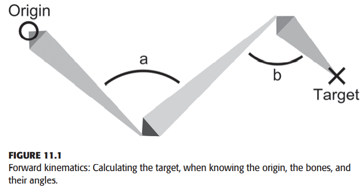

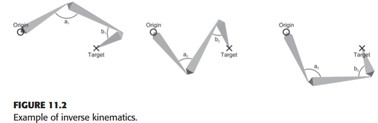

## Solving The IK Problem

主要分为 2 大类，analytical 分析（迭代），numerical 数值计算

cyclic coordinate decent (CCD), Jacobian matrix，数值计算虽然慢，但是效果更好。

## Look-At Inverse Kinematics

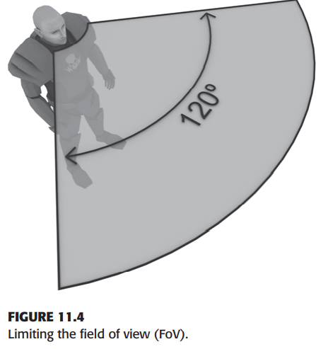

```C++
class InverseKinematics
{
public:
    InverseKinematics(SkinnedMesh* pSkinnedMesh);
    void UpdateHeadIK();
    void ApplyLookAtIK(D3DXVECTOR3 &lookAtTarget, float maxAngle);
private:
    SkinnedMesh *m_pSkinnedMesh;
    Bone* m_pHeadBone;
    D3DXVECTOR3 m_headForward;
};

InverseKinematics::InverseKinematics(SkinnedMesh* pSkinnedMesh)
{
    m_pSkinnedMesh = pSkinnedMesh;
    // Find the head bone
    m_pHeadBone = (Bone*)m_pSkinnedMesh->GetBone("Head");
    // Exit if there is no head bone
    if(m_pHeadBone != NULL)
    {
        // Calculate the local forward vector for the head bone
        // Remove translation from head matrix
        D3DXMATRIX headMatrix;
        headMatrix = m_pHeadBone->CombinedTransformationMatrix;
        headMatrix._41 = 0.0f;
        headMatrix._42 = 0.0f;
        242 Character Animation with Direct3D
        headMatrix._43 = 0.0f;
        headMatrix._44 = 1.0f;
        D3DXMATRIX toHeadSpace;
        if(D3DXMatrixInverse(&toHeadSpace, NULL, &headMatrix) == NULL) 
        	return;
        // The model is looking toward -z in the content
        D3DXVECTOR4 vec;
        D3DXVec3Transform(&vec, &D3DXVECTOR3(0, 0, -1), &toHeadSpace);
        m_headForward = D3DXVECTOR3(vec.x, vec.y, vec.z);
    }
}
```

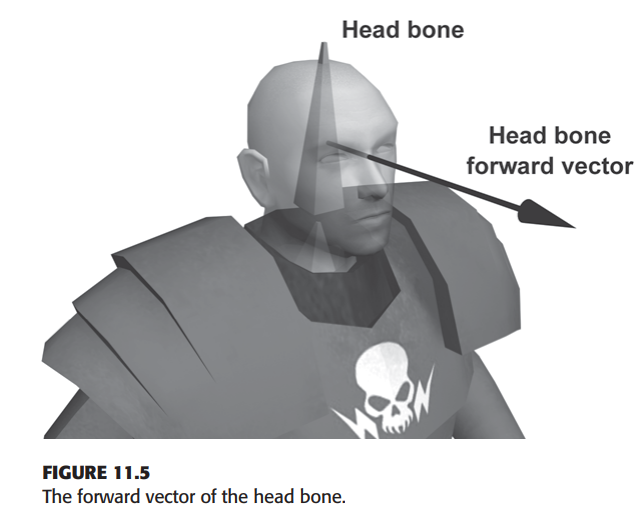

```C++
void InverseKinematics::ApplyLookAtIK(D3DXVECTOR3 &lookAtTarget, 
float maxAngle)
{
    // Start by transforming to local space
    D3DXMATRIX mtxToLocal;
    D3DXMatrixInverse(&mtxToLocal, NULL, 
    &m_pHeadBone->CombinedTransformationMatrix);
    D3DXVECTOR3 localLookAt;
    D3DXVec3TransformCoord(&localLookAt, &lookAtTarget, &mtxToLocal );
    // Normalize local look at target
    D3DXVec3Normalize(&localLookAt, &localLookAt);
    // Get rotation axis and angle
    D3DXVECTOR3 localRotationAxis;
    D3DXVec3Cross(&localRotationAxis, &m_headForward, &localLookAt);
    D3DXVec3Normalize(&localRotationAxis, &localRotationAxis);
    float localAngle = acosf(D3DXVec3Dot(&m_headForward, &localLookAt));
    // Limit angle
    localAngle = min( localAngle, maxAngle );
    // Apply the transformation to the bone
    D3DXMATRIX rotation;
    D3DXMatrixRotationAxis(&rotation, &localRotationAxis, localAngle);
    m_pHeadBone->CombinedTransformationMatrix = rotation * 
    m_pHeadBone->CombinedTransformationMatrix;
    // Update changes to child bones
    if(m_pHeadBone->pFrameFirstChild)
    {
        m_pSkinnedMesh->UpdateMatrices(
        (Bone*)m_pHeadBone->pFrameFirstChild, 
        &m_pHeadBone->CombinedTransformationMatrix);
    }
}
```

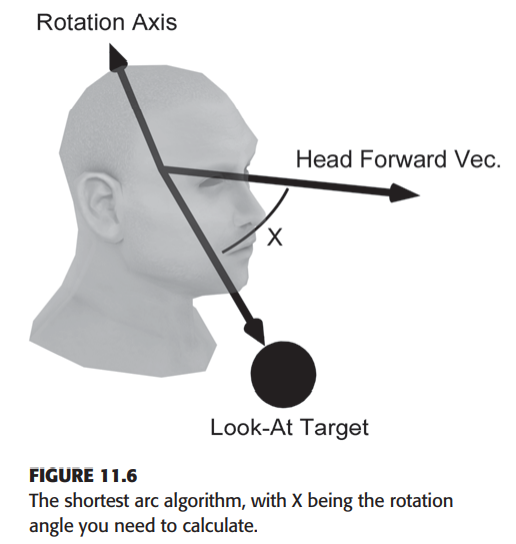

## Two-Joint Inverse Kinematics

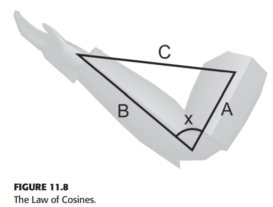
$$
C^2 = A^2 + B^2 - 2ABcos(x)
$$

$$
x = acos(\frac{A^2 + B^2 - C^2}{2AB})
$$

```C++
void InverseKinematics::ApplyArmIK(D3DXVECTOR3 &hingeAxis, 
D3DXVECTOR3 &target)
{ 
    // Set up some vectors and positions
    D3DXVECTOR3 startPosition = D3DXVECTOR3(
        m_pShoulderBone->CombinedTransformationMatrix._41,
        m_pShoulderBone->CombinedTransformationMatrix._42,
        m_pShoulderBone->CombinedTransformationMatrix._43);
    D3DXVECTOR3 jointPosition = D3DXVECTOR3(
        m_pElbowBone->CombinedTransformationMatrix._41,
        m_pElbowBone->CombinedTransformationMatrix._42,
        m_pElbowBone->CombinedTransformationMatrix._43);
    D3DXVECTOR3 endPosition = D3DXVECTOR3(
        m_pHandBone->CombinedTransformationMatrix._41,
        m_pHandBone->CombinedTransformationMatrix._42,
        m_pHandBone->CombinedTransformationMatrix._43);
    D3DXVECTOR3 startToTarget = target - startPosition;
    D3DXVECTOR3 startToJoint = jointPosition - startPosition;
    D3DXVECTOR3 jointToEnd = endPosition - jointPosition;
    float distStartToTarget = D3DXVec3Length(&startToTarget);
    float distStartToJoint = D3DXVec3Length(&startToJoint);
    float distJointToEnd = D3DXVec3Length(&jointToEnd);
    // Calculate joint bone rotation
    // Calculate current angle and wanted angle
    float wantedJointAngle = 0.0f;
    if(distStartToTarget >= distStartToJoint + distJointToEnd)
    {
        // Target out of reach
        wantedJointAngle = D3DXToRadian(180.0f);
    }
    else
    {
        //Calculate wanted joint angle (using the Law of Cosines)
        float cosAngle = (distStartToJoint * distStartToJoint + distJointToEnd * distJointToEnd –distStartToTarget * distStartToTarget) / (2.0f * distStartToJoint * distJointToEnd);
        wantedJointAngle = acosf(cosAngle);
    }
    //Normalize vectors
    D3DXVECTOR3 nmlStartToJoint = startToJoint;
    D3DXVECTOR3 nmlJointToEnd = jointToEnd;
    D3DXVec3Normalize(&nmlStartToJoint, &nmlStartToJoint);
    D3DXVec3Normalize(&nmlJointToEnd, &nmlJointToEnd);
    //Calculate the current joint angle
    float currentJointAngle = acosf(D3DXVec3Dot(&(-nmlStartToJoint), &nmlJointToEnd));
    //Calculate rotation matrix
    float diffJointAngle = wantedJointAngle - currentJointAngle;
    D3DXMATRIX rotation;
    D3DXMatrixRotationAxis(&rotation, &hingeAxis, diffJointAngle);
    //Apply elbow transformation
    m_pElbowBone->TransformationMatrix = rotation * m_pElbowBone->TransformationMatrix;
    //Now the elbow “bending” has been done. Next you just 
    //need to rotate the shoulder using the Look-at IK algorithm
    //Calcuate new end position
    //Calculate this in world position and transform 
    //it later to start bones local space
    D3DXMATRIX tempMatrix;
    tempMatrix = m_pElbowBone->CombinedTransformationMatrix;
    tempMatrix._41 = 0.0f; 
    tempMatrix._42 = 0.0f; 
    tempMatrix._43 = 0.0f; 
    tempMatrix._44 = 1.0f;
    D3DXVECTOR3 worldHingeAxis;
    D3DXVECTOR3 newJointToEnd;
    D3DXVec3TransformCoord(&worldHingeAxis, &hingeAxis, &tempMatrix);
    D3DXMatrixRotationAxis(&rotation,&worldHingeAxis,diffJointAngle);
    D3DXVec3TransformCoord(&newJointToEnd, &jointToEnd, &rotation);
    D3DXVECTOR3 newEndPosition;
    D3DXVec3Add(&newEndPosition, &newJointToEnd, &jointPosition);
    // Calculate start bone rotation
    D3DXMATRIX mtxToLocal;
    D3DXMatrixInverse(&mtxToLocal, NULL, &m_pShoulderBone->CombinedTransformationMatrix);
    D3DXVECTOR3 localNewEnd; //Current end point
    D3DXVECTOR3 localTarget; //IK target in local space
    D3DXVec3TransformCoord(&localNewEnd,&newEndPosition,&mtxToLocal);
    D3DXVec3TransformCoord(&localTarget, &target, &mtxToLocal);
    D3DXVec3Normalize(&localNewEnd, &localNewEnd);
    D3DXVec3Normalize(&localTarget, &localTarget);
    D3DXVECTOR3 localAxis;
    D3DXVec3Cross(&localAxis, &localNewEnd, &localTarget);
    if(D3DXVec3Length(&localAxis) == 0.0f)
    	return;
    D3DXVec3Normalize(&localAxis, &localAxis);
    float localAngle = acosf(D3DXVec3Dot(&localNewEnd, &localTarget));
    // Apply the rotation that makes the bone turn
    D3DXMatrixRotationAxis(&rotation, &localAxis, localAngle);
    m_pShoulderBone->CombinedTransformationMatrix = rotation * m_pShoulderBone->CombinedTransformationMatrix;
    m_pShoulderBone->TransformationMatrix = rotation * m_pShoulderBone->TransformationMatrix;
    // Update matrices of child bones.
    if(m_pShoulderBone->pFrameFirstChild)
    	m_pSkinnedMesh->UpdateMatrices((BONE*)m_pShoulderBone->pFrameFirstChild, &m_pShoulderBone->CombinedTransformationMatrix);
}
```


# 12 Wrinkle Maps 皱纹图

```
Introduction to normal maps
How to create normal maps
How to convert your geometry to accommodate normal mapping
The real-time shader code needed for rendering
Specular lighting
Wrinkle maps
```

## Introduction To Normal Mapping

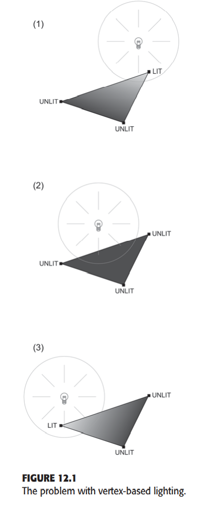

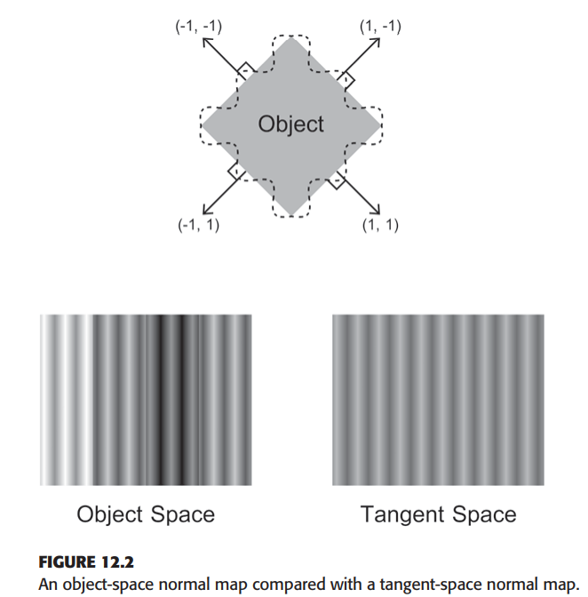

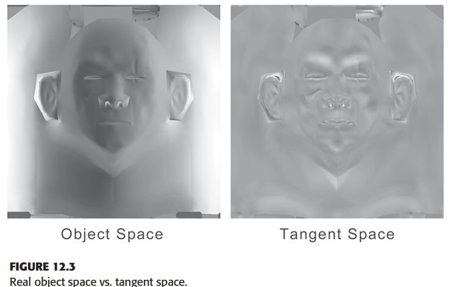

### Encoding Normals as Color

```C++
float3 normal = 2.0f * tex2D(NormalSampler, IN.tex0).rgb - 1.0f;
```

### Putting the Normal Map to Use

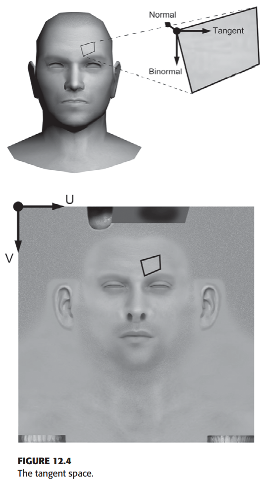

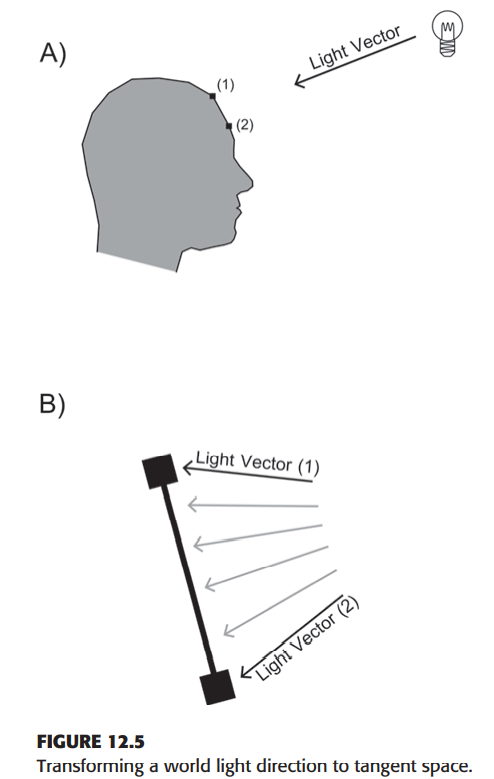

The TBN-Matrix
$$
TBN = 
\begin{bmatrix}
Tangent.x & Binormal.x & Normal.x \\
Tangent.y & Binormal.y & Normal.y \\
Tangent.z & Binormal.z & Normal.z \\
\end{bmatrix}
$$
point in world space v_w, vector in tangent space v_t
$$
v_t = v_w * TBN
$$

```C++
//Get the position of the vertex in the world
float4 posWorld = mul(vertexPosition, matW);
//Get vertex to light direction
float3 light = normalize(lightPos - posWorld);
//Create the TBN-Matrix
float3x3 TBNMatrix = float3x3(vertexTangent, 
vertexBinormal, 
vertexNormal);
//Setting the lightVector
lightVec = mul(TBNMatrix, light);
```

### Converting a Mesh to Support Normal Mapping

```
...
```

## The Normal Mapping Shader

```C++
//Face Vertex Format
D3DVERTEXELEMENT9 faceVertexDecl[] = 
{
    //1st Stream: Base Mesh
    {0, 0, D3DDECLTYPE_FLOAT3, D3DDECLMETHOD_DEFAULT, 
    D3DDECLUSAGE_POSITION, 0},
    {0, 12, D3DDECLTYPE_FLOAT3, D3DDECLMETHOD_DEFAULT, 
    D3DDECLUSAGE_NORMAL, 0},
    {0, 24, D3DDECLTYPE_FLOAT2, D3DDECLMETHOD_DEFAULT, 
    D3DDECLUSAGE_TEXCOORD, 0},
    {0, 32, D3DDECLTYPE_FLOAT3, D3DDECLMETHOD_DEFAULT, 
    D3DDECLUSAGE_TANGENT, 0},
    {0, 44, D3DDECLTYPE_FLOAT3, D3DDECLMETHOD_DEFAULT, 
    D3DDECLUSAGE_BINORMAL, 0},
    //2nd Stream
    {1, 0, D3DDECLTYPE_FLOAT3, D3DDECLMETHOD_DEFAULT, 
    D3DDECLUSAGE_POSITION, 1},
    {1, 12, D3DDECLTYPE_FLOAT3, D3DDECLMETHOD_DEFAULT, 
    D3DDECLUSAGE_NORMAL, 1},
    {1, 24, D3DDECLTYPE_FLOAT2, D3DDECLMETHOD_DEFAULT, 
    D3DDECLUSAGE_TEXCOORD, 1},
    //3rd Stream
    {2, 0, D3DDECLTYPE_FLOAT3, D3DDECLMETHOD_DEFAULT, 
    D3DDECLUSAGE_POSITION, 2},
    {2, 12, D3DDECLTYPE_FLOAT3, D3DDECLMETHOD_DEFAULT, 
    D3DDECLUSAGE_NORMAL, 2},
    {2, 24, D3DDECLTYPE_FLOAT2, D3DDECLMETHOD_DEFAULT, 
    D3DDECLUSAGE_TEXCOORD, 2},
    //4th Stream
    {3, 0, D3DDECLTYPE_FLOAT3, D3DDECLMETHOD_DEFAULT, 
    D3DDECLUSAGE_POSITION, 3},
    {3, 12, D3DDECLTYPE_FLOAT3, D3DDECLMETHOD_DEFAULT, 
    D3DDECLUSAGE_NORMAL, 3},
    {3, 24, D3DDECLTYPE_FLOAT2, D3DDECLMETHOD_DEFAULT, 
    D3DDECLUSAGE_TEXCOORD, 3},
    //5th Stream
    {4, 0, D3DDECLTYPE_FLOAT3, D3DDECLMETHOD_DEFAULT, 
    D3DDECLUSAGE_POSITION, 4},
    {4, 12, D3DDECLTYPE_FLOAT3, D3DDECLMETHOD_DEFAULT, 
    D3DDECLUSAGE_NORMAL, 4},
    {4, 24, D3DDECLTYPE_FLOAT2, D3DDECLMETHOD_DEFAULT, 
    D3DDECLUSAGE_TEXCOORD, 4},
    D3DDECL_END()
}

//Vertex Input
struct VS_INPUT
{
    //Stream 0: Base Mesh
    float4 pos0 : POSITION0;
    float3 norm0 : NORMAL0;
    float2 tex0 : TEXCOORD0;
    float3 tangent : TANGENT0;
    float3 binormal : BINORMAL0;
    //Stream 1: Morph Target 1
    float4 pos1 : POSITION01;
    float3 norm1 : NORMAL1;
    //Stream 2: Morph Target 2
    float4 pos2 : POSITION2;
    float3 norm2 : NORMAL2;
    //Stream 3: Morph Target 3
    float4 pos3 : POSITION3;
    float3 norm3 : NORMAL3;
    //Stream 4: Morph Target 4
    float4 pos4 : POSITION4;
    float3 norm4 : NORMAL4; 
};

//Vertex Shader
VS_OUTPUT morphNormalMapVS(VS_INPUT IN)
{
    VS_OUTPUT OUT = (VS_OUTPUT)0;
    float4 position = IN.pos0;
    float3 normal = IN.norm0;
    //Blend Position
    position += (IN.pos1 - IN.pos0) * weights.r;
    position += (IN.pos2 - IN.pos0) * weights.g;
    position += (IN.pos3 - IN.pos0) * weights.b;
    position += (IN.pos4 - IN.pos0) * weights.a;
    //Blend Normal
    normal += (IN.norm1 - IN.norm0) * weights.r;
    normal += (IN.norm2 - IN.norm0) * weights.g;
    normal += (IN.norm3 - IN.norm0) * weights.b;
    normal += (IN.norm4 - IN.norm0) * weights.a;
    //Getting the position of the vertex in the world
    float4 posWorld = mul(position, matW);
    OUT.position = mul(posWorld, matVP);
    //Get normal, tangent, and binormal in world space
    normal = normalize(mul(normal, matW));
    float3 tangent = normalize(mul(IN.tangent, matW));
    float3 binormal = normalize(mul(IN.binormal, matW));
    //Getting vertex -> light vector
    float3 light = normalize(lightPos - posWorld);
    //Calculating the binormal and setting 
    //the tangent binormal and normal matrix
    float3x3 TBNMatrix = float3x3(tangent, binormal, normal);
    //Setting the lightVector
    OUT.lightVec = mul(TBNMatrix, light);
    OUT.tex0 = IN.tex0;
    return OUT;
}

//Pixel Shader
float4 morphNormalMapPS(VS_OUTPUT IN) : COLOR0
{
    //Calculate the color and the normal
    float4 color = tex2D(DiffuseSampler, IN.tex0);
    //This is how you uncompress a normal map
    float3 normal = 2.0f * tex2D(NormalSampler, IN.tex0).rgb - 1.0f;
    //Normalize the light
    float3 light = normalize(IN.lightVec);
    Chapter 12 Wrinkle Maps 275
    //Set the output color
    float shade = max(saturate(dot(normal, light)), 0.2f);
    return color * shade;
}
```

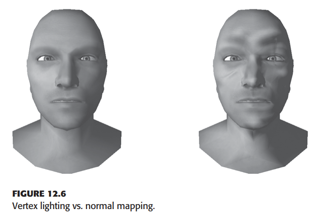

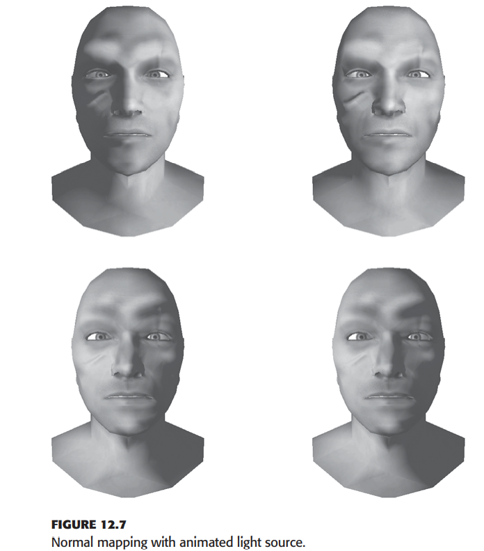

## Creating Normal Maps

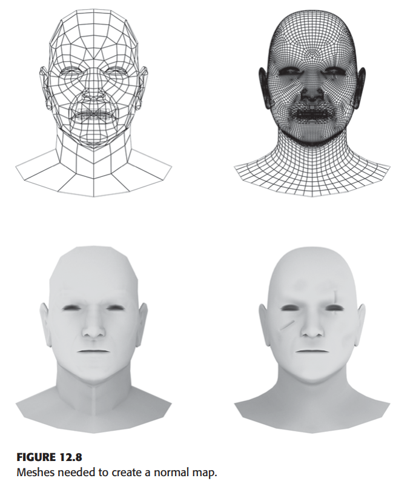

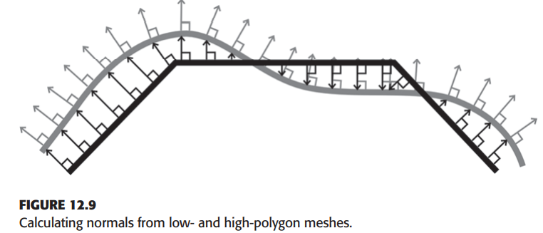

### Creating Normal Maps In Practice

* Zbrush
* Mudbox
* Melody tool
* PS Plugin

## Specular Highlight

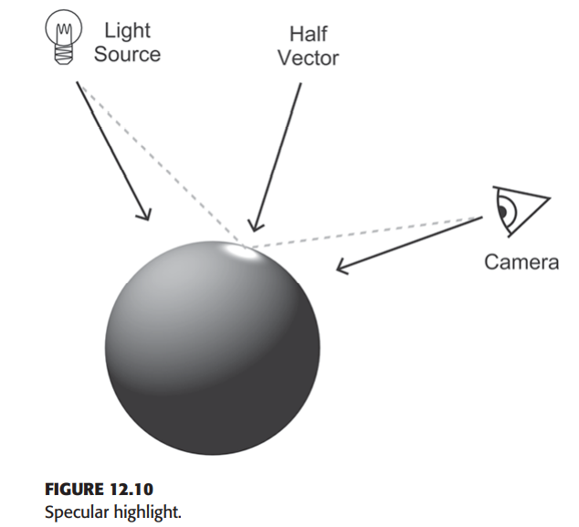

### Specular Maps

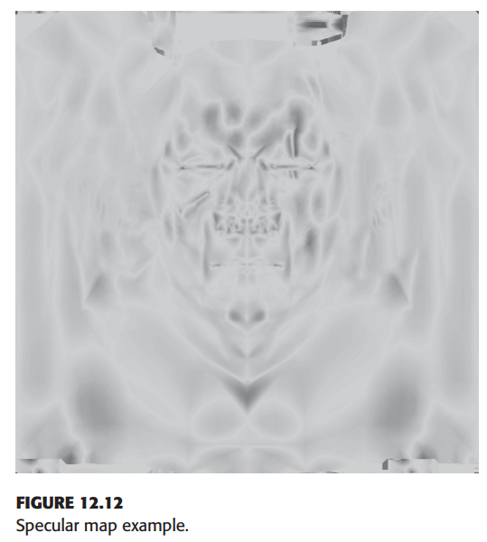

```C++
//Vertex Shader
VS_OUTPUT morphNormalMapVS(VS_INPUT IN)
{
    VS_OUTPUT OUT = (VS_OUTPUT)0;
    float4 position = IN.pos0;
    float3 normal = IN.norm0;
    //Blend Position
    position += (IN.pos1 - IN.pos0) * weights.r;
    position += (IN.pos2 - IN.pos0) * weights.g;
    position += (IN.pos3 - IN.pos0) * weights.b;
    position += (IN.pos4 - IN.pos0) * weights.a;
    //Blend Normal
    normal += (IN.norm1 - IN.norm0) * weights.r;
    normal += (IN.norm2 - IN.norm0) * weights.g;
    normal += (IN.norm3 - IN.norm0) * weights.b;
    normal += (IN.norm4 - IN.norm0) * weights.a;
    //Getting the position of the vertex in the world
    float4 posWorld = mul(position, matW);
    OUT.position = mul(posWorld, matVP);
    normal = normalize(mul(normal, matW));
    float3 tangent = normalize(mul(IN.tangent, matW));
    float3 binormal = normalize(mul(IN.binormal, matW));
    //Getting light-to-vertex direction
    float3 lightDir = normalize(lightPos - posWorld);
    //Get camera-to-vertex direction
    float3 viewDir = normalize(cameraPos - posWorld);
    //Calculate the half vector
    float3 vHalf = normalize(lightDir + viewDir);
    //Calculating the binormal and setting 
    //the tangent binormal and normal matrix
    float3x3 TBNMatrix = float3x3(tangent, binormal, normal);
    //Setting the lightVector
    OUT.lightVec = mul(TBNMatrix, lightDir);
    OUT.lightHalf = mul(TBNMatrix, vHalf);
    OUT.tex0 = IN.tex0;
    return OUT;
}
//Pixel Shader
float4 morphNormalMapPS(VS_OUTPUT IN) : COLOR0
{
    //Calculate the color and the normal
    float4 color = tex2D(DiffuseSampler, IN.tex0);
    //This is how you uncompress a normal map
    float3 normal = 2.0f * tex2D(NormalSampler, IN.tex0).rgb - 1.0f;
    //Get specular
    float4 specularColor = tex2D(SpecularSampler, IN.tex0);
    //Set the output color
    float diffuse = max(saturate(
    dot(normal, normalize(IN.lightVec))), 0.2f);
    float specular = max(saturate(
    dot(normal, normalize(IN.lightHalf))), 0.0f);
    specular = pow(specular, 85.0f) * 0.4f;
    return color * diffuse + specularColor * specular;
}

```

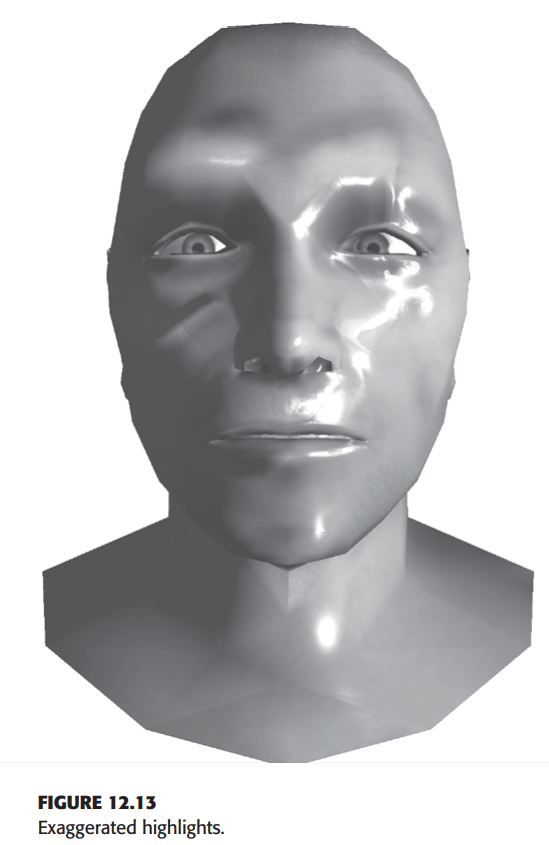

## Wrinkle Maps

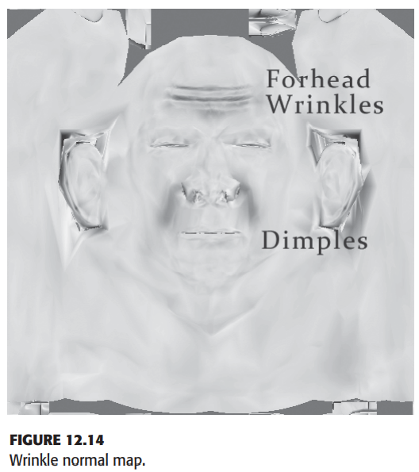

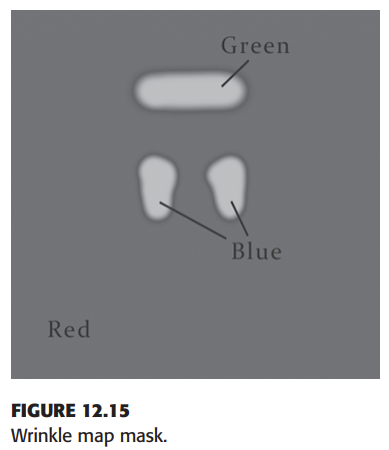

```C++
//Pixel Shader
float4 morphNormalMapPS(VS_OUTPUT IN) : COLOR0
{
    //Sample color
    float4 color = tex2D(DiffuseSampler, IN.tex0);
    //Sample blend from wrinkle mask texture
    float4 blend = tex2D(BlendSampler, IN.tex0);
    //Sample normal and decompress
    float3 normal = 2.0f * tex2D(NormalSampler, IN.tex0).rgb - 1.0f;
    //Calculate final normal weight
    float w = blend.r + foreheadWeight * blend.g + cheekWeight * blend.b;
    w = min( w, 1.0f );
    normal.x *= w;
    normal.y *= w;
    //Re-normalize
    normal = normalize( normal );
    //Normalize the light
    float3 light = normalize(IN.lightVec);
    //Set the output color
    float diffuse = max(saturate(dot(normal, light)), 0.2f);
    return color * diffuse;
}
```

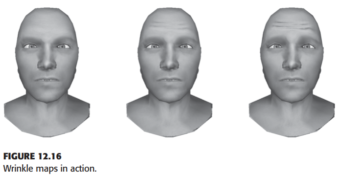

# 13 Crowd Simulation

crowd simulation—namely, flocking behaviors 人群模拟——即蜂拥行为 

```
Flocking behaviors
“Boids” implementation
Basic crowd simulation
Crowd simulation and obstacle avoidanc
```

## Flocking Behaviors

```
In philosophy, systems theory, and science, emergence is the way complex systems
and patterns arise out of a multiplicity of relatively simple interactions. Emergence
is central to the theories of integrative levels and of complex systems.
-Wikipedia
```

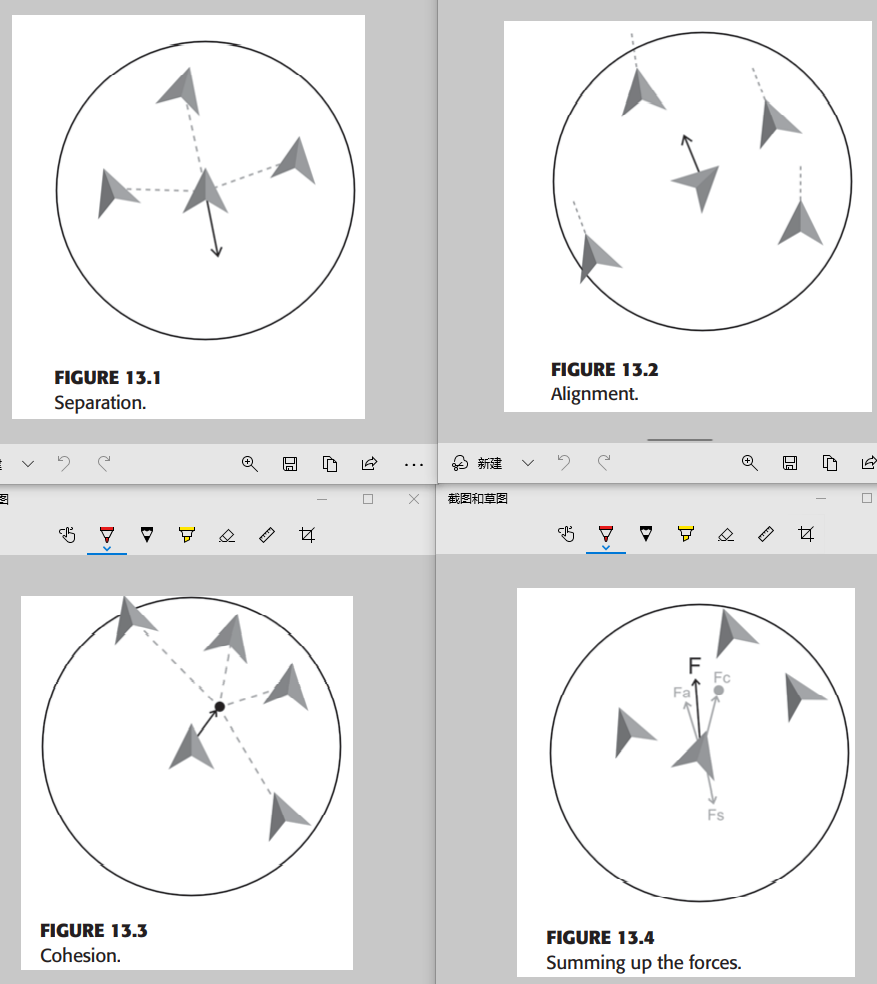

## Introduction to Crowd Simulation

GTA

```C++
class CrowdEntity
{
    friend class Crowd;
    public:
        CrowdEntity(Crowd *pCrowd);
        ~CrowdEntity();
        void Update(float deltaTime);
        void Render();
        D3DXVECTOR3 GetRandomLocation();
    private:
        static SkinnedMesh* sm_pSoldierMesh;
        Crowd* m_pCrowd;
        D3DXVECTOR3 m_position;
        D3DXVECTOR3 m_velocity;
        D3DXVECTOR3 m_goal;
        ID3DXAnimationController* m_pAnimController;
}

class Crowd
{
    public:
        Crowd(int numEntities);
        ~Crowd();
        void Update(float deltaTime);
        void Render();
        void GetNeighbors(CrowdEntity* pEntity, 
        float radius, 
        vector<CrowdEntity*> &neighbors); 
    private:
    	vector<CrowdEntity*> m_entities;
};

void CrowdEntity::Update(float deltaTime)
{
    const float ENTITY_INFLUENCE_RADIUS = 3.0f;
    const float NEIGHBOR_REPULSION = 5.0f;
    const float ENTITY_SPEED = 2.0f;
    const float ENTITY_SIZE = 1.0f;
    //Force toward goal
    D3DXVECTOR3 forceToGoal = m_goal - m_position;
    //Has goal been reached?
    if(D3DXVec3Length(&forceToGoal) < ENTITY_INFLUENCE_RADIUS)
    {
        //Pick a new random goal
        m_goal = GetRandomLocation();
    }
    D3DXVec3Normalize(&forceToGoal, &forceToGoal);
    //Get neighbors
    vector<CrowdEntity*> neighbors;
    m_pCrowd->GetNeighbors(this, 
    ENTITY_INFLUENCE_RADIUS,
    neighbors);
    //Avoid bumping into close neighbors
    D3DXVECTOR3 forceAvoidNeighbors(0.0f, 0.0f, 0.0f);
    for(int i=0; i<(int)neighbors.size(); i++)
    {
        D3DXVECTOR3 toNeighbor;
        toNeighbor = neighbors[i]->m_position - m_position;
        float distToNeighbor = D3DXVec3Length(&toNeighbor);
        toNeighbor.y = 0.0f;
        float force = 1.0f-(distToNeighbor / ENTITY_INFLUENCE_RADIUS);
        forceAvoidNeighbors += -toNeighbor * NEIGHBOR_REPULSION*force;
        //Force move intersecting entities
        if(distToNeighbor < ENTITY_SIZE)
        {
            D3DXVECTOR3 center = (m_position + 
            neighbors[i]->m_position) * 0.5f;
            D3DXVECTOR3 dir = center - m_position;
            D3DXVec3Normalize(&dir, &dir);
            //Force move both entities
            m_position = center - dir * ENTITY_SIZE * 0.5f;
            neighbors[i]->m_position = center + dir*ENTITY_SIZE*0.5f;
        }
    }
    //Sum up forces
    D3DXVECTOR3 acc = forceToGoal + forceAvoidNeighbors;
    D3DXVec3Normalize(&acc, &acc);
    //Update velocity & position
    m_velocity += acc * deltaTime;
    D3DXVec3Normalize(&m_velocity, &m_velocity);
    m_position += m_velocity * ENTITY_SPEED * deltaTime;
    //Update animation
    m_pAnimController->AdvanceTime(deltaTime, NULL);
}

```

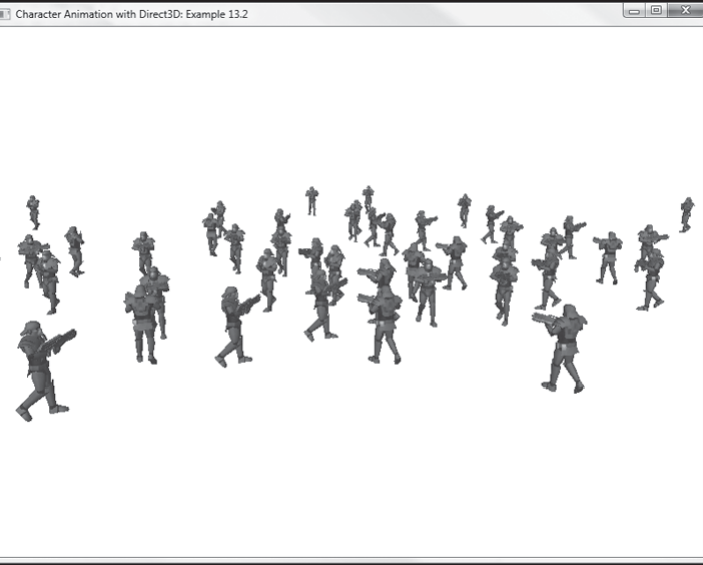

## Smart Objects

So far your crowd still looks more or less like a bunch of ants milling around seemingly without purpose. So what is it that makes a crowd agent look and  behave like a part of the environment? Well, mostly any interaction your agent does with the environment makes the agent seem “aware” of its environment (even though this is seldom the case).

到目前为止，你的人群看起来或多或少像一群蚂蚁在四处游荡 看似毫无目的。 那么是什么让众包代理看起来和 表现得像环境的一部分？ 好吧，主要是您的代理的任何互动 与环境一起使代理似乎“意识到”其环境 （尽管这种情况很少发生）。 

One way of implementing this is to distribute the object interaction logic to the actual objects themselves. This has been done with great success in,

实现这一点的一种方法是将对象交互逻辑分发到 实际对象本身。 这在以下方面取得了巨大的成功， 

```C++
class Obstacle
{
    public:
        Obstacle(D3DXVECTOR3 pos, float radius);
        D3DXVECTOR3 GetForce(CrowdEntity* pEntity);
        void Render();
    public:
        static ID3DXMesh* sm_cylinder; 
        D3DXVECTOR3 m_position;
        float m_radius;
};

D3DXVECTOR3 Obstacle::GetForce(CrowdEntity* pEntity)
{
    D3DXVECTOR3 vToEntity = m_position - pEntity->m_position;
    float distToEntity = D3DXVec3Length(&vToEntity);
    //Affected by this obstacle?
    if(distToEntity < m_radius * 3.0f)
    {
        D3DXVec3Normalize(&vToEntity, &vToEntity);
        float force = 1.0f - (distToEntity / m_radius * 3.0f);
        return vToEntity * force * 10.0f;
    }
    return D3DXVECTOR3(0.0f, 0.0f, 0.0f);
}

```

## Following A Terrain

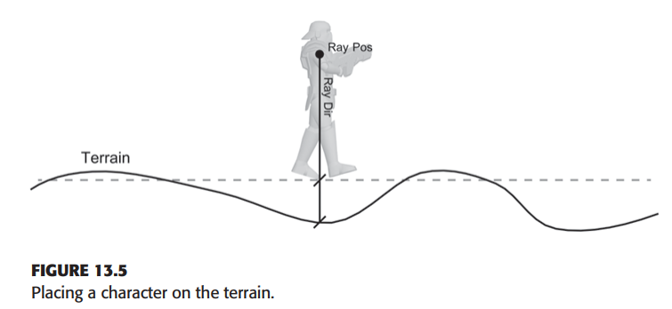

# 14 Character Decals

```
Decals in games
Picking a hardware-rendered mesh
Creating decal geometry
Calculating decal UV coordinates
```

## Introduction to Decals

```
“A design or picture produced in order to be transferred to another surface
either permanently or temporarily.”
Or,
“A decorative sticker.”
-Wikipedia
```

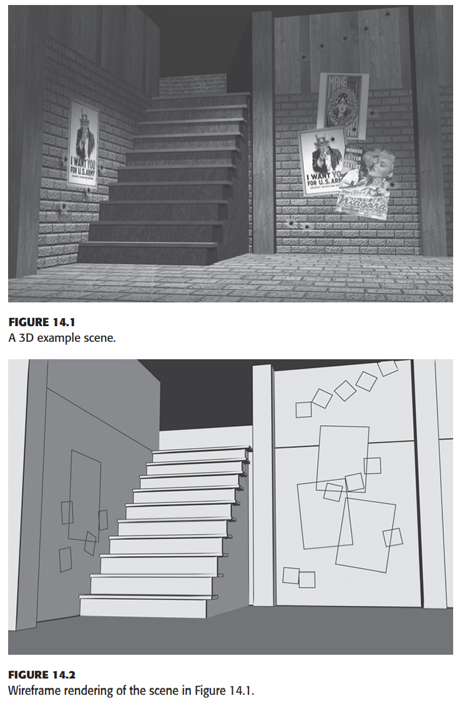

```
1. Pick the triangle on the character through which a ray intersects.
2. Grow the selection of triangles until you have a large enough surface to fit
the decal.
3. Calculate new UV coordinates for the decal mesh.
4. Copy the skinning information (blending weights and blending indices) to
the decal mesh.
5. Render the decal as any other bone mesh (with the small exception of using
clamped UV).
```

## Picking a Hardware-rendered Mesh

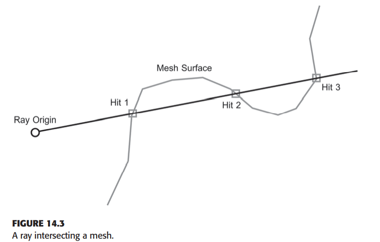

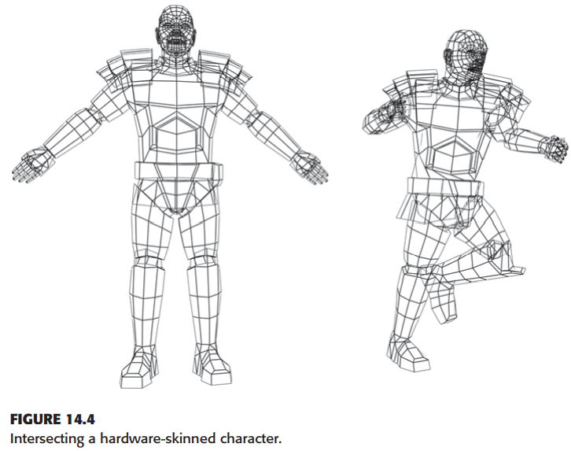

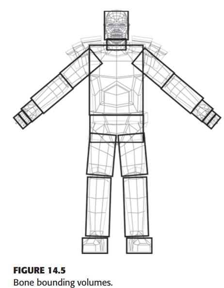

```C++
D3DXINTERSECTINFO BoneMesh::GetFace(D3DXVECTOR3 &rayOrg, D3DXVECTOR3 &rayDir)
{
    D3DXINTERSECTINFO hitInfo;
    //Must test against software-skinned model
    if (pSkinInfo != NULL)
    {
        //Make sure vertex format is correct
        if(OriginalMesh->GetFVF() != Vertex::FVF)
        {
            hitInfo.FaceIndex = 0xffffffff;
            return hitInfo;
        }
        //Set up bone transforms
        int numBones = pSkinInfo->GetNumBones();
        for(int i=0;i < numBones;i++)
        {
            D3DXMatrixMultiply(&currentBoneMatrices[i],
            &boneOffsetMatrices[i], 
            boneMatrixPtrs[i]);
        }
        //Create temp mesh
        ID3DXMesh *tempMesh = NULL;
        OriginalMesh->CloneMeshFVF(D3DXMESH_MANAGED, 
            OriginalMesh->GetFVF(), 
            g_pDevice, 
            &tempMesh);
        //Get source and destination buffer
        BYTE *src = NULL;
        BYTE *dest = NULL;
        OriginalMesh->LockVertexBuffer(D3DLOCK_READONLY, (VOID**)&src);
        tempMesh->LockVertexBuffer(0, (VOID**)&dest);
        //Perform the software skinning
        pSkinInfo->UpdateSkinnedMesh(currentBoneMatrices,
                NULL,
                src,
                dest);
        /Unlock buffers
        OriginalMesh->UnlockVertexBuffer();
        tempMesh->UnlockVertexBuffer();
        //Perform the intersection test
        BOOL Hit;
        D3DXIntersect(tempMesh, 
                &rayOrg, 
                &rayDir, 
                &Hit, 
                &hitInfo.FaceIndex, 
                &hitInfo.U, 
                &hitInfo.V, 
                &hitInfo.Dist, 
                NULL, 
                NULL);
        //Release temporary mesh
        tempMesh->Release();
        if(Hit)
        {
            //Successful hit
            return hitInfo;
        }
    }
    //No hit
    hitInfo.FaceIndex = 0xffffffff;
    hitInfo.Dist = -1.0f;
    return hitInfo;
}
```

## Creating Deal Geometry

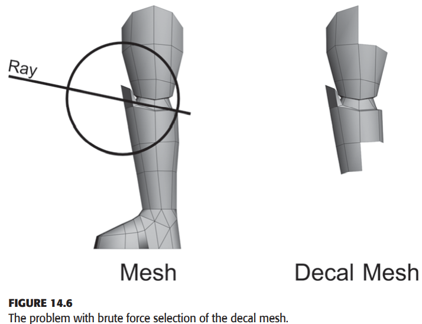

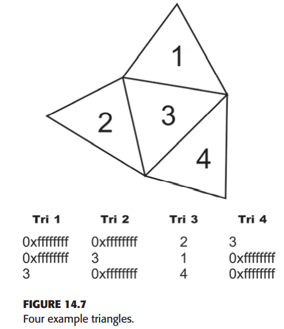

### Calculating The Exact Hit Position

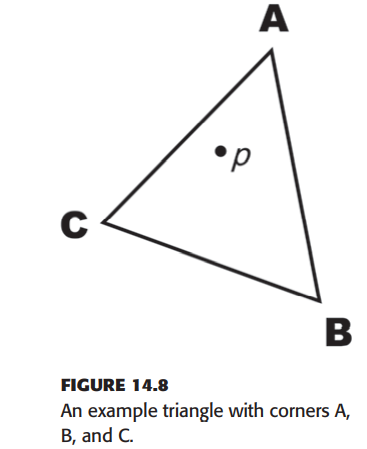
$$
p = A + u(BA)+ v(CA)
$$

### Selecting Triangles For the Decal Mesh

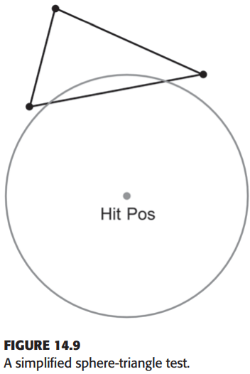

### Copying The Skinning Information

```
...
```

### The CharacterDecal Class

```C++
class CharacterDecal
{
public:
    CharacterDecal(ID3DXMesh* pDecalMesh);
    ~CharacterDecal();
	void Render();
public:
	ID3DXMesh* m_pDecalMesh;
};
```

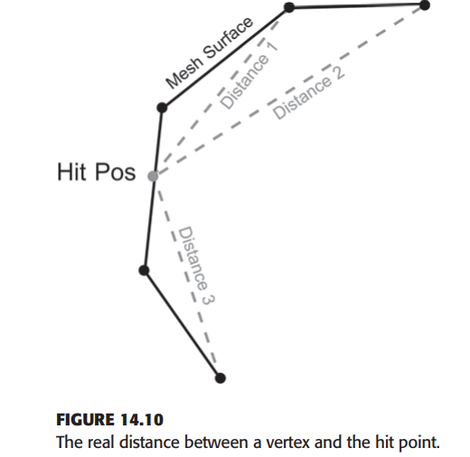

## Calculating Decal UV Coordinates

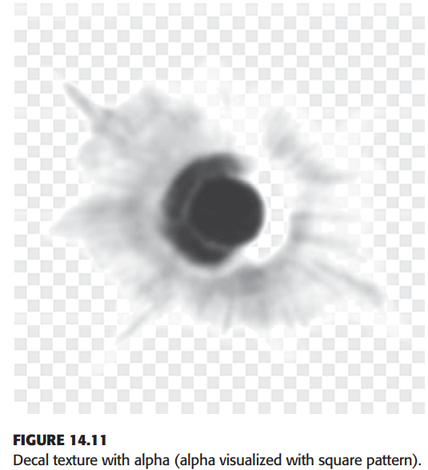

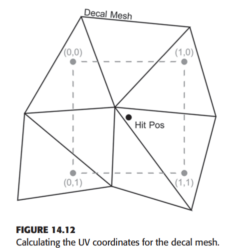

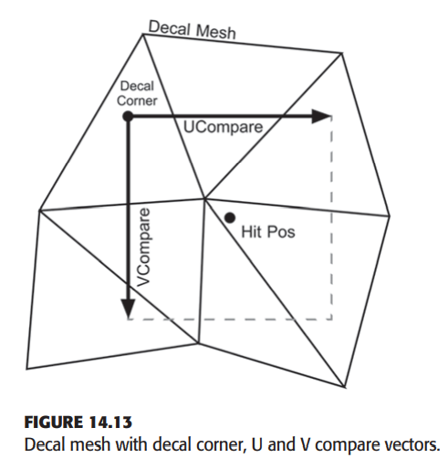

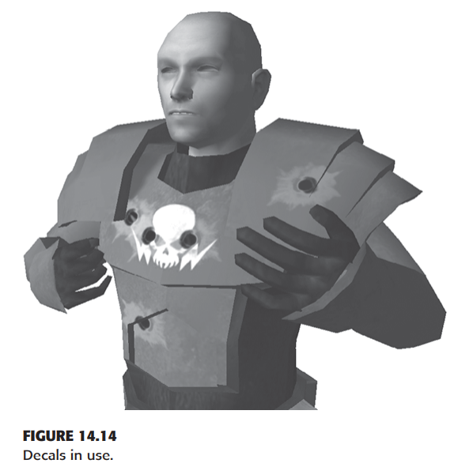

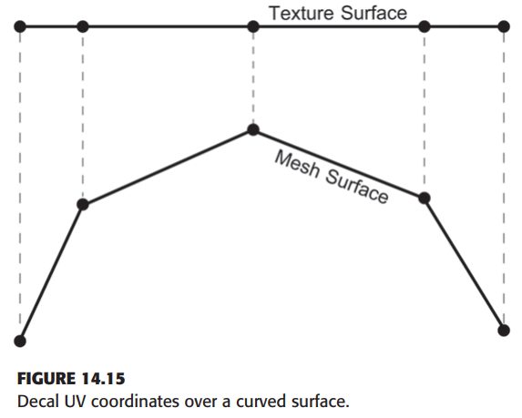

# 15 Hair Animation

```
Single hairs versus strips of hair
Generating hair strips from control splines
Animating control splines
```

## Hair Representation

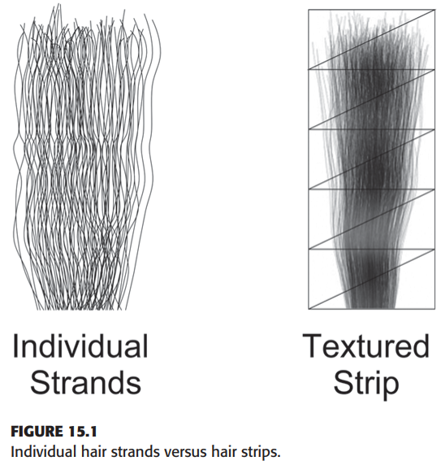

GPUGems2 Chapter 23

## Hair Modeling


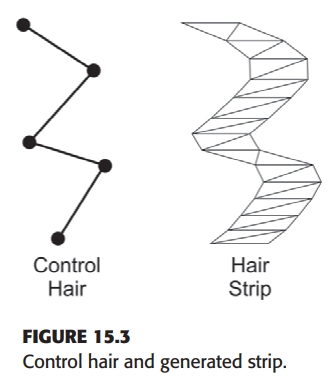

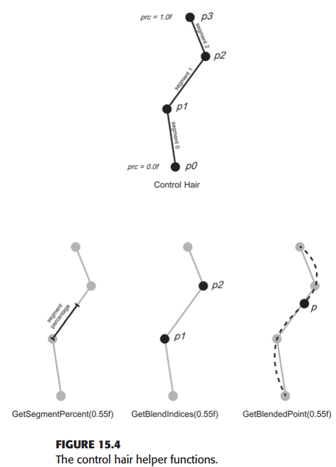

## The Hair Patch Class

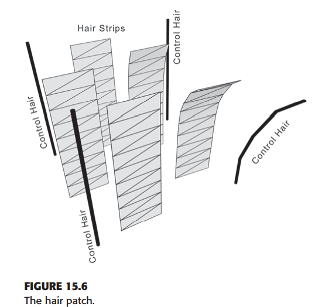

```
...
```

## Creating A HairCut

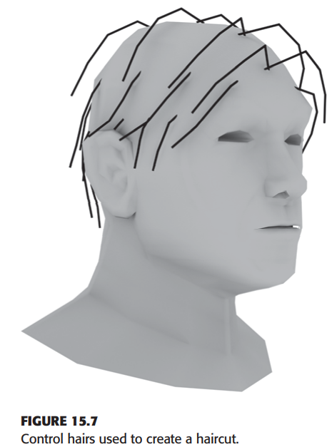

## Animating The Control Hair

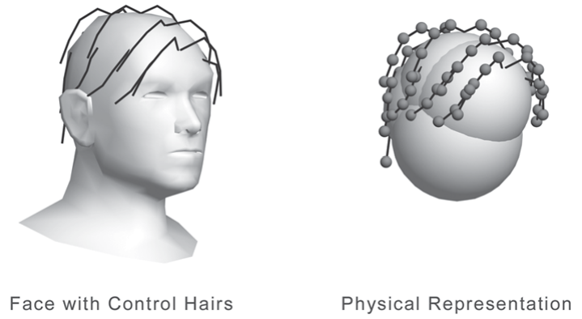

### The Hair Class

```C++
class Hair
{
    public:
        Hair();
        ~Hair();
        void LoadHair(const char* hairFile);
        void CreatePatch(int index1, 
        int index2, 
        int index3, 
        int index4);
        void Update(float deltaTime);
        void Render(D3DXVECTOR3 &camPos);
        int GetNumVertices();
        int GetNumFaces();
    public:
        vector<ControlHair*> m_controlHairs;
        vector<HairPatch*> m_hairPatches;
        IDirect3DTexture9* m_pHairTexture;
        vector<BoundingSphere> m_headSpheres;
};
```

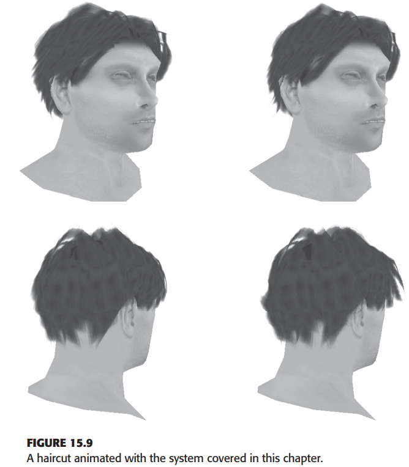

# 16 Putting It All Together

```
Mixing facial animation with skeletal animation
The Character class
Future improvements
Alan Wake case study
Final thought
```

## Attaching The Head To The Body

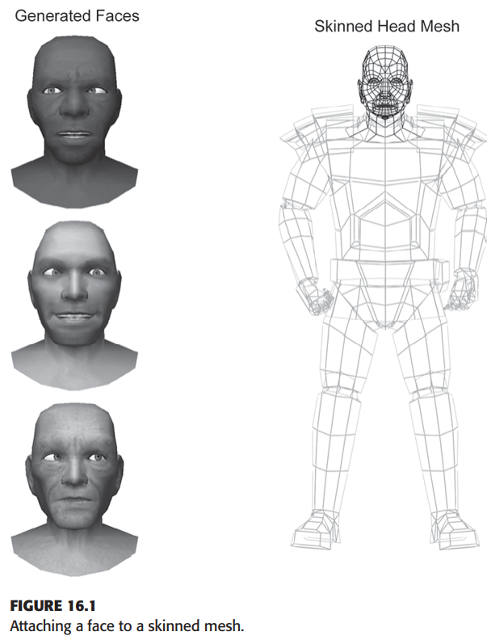

```
...
```

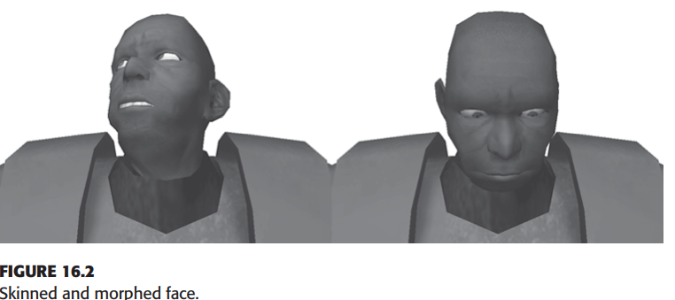

## The Character Class

```C++
class Character : public RagDoll
{
    public:
        Character(char fileName[], D3DXMATRIX &world);
        ~Character();
        void Update(float deltaTime);
        void Render();
        void RenderMesh(Bone *bone);
        void RenderFace(BoneMesh *pFacePlaceholder);
        void PlayAnimation(string name);
        void Kill();
    public:
        bool m_lookAtIK, m_armIK;
        bool m_dead;
    private:
        Face *m_pFace;
        FaceController *m_pFaceController;
        ID3DXAnimationController* m_pAnimController;
        InverseKinematics *m_pIK;
        IDirect3DVertexDeclaration9 *m_pFaceVertexDecl;
        int m_animation;
};
```

## Future Work

Character Level-Of-Detail LOD

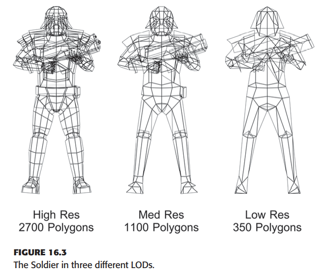

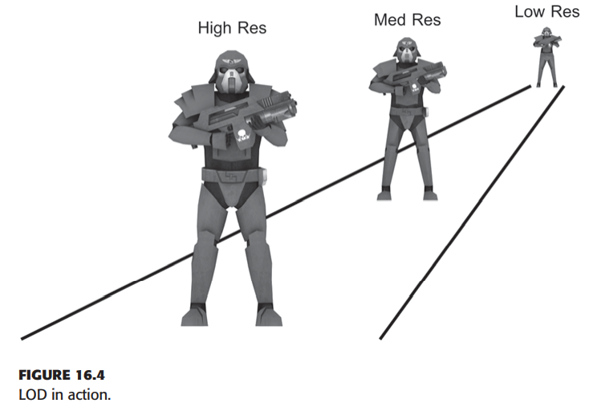

### Root Motion Versus Non-Root Motion

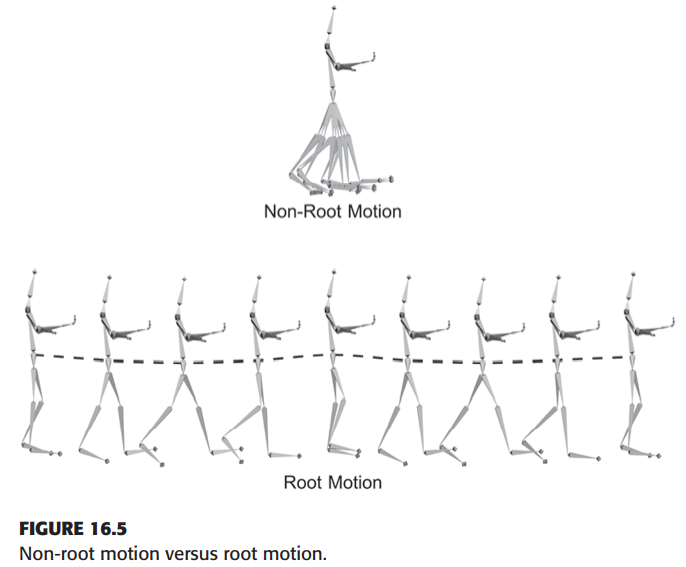

### Animation Trees/ Animation Graph

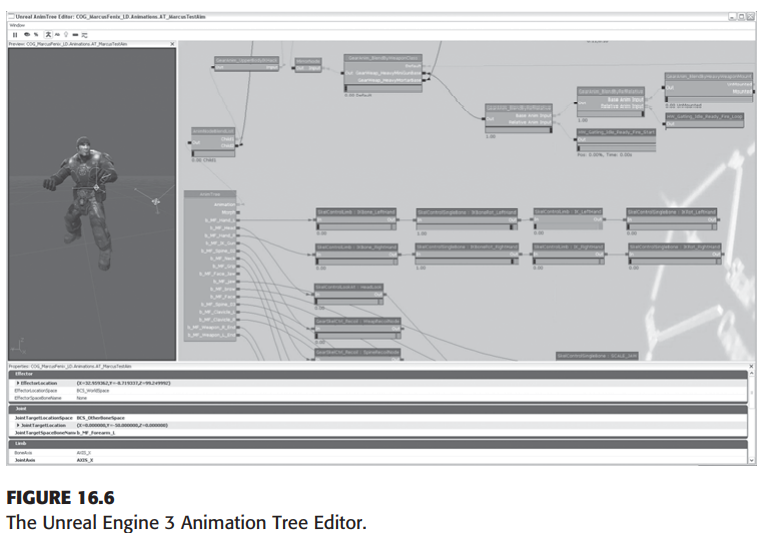

### Track Masks

### Separate Mesh And Animation Files

## Alan Wake Case Study

```
Alan Wake, a bestselling writer, hasn’t managed to write anything in over two
years. Now his wife, Alice, brings him to the idyllic small town of Bright Falls to recover his creative flow. But when she vanishes without a trace, Wake finds himself
trapped in a nightmare.
Word by word, his latest work, a thriller he can’t even remember writing, is
coming true before his eyes.
Find out more at: www.AlanWake.com.
```

