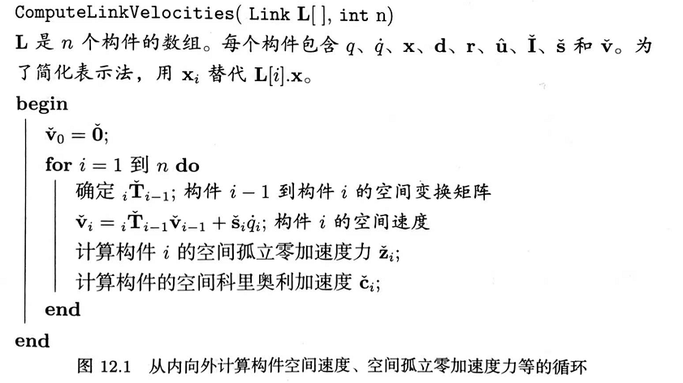
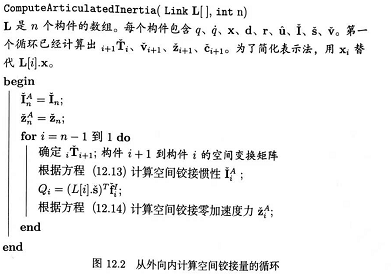
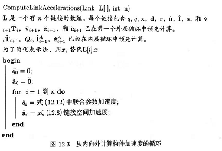
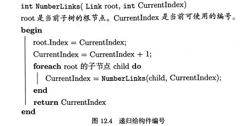

第三部分 9~12 章

刚体动力学、碰撞与约束，模拟复杂骨骼的铰接体动力学

# 第 12 章 铰接体 articulated body

Articulated body：树形链接的链来建模，具备骨骼的人类和动物

Articulated body 动力学有多种模拟的方法，经验证，计算机动画中最有效的是 Featherstone 【1983】开发的、最早用于机器人学的算法。Mirtich [1996a] 详细阐述了该算法再图形学中的实际应用，Kokkevis [2004] 给出了一个特别有效的实现。

## 12.1 铰接体的结构

转动关节，移动关节

为了简化建模，认定各个关节只存在一个自由度

qi 表示每个关节的参数，qi 一阶导数表示角速度和速度，qi 二阶导数表示转动关节的加速度和平动加速度

## 12.2 铰接体的动态状态

计算位形的加速度的算法由 Keatherstone 提出，Mirtich 详细阐述，最后由 Kokkevis 总结。

三个步骤

第一次循环从根构件往外侧构件遍历，利用目前的状态计算所有构件的平移速度和角速度

第二次循环从外侧构件向根构件遍历，利用上述速度及施加的力和力矩，得到计算各构件加速度所需的量

第三次循环从根构件往外侧遍历，计算各个构件的加速度

12.3 空间代数

12.4 空间代数记号下速度和加速度的传递

12.5 空间孤立量

## 12.6  第一次循环

## 12.7 计算空间铰接量

## 12.8 计算构件加速度

## 12.9 推广到树状铰接体

## 总结

