# Intro

## 阅读课外文献，老的论文关注跟课程相关部分即可

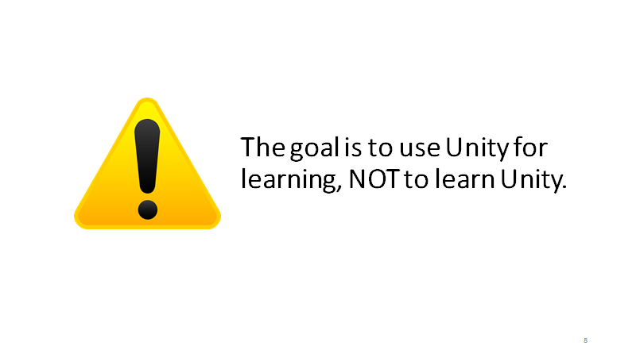

# **Issues for Discussion Today**

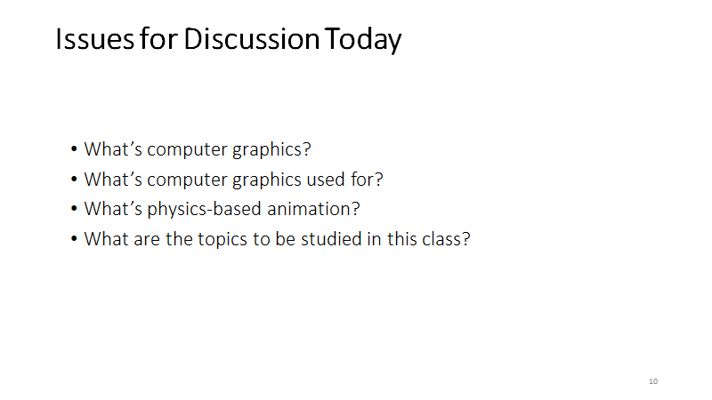

## What’s computer graphics?

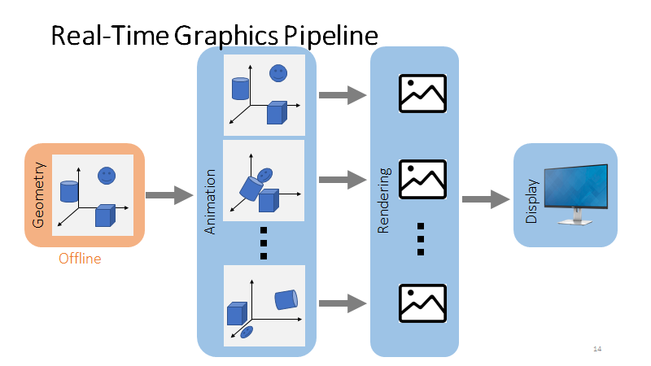

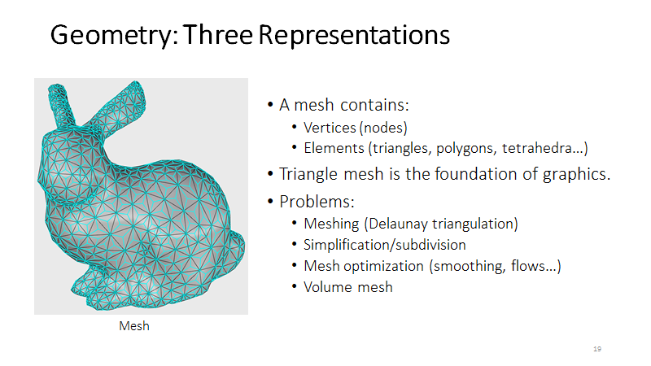

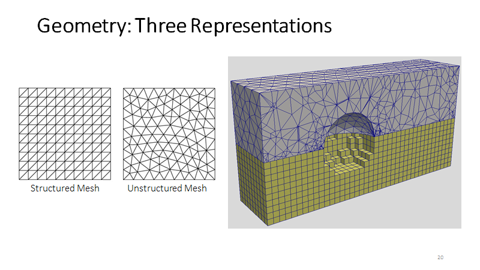

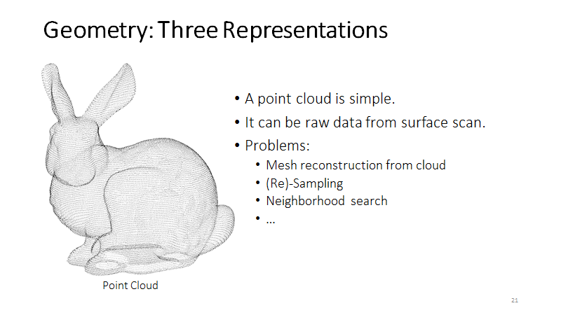

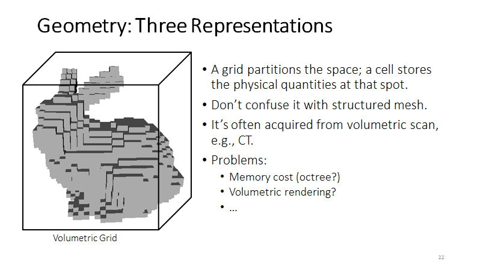

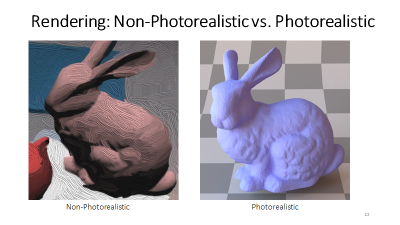

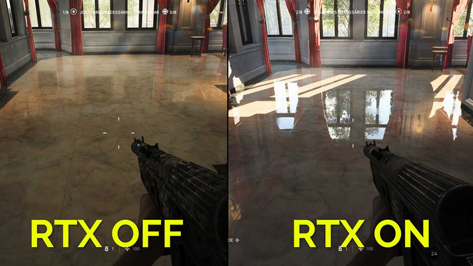

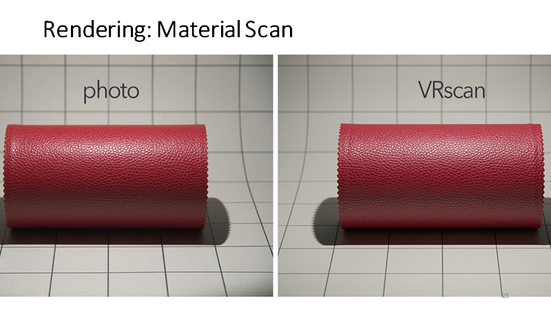

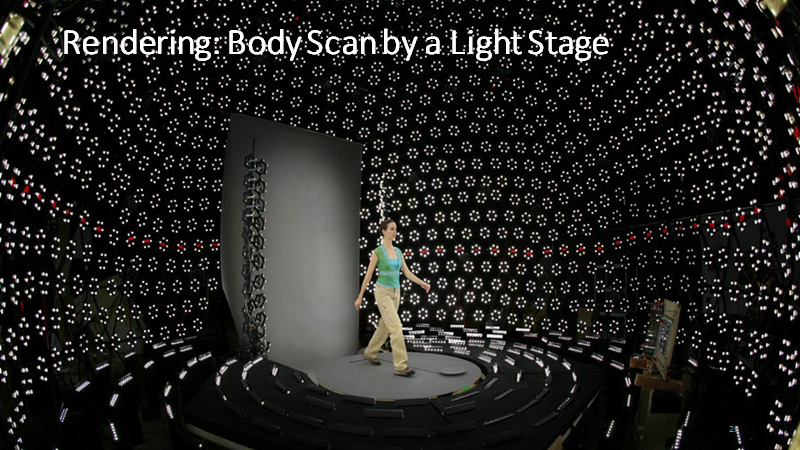

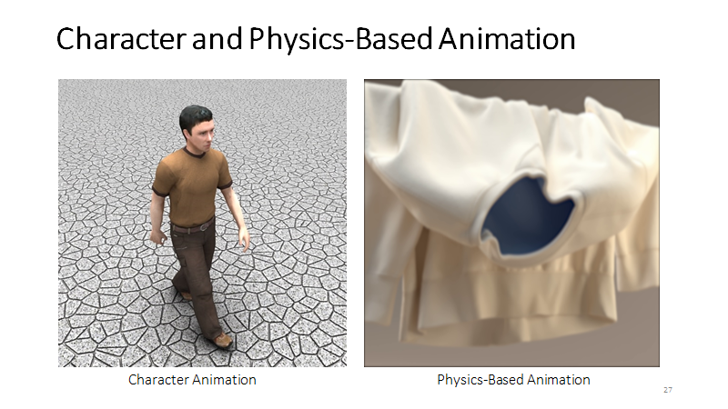

## What’s computer graphics used for?

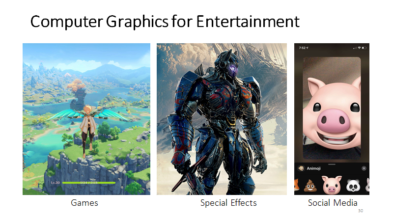

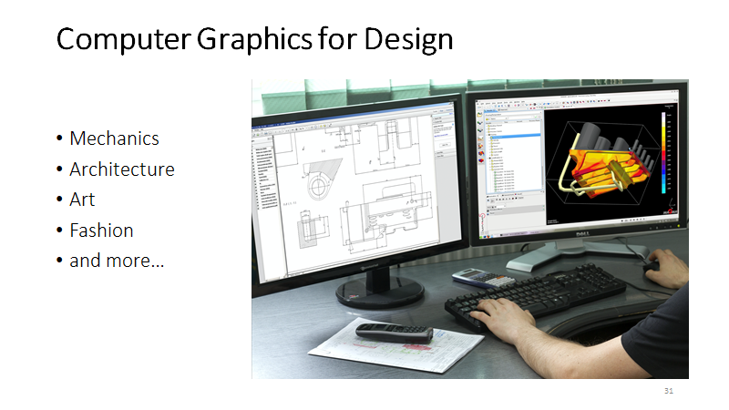

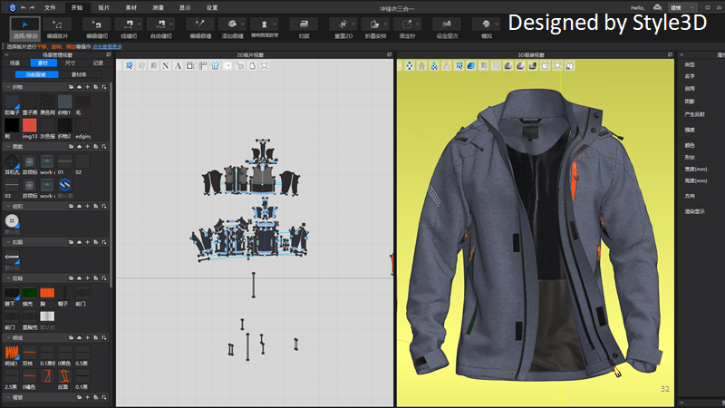

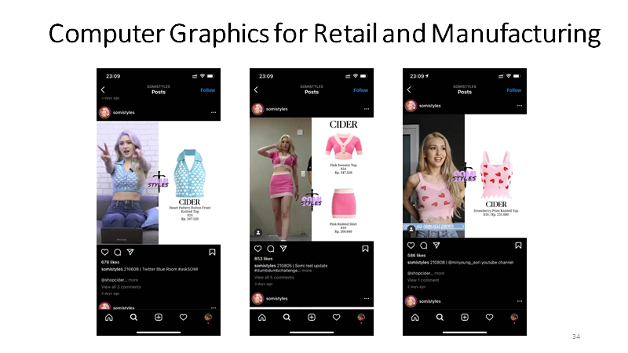

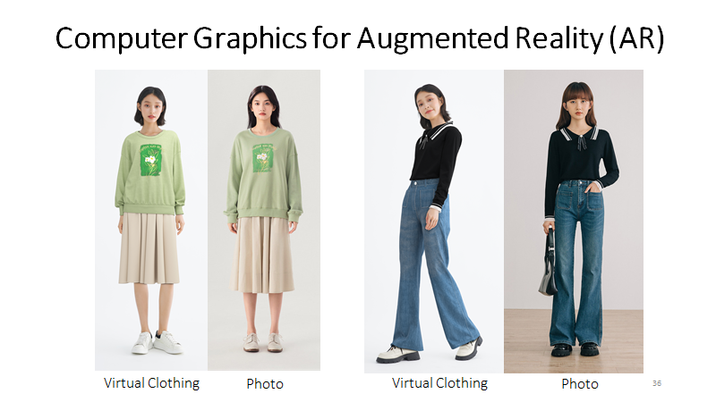

## What’s physics-based animation?

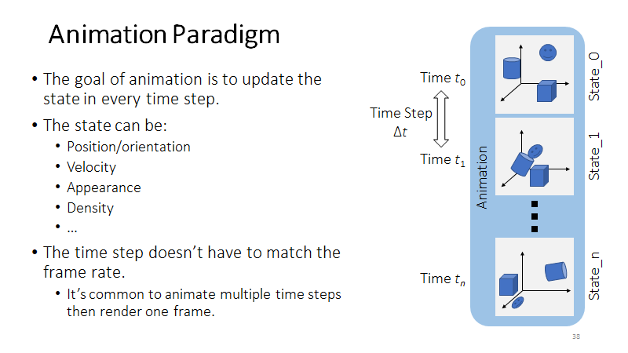

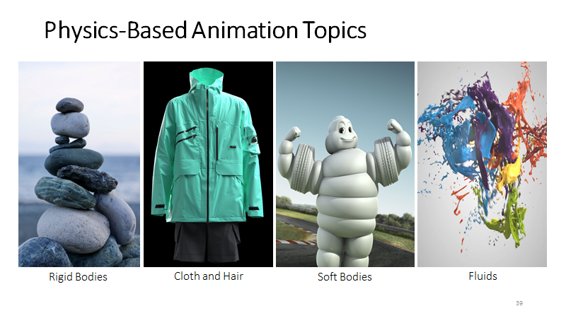

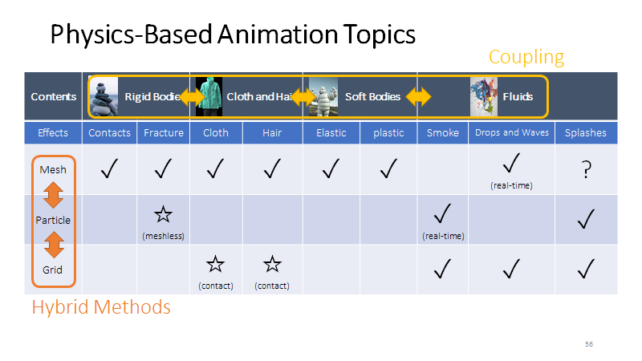

## What are the topics to be studied in this class?

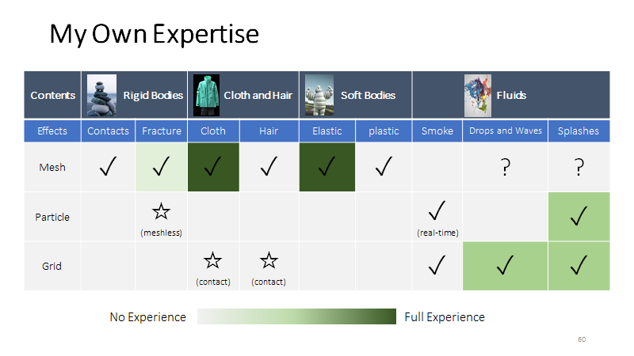

## Note

Mesh 是对物体的，Grid 是对场景的

# After-class reading list

 Witkin and Baraff. 2001. Physically Based Modeling – Rigid Body Dynamics. SIGGRAPH Courses.
 Muller et al. 2005. Meshless Deformations Based on Shape Matching. TOG (SIGGRAPH).
 Baraff and Witkin. 1998. Large Step in Cloth Simulation. SIGGRAPH.
 Bridson et al. 2003. Simulation of Clothing with Folds and Wrinkles. SCA.
 Bergou et al. 2006. A Quadratic Bending Model for Inextensible Surfaces. SCA.
 Muller. 2008. Hierarchical Position Based Dynamics. VRIPHYS.
 Bouaziz et al. 2014. Projective Dynamics: Fusing Constraint Projections for Fast Simulation. TOG (SIGGRAPH).
 Le Grand. 2007. GPU Gems 3 – Chapter 32. Broad-Phase Collision Detection with CUDA.
 Bridson et al. 2002. Robust Treatment of Collisions, Contact and Friction for Cloth Animation. TOG (SIGGRAPH).
 Volino et al. 2006. Resolving Surface Collisions through Intersection Contour Minimization. TOG (SIGGRAPH).

 (Optional)
 Provot. 1995. Deformation Constraints in a Mass-Spring Model to Describe Rigid Cloth Behavior. Graphics Interface.
 Tournier et al. 2015. Stable Constrained Dynamics. TOG (SIGGRAPH).