# Rigid Body Dynamics

游戏引擎都会内置，学习原理，而不是如何使用。

## **Rigid Body Simulation**

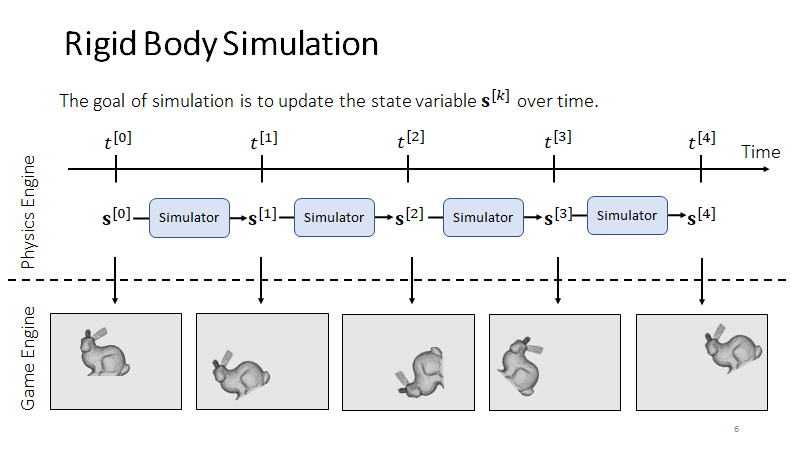

## **Rigid Body Motion**

刚体只有位移和旋转

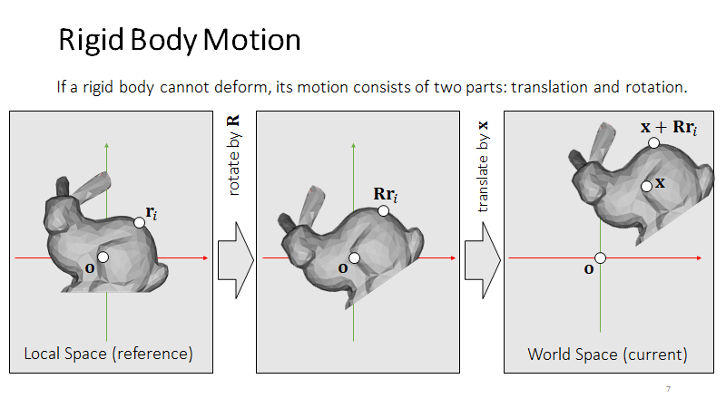

# **Translational Motion**

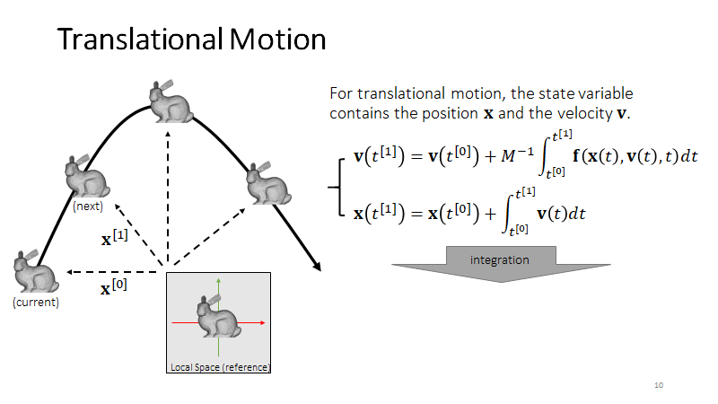

## **Integration Methods** **Explained**

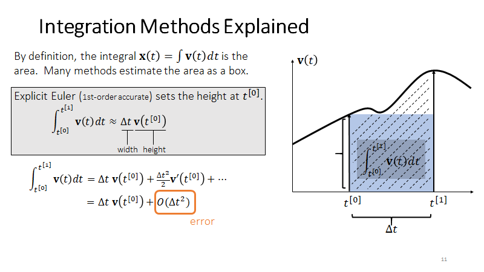

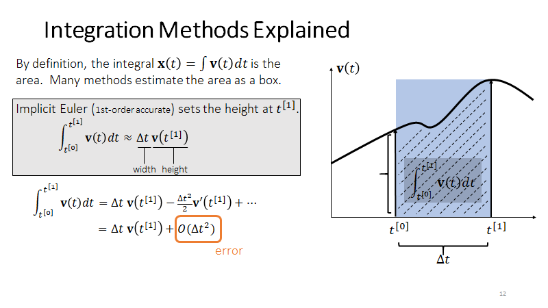

二阶精确

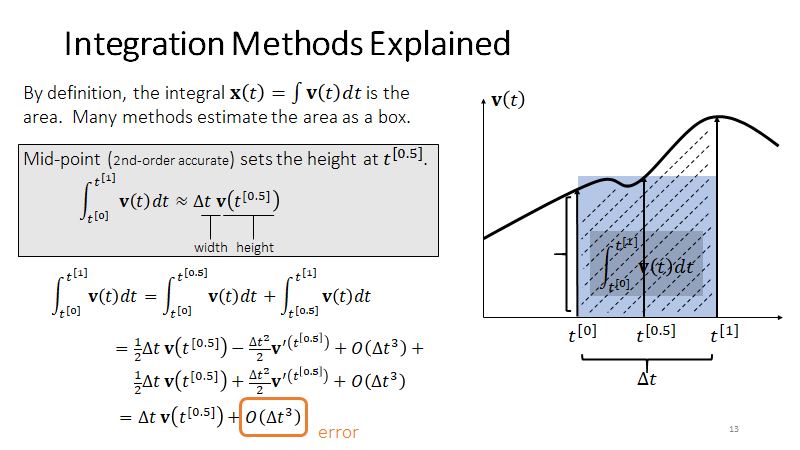

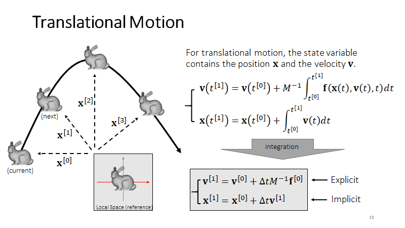

速度和位置分别是 2 只青蛙

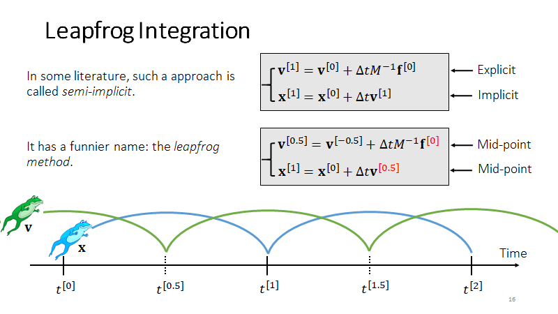

## **Types of Forces** 

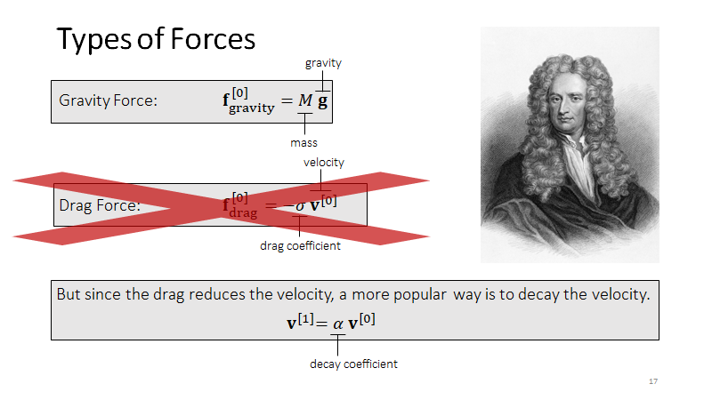

## **Rigid Body Simulation (Translation Only)**

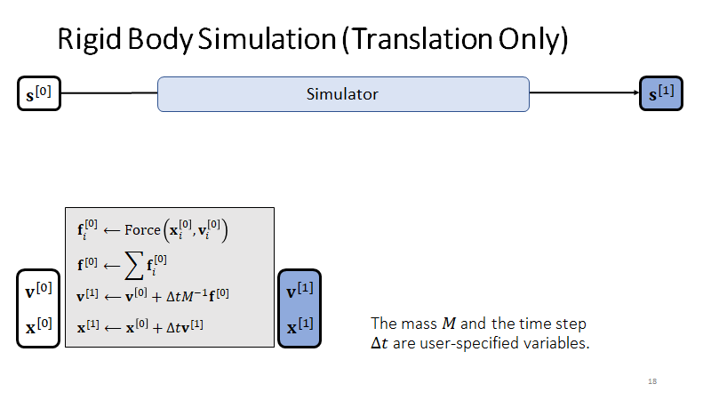

# **Rotational Motion**

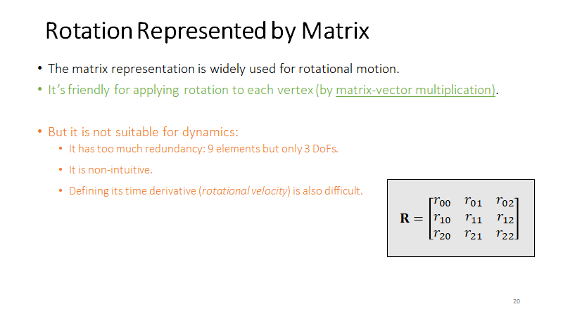

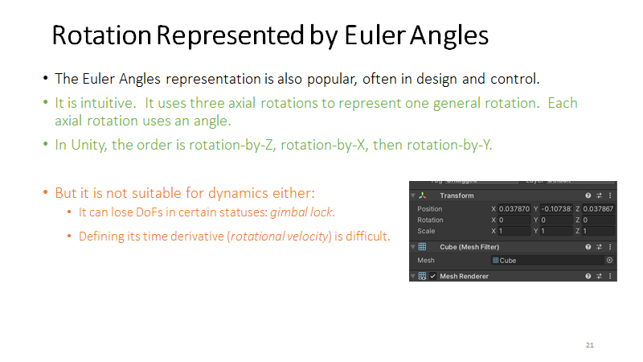

