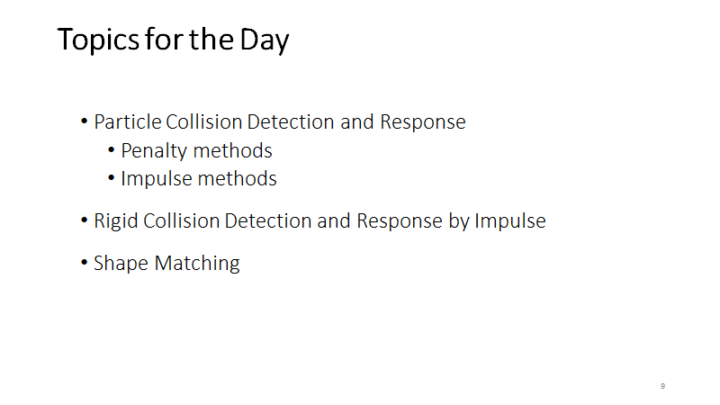
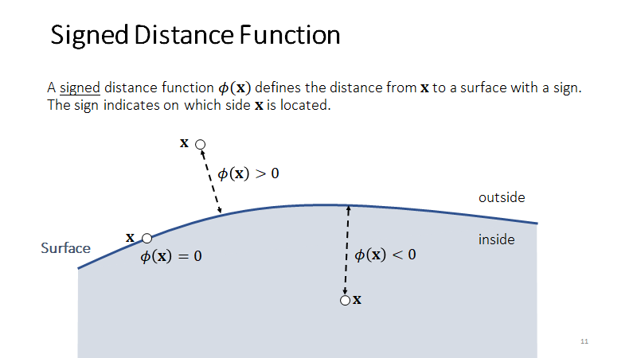
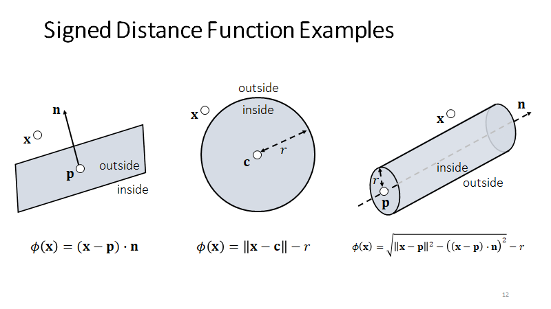
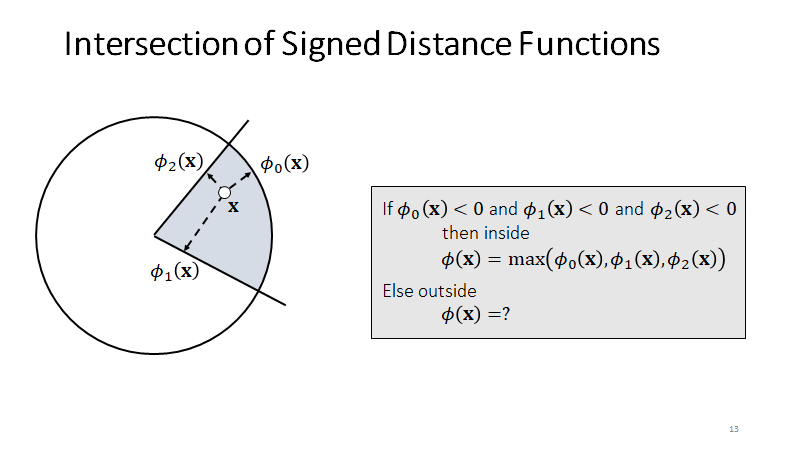
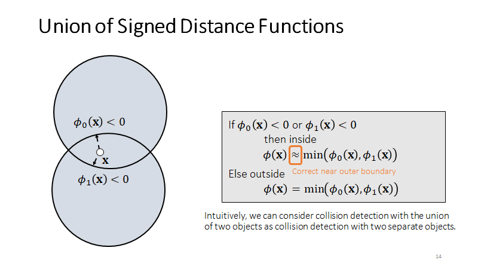
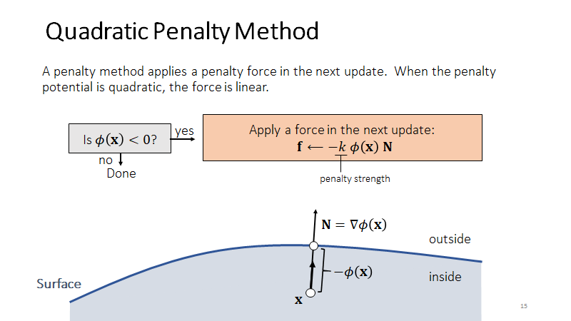
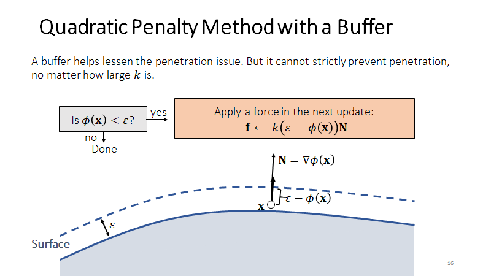
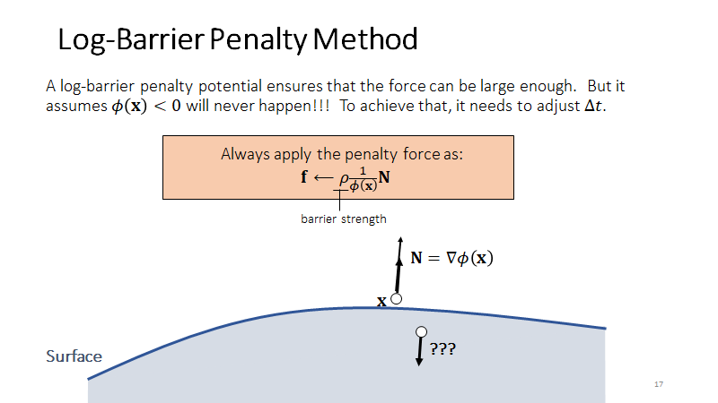
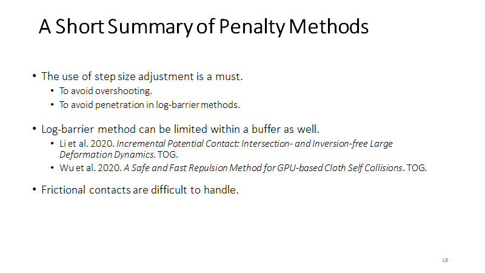
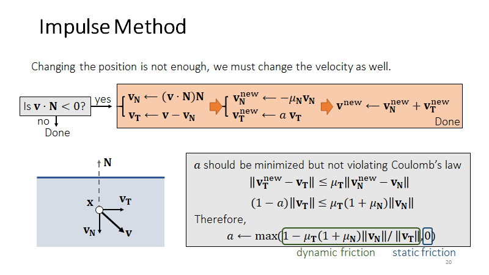

# Rigid Contacts

# **Particle Collision  Detection and Response**

## **Penalty Methods**

k 太小会穿模，k 太大会弹飞

k 也跟距离有关，利用小步长来避免穿透

## **Impulse Method**

Penalty 施加力需要下一帧才生效，Impulse 是立刻生效

好处是可以精确控制，缺点是复杂麻烦

# **Rigid Body Collision Detection and Response**

