# Rigid Contacts

# **Particle Collision  Detection and Response**

## **Penalty Methods**（惩罚）

k 太小会穿模，k 太大会弹飞

k 也跟距离有关，利用小步长来避免穿透

## **Impulse Method** (冲动)

Penalty 施加力需要下一帧才生效，Impulse 是立刻生效

好处是可以精确控制（摩擦力），缺点是复杂麻烦。

刚体用 Impulse 方法比较多，衣服用 Penalty 方法较多

# **Rigid Body Collision Detection and Response**

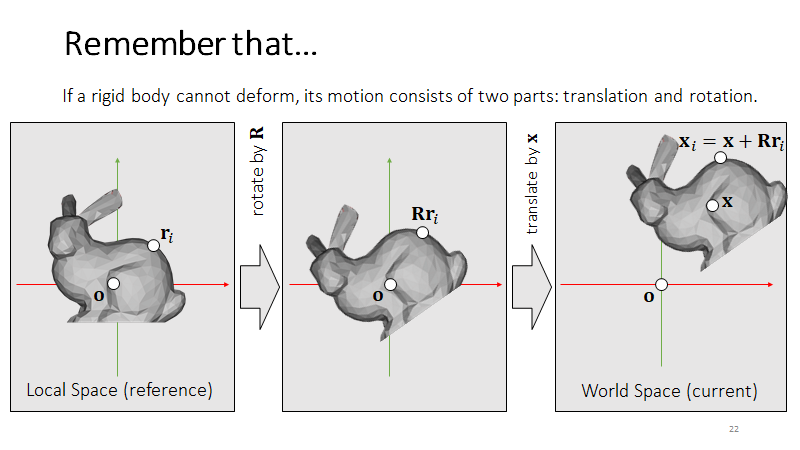

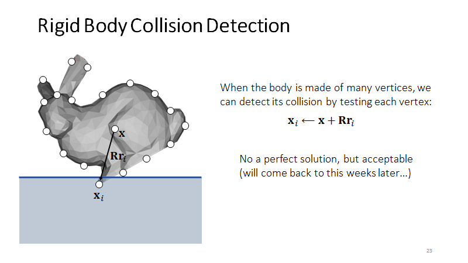

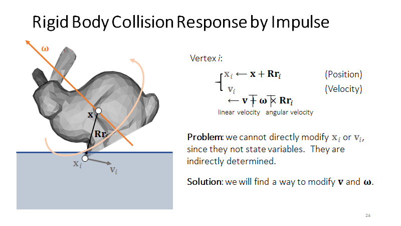

只想改速度，直接改位置比较困难。

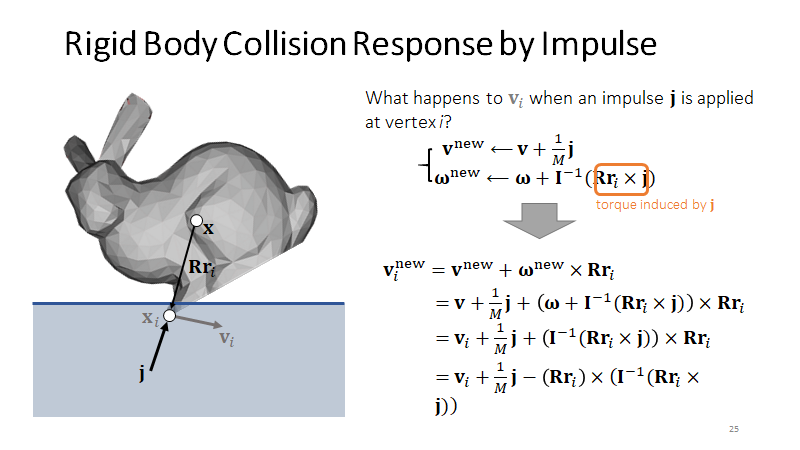

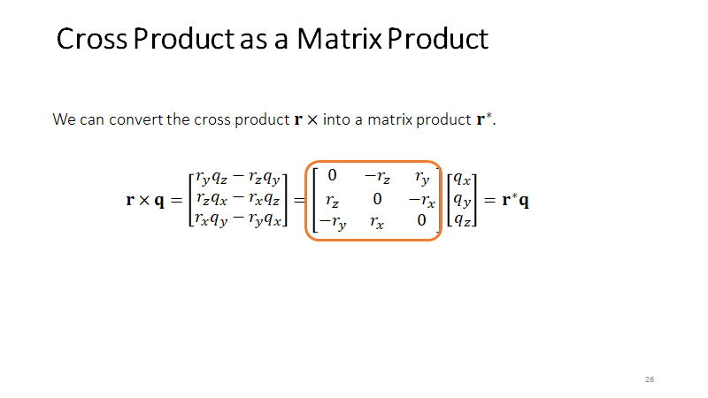

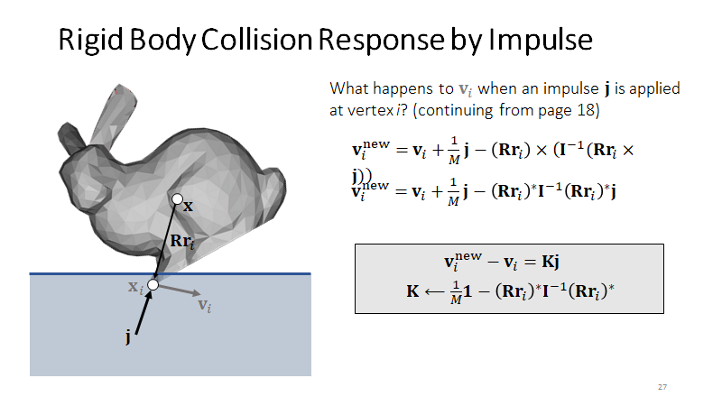

算法过程，判断单个质点是否碰撞以及速度方向。灰色表示中间变量，实际不存在，用冲量去更新。新的冲量跟 Vi_new 是线性关系，得到冲量后更新整体的 v 和 w

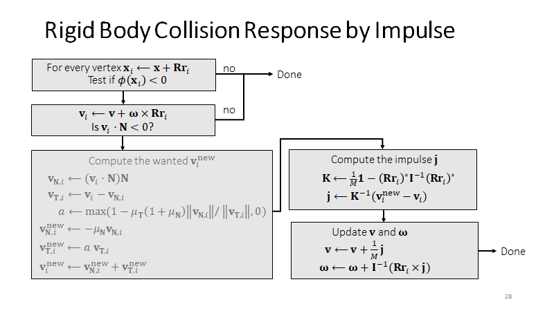

多个点取平均值，出现抖动需要特殊处理衰减，更新位置是非线性问题。

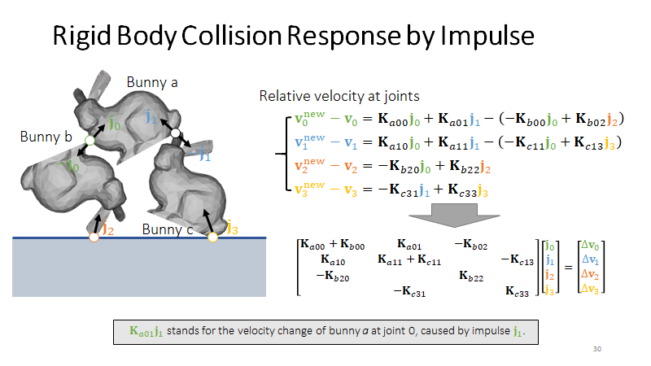

https://graphics.pixar.com/pbm2001

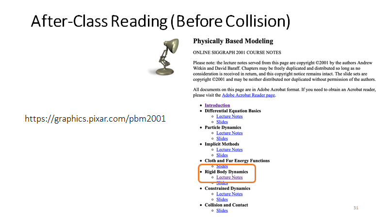

# **Shape Matching**

先让每个质点都 Impulse 自己动，最后再聚回一个刚体

 

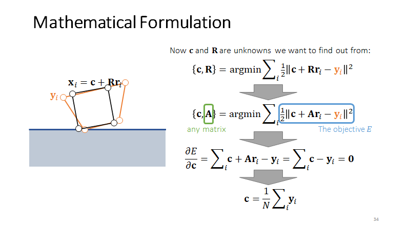

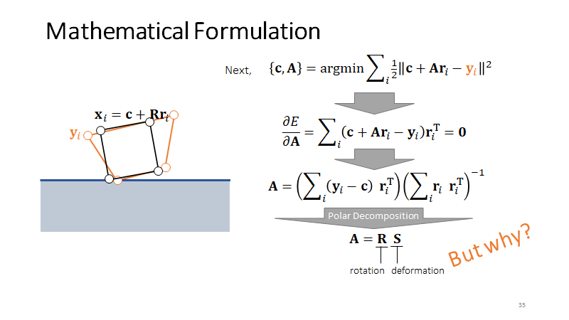

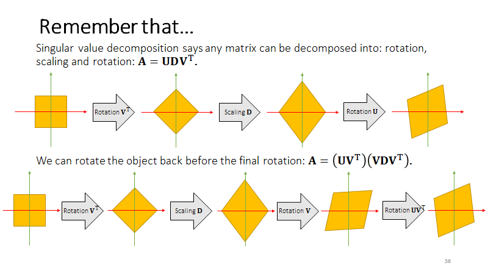

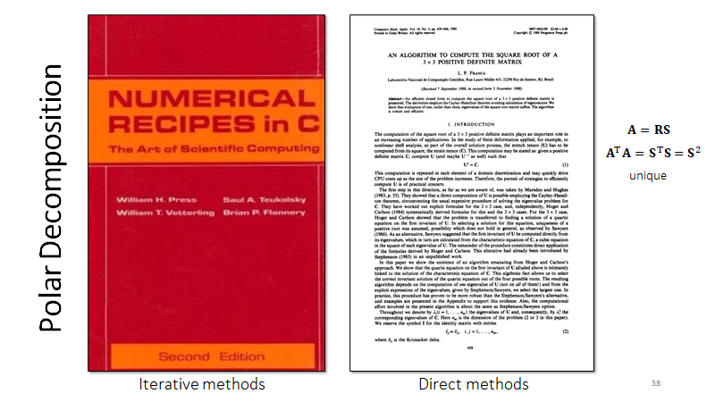

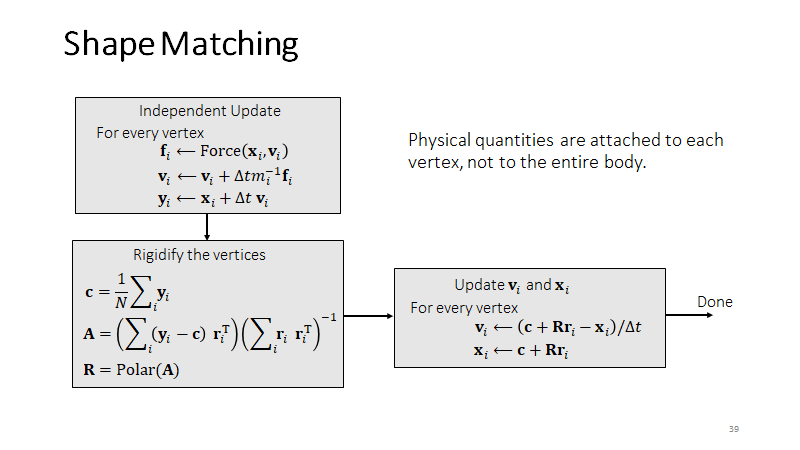

优点：没有物理运算在里面，容易模拟衣服和软体

缺点：很难保证约束，同时满足约束（可能需要迭代），适合摩擦力精确度不高的场合

