# Constraint Approaches

# **Strain Limiting  and Position Based Dynamics**

## **The Stiffness Issue**

## **A Single Spring**

质心保持不变，运动的量是由质量决定的。

## **Multiple Springs – A Gauss-Seidel Approach**

迭代的次数够多，就能达到满意的效果。跟数学的方法不一样，跟机器学习的方法类似。依赖顺序，边的顺序会影响收敛的速度。

## **Multiple Springs – A Jacobi Approach**

更容易并行

一个点的变化先不直接生效，将所有边的影响计算后取平均

收敛的速度更慢一些，迭代越多效果越好

## **Position Based Dynamics (PBD)**

先做 Shape Matching 自由变化

弹性：没有物理量，根据迭代次数决定，网格的顶点数量。

速度更新很重要

优点：

​	容易并行

​	容易实现，定义约束函数。没有隐式积分，没有力和 Hessian 的概念

​	速度比较快，1000 个顶点以下。

缺点：

​	物理不正确

​	没有物理含义，无法用高阶的方式来解释。

​	弹性受到迭代次数和网格数量的影响。没有精确解，Locking  Issue

​	分层，从低分辨率传递到高分辨率

​	

## **Strain Limiting**

PBD 的改进版

把 PBD 的约束放宽了， = 1 就是 PBD 的情况

约束三角形的面积

质心不变：满足数学上顶点运动最小的要求，物理上没有新的动量，不会乱动。

## **Strain Limiting in Simulation**

# **Projective Dynamics**

PBD 直接修改顶点位置，Projective Dynamics 使用 projection 投影方法来定义一个 quadratic 能量

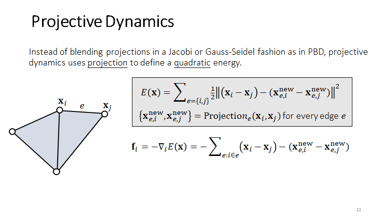

构造了中间变量，得到了跟弹簧模拟一样的结果。原因在于 Hessian，变成了常数矩阵。

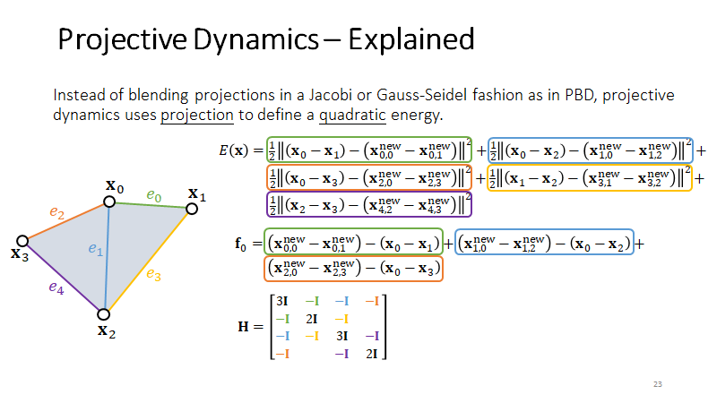

有了 Hessian 矩阵就可以计算隐式积分，分解一次后既可以简单迭代求解。

模拟结果收敛的好坏，由 Hessian 是否合适决定。

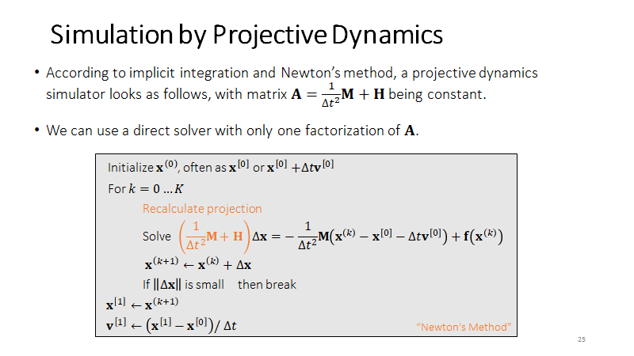

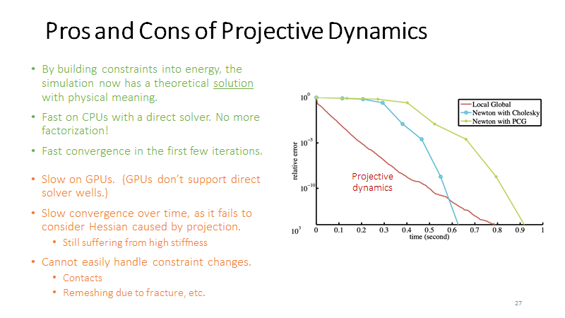

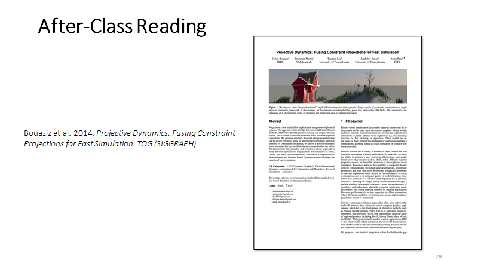

# 为什么游戏中用 PBD 比较多？不是计算量的问题，而是内存访问

这些公式的计算其实非常快，慢的原因是对内存的访问速度，GPU Buffer。PBD 的好处不是计算少或者效果好，而是对内存的访问非常少，只需要访问顶点位置和修改。而其他物理的方式会有其它变量，导致内存开销变大。

# **Constrained Dynamics** 强约束防止关节分开

Stiff 的效果需要增加迭代次数，导致计算量变大。适合模拟关节，约束力很强，否则四肢会分开来。

最大的好处是可以处理  Stiffness 无穷大

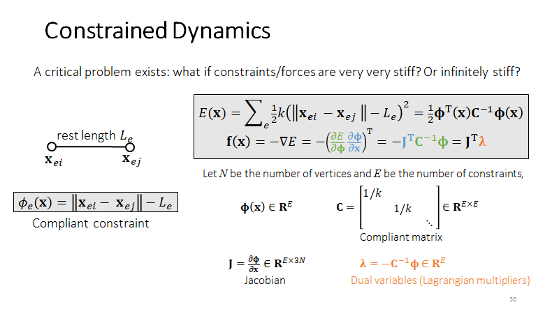

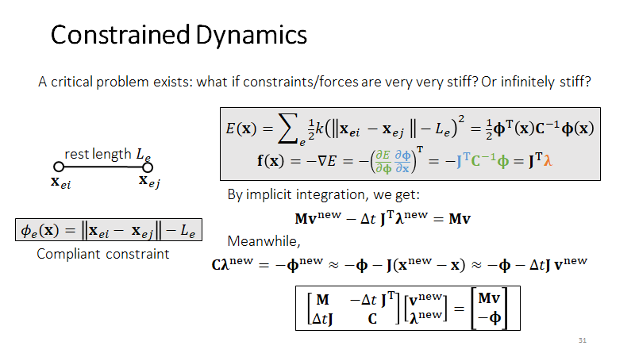

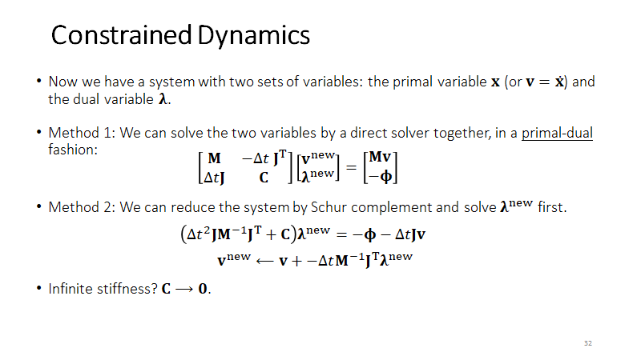

直接法：需要正定，否则很多线性方法用不了

迭代法：有时候不容易构造矩阵，不稀疏

最大的好处是可以处理  Stiffness 无穷大

## •Articulated Rigid Bodies (ragdoll animation)

# **Stable Constrained Dynamics**

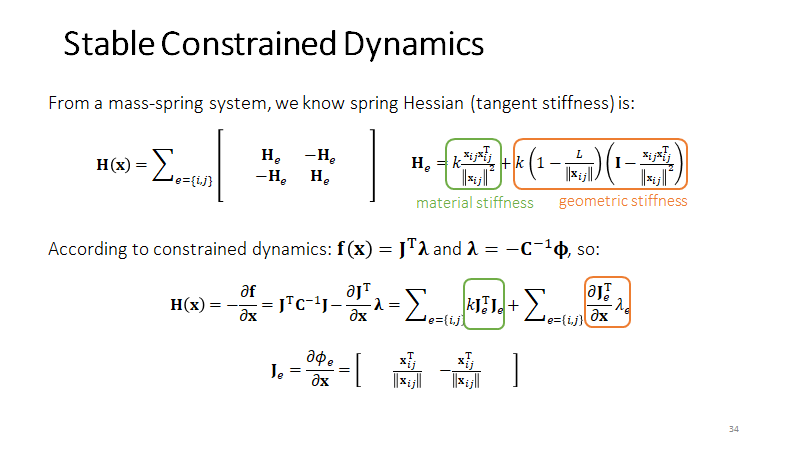

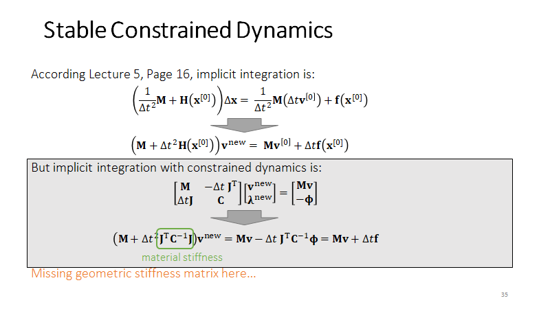

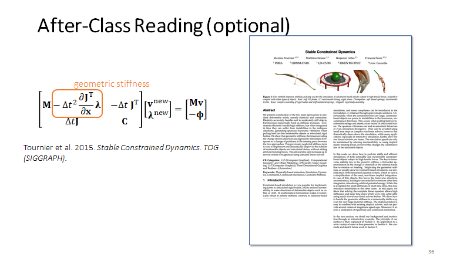

# 总结

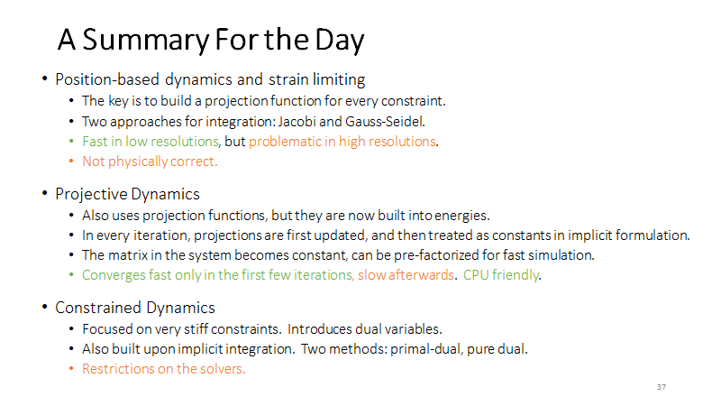