# Constraint Approaches

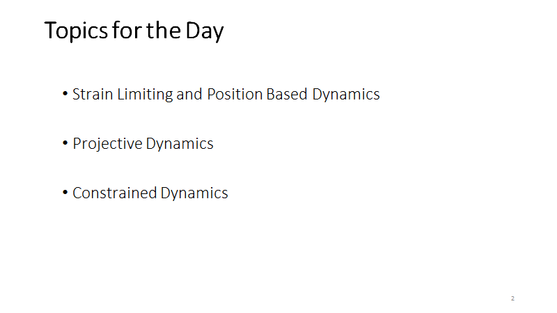

# **Strain Limiting  and Position Based Dynamics**

## **The Stiffness Issue**

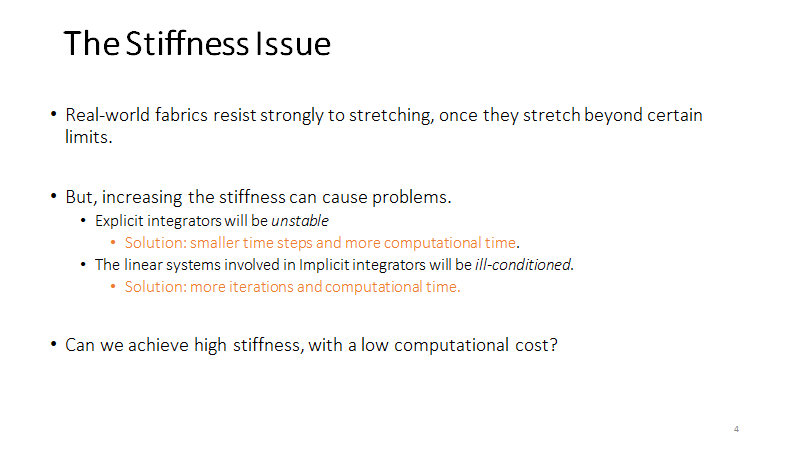

## **A Single Spring**

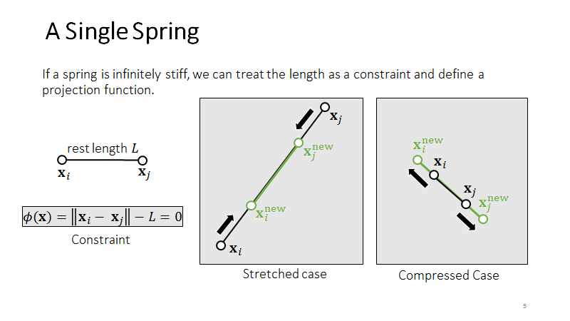

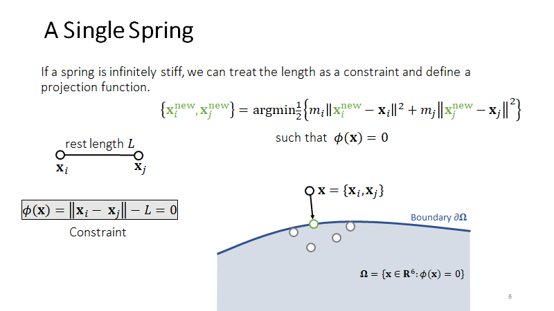

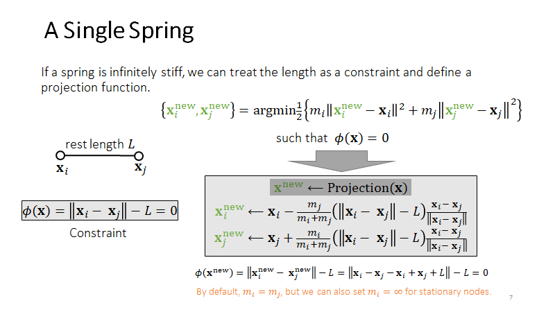

质心保持不变，运动的量是由质量决定的。

## **Multiple Springs – A Gauss-Seidel Approach**

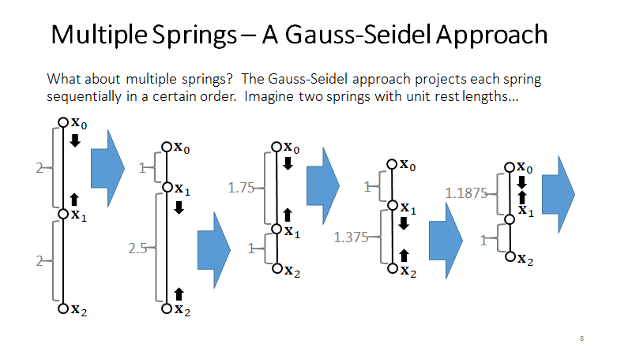

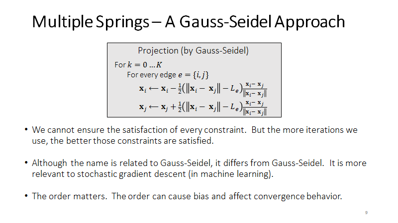

迭代的次数够多，就能达到满意的效果。跟数学的方法不一样，跟机器学习的方法类似。依赖顺序，边的顺序会影响收敛的速度。

## **Multiple Springs – A Jacobi Approach**

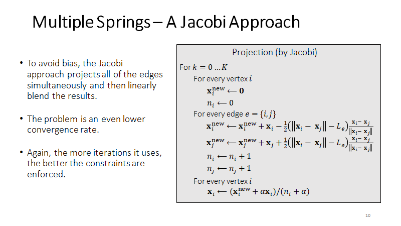

更容易并行

一个点的变化先不直接生效，将所有边的影响计算后取平均

收敛的速度更慢一些，迭代越多效果越好

## **Position Based Dynamics (PBD)**

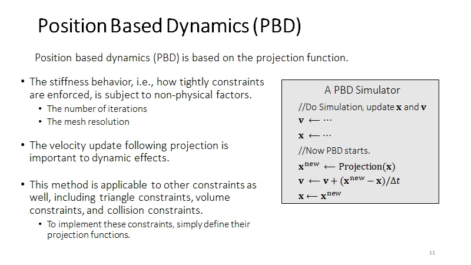

先做 Shape Matching 自由变化

弹性：没有物理量，根据迭代次数决定，网格的顶点数量。

速度更新很重要

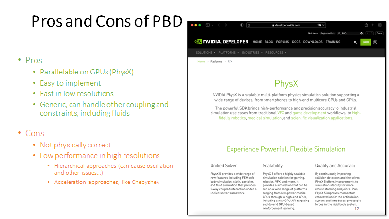

优点：

​	容易并行

​	容易实现，定义约束函数。没有隐式积分，没有力和 Hessian 的概念

​	速度比较快，1000 个顶点以下。

缺点：

​	物理不正确

​	没有物理含义，无法用高阶的方式来解释。

​	弹性受到迭代次数和网格数量的影响。没有精确解，Locking  Issue

​	分层，从低分辨率传递到高分辨率

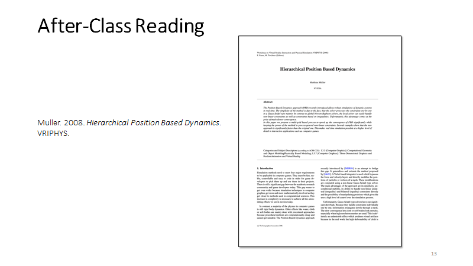

​	

## **Strain Limiting**

PBD 的改进版

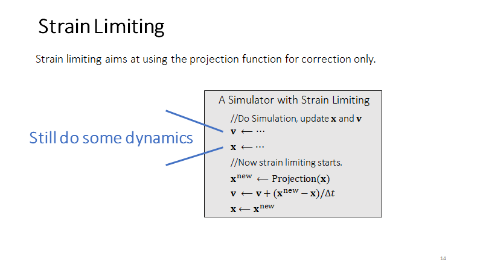

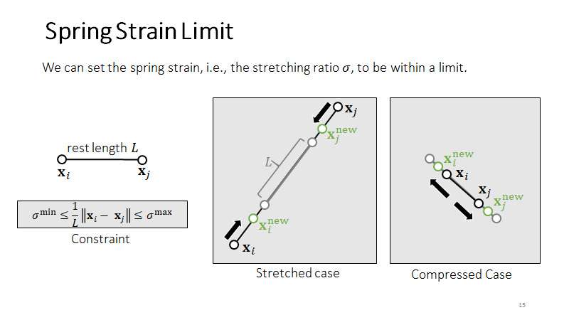

把 PBD 的约束放宽了， = 1 就是 PBD 的情况

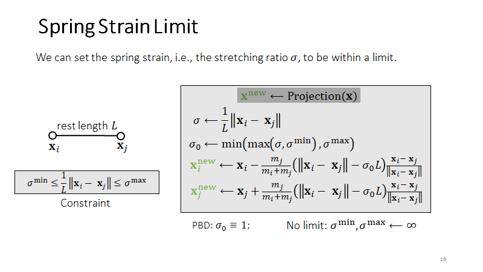

约束三角形的面积

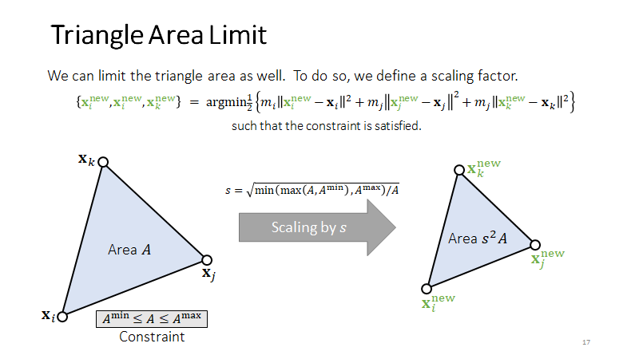

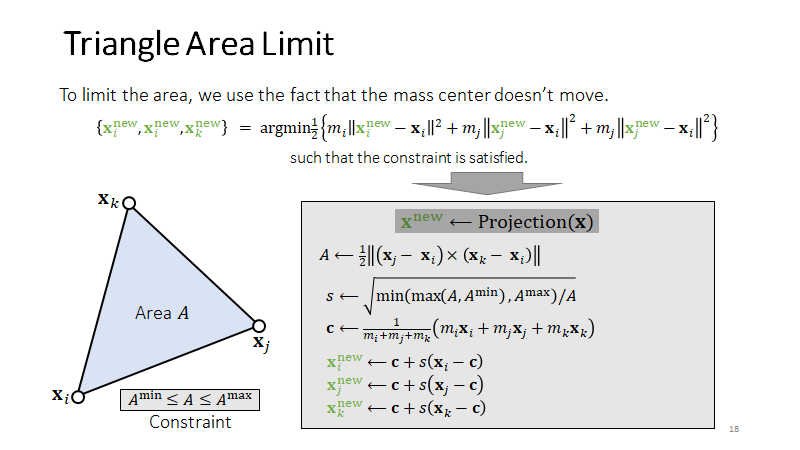

质心不变：满足数学上顶点运动最小的要求，物理上没有新的动量，不会乱动。

## **Strain Limiting in Simulation**

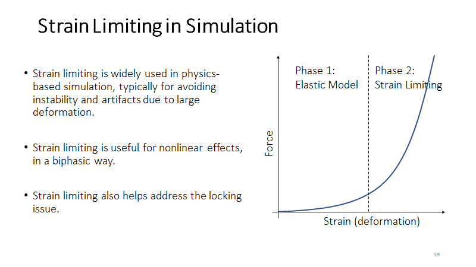

# **Projective Dynamics**