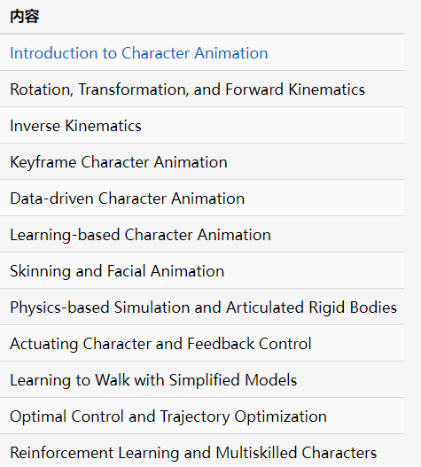

# [GAMES105 (games-105.github.io)](https://games-105.github.io/)

计算机角色动画大致可分为

​	`基于数据和关键帧` 的动画

​	`基于物理仿真与运动控制` 的动画

两大主要的研究方向。

本课程的第一部分将概括性的介绍关键帧动画的基本技术，并涵盖近年来利用深度学习和生成模型实现可交互角色动画的新方法。

课程的第二部分将着重于讲解物理角色动画的基本方法，涵盖物理仿真、运动控制基础，以及近年来基于深度强化学习的新进展。

# Ref

[1] John Lasseter. 1987. Principles of traditional animation applied to 3D computer animation. SIGGRAPH Comput. Graph. 21, 4 (July 1987), 35–44. https://doi.org/10.1145/37402.37407

[2] Sebastian Starke, Yiwei Zhao, Taku Komura, and Kazi Zaman. 2020. Local motion phases for learning multi-contact character movements. ACM Trans. Graph. 39, 4, Article 54 (August 2020), 14 pages. https://doi.org/10.1145/3386569.3392450

[3] Xue Bin Peng, Yunrong Guo, Lina Halper, Sergey Levine, and Sanja Fidler. 2022. ASE: large-scale reusable adversarial skill embeddings for physically simulated characters. ACM Trans. Graph. 41, 4, Article 94 (July 2022), 17 pages. https://doi.org/10.1145/3528223.3530110

[4] Heyuan Yao, Zhenhua Song, Baoquan Chen, and Libin Liu. 2022. ControlVAE:Model-Based Learning of Generative Controllers for Physics-Based Characters. ACM Trans. Graph. 41, 6, Article 183 (December 2022), 16 pages. https://doi.org/10.1145/3550454.3555434

