# 网络多人游戏架构与编程

* 作者简介
  * Joshua Glazer, 独立的游戏开发工作室，为 UE， LOL，EA，微软等公司提供咨询，USC 兼职讲师
  * Sanjay Madhav，南加州大学 USC 高级讲师，在 EA 开发过《荣誉勋章：血战太平洋》等游戏

# 前言

1. 互联网是如何工作的，如何将数据发送给其它计算机。
2. 如何准备用于网络传输的游戏数据，如何更新网络中的游戏对象，如何组织参与游戏的计算机。
3. 如何补偿不可靠性和网络延迟，如何将游戏代码设计得同时具有可扩展性和安全性。
4. 如何集成玩家服务，使用云服务器

# 第1章 网络游戏概述

## 问题
   1. 本地多人游戏和网络游戏最大的区别？
      * 有两台或更多的计算机在一个活动的游戏中彼此连接。
   2. 本地网络连接的 3 种不同类型？
      * 串口，电话线调制解调器，以太网
   3. 将网络游戏的运行从局域网切换到互联网主要考虑是什么？
      * 延迟，数据在网络中的传输时间。延迟补偿的方法
   4. MUD 是什么？发展为什么类型的游戏？
      * 多用户网络游戏，《龙与地下城》，运行于 BBS。发展成为图形化改进的 MMO
   5. MMO 与标准在线游戏的区别是什么？
      * 在线人数，标准的 4 ~ 32，MMO 成百上千。
   6. 在《星际围攻：部落》中，哪个系统来提供可靠性？
      *  事件管理器
   7. 描述以下，当数据包丢失时，《星际围攻：部落》网络模型中 ghost 管理器如何重建最小必要的传输。
      * 首先依据状态变换据欸的那个，其次由优先级决定。
   8. 《帝国时代》的点对点模型中，轮班计时器的目的是什么？每个节点传送什么信息到其它节点。
      * 解决等待执行命令时间过长，看起来响应十分缓慢的问题。传输一个轮班时间内的命令队列。 

## 1.1 多人游戏的简要历程

1. 本地多人游戏，和单机游戏没啥区别，《双人网球》
2. 早期网络多人游戏，大型机组成的小网络。
3. 多用户网络游戏，MUD，运行于 BBS
4. 局域网游戏，LAN，《DOOM》。串口，以太网
5. 在线游戏，《雷神之锤》《虚幻》
6. 大规模多人在线游戏，MMO
7. 移动网络游戏，可靠性低采用异步通信模型游戏，随着 wifi 普及，实时网络游戏《炉石》

## 1.2 星际部落围攻

1998年，FPS，128 个玩家，电话线拨号上网。本书游戏案例（robo Cat Action）
* 数据 4 种类型
  * 非保障数据，首先丢弃
  * 保障数据，保证准确的到达顺序
  * 最近的状态数据，最新版本的才是重要
  * 最快保障数据，最高优先级，在可靠的基础上保证尽快到达sha

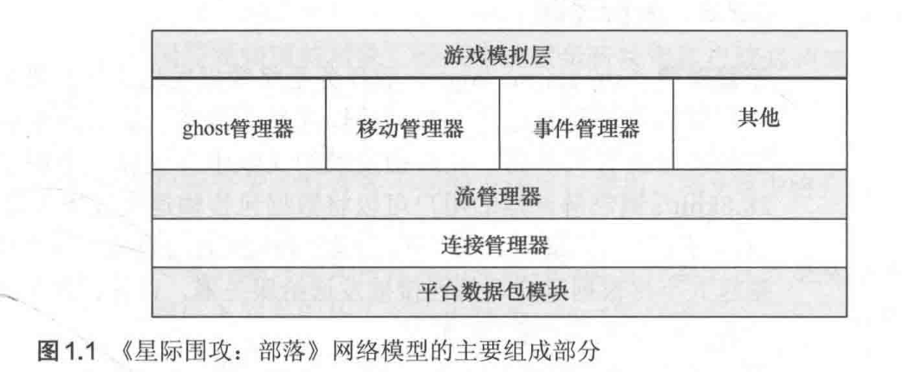

1. 平台数据包模块，最底层针对特定平台，对标准套接字的封装。**不可靠**
2. 连接管理器，从上层流管理器接收数据，给底层平台数据包模块。仅保证投递状态，使用滑动窗口种接收域的位字段实现**不可靠**
3. 流管理器，决定允许数据传输的最大速率，根据网络连接的质量有所不同。把请求按照优先次序排好，分派给连接管理器，高层通过流管理器的投递状态得到通知。
4. 事件管理器，远程过程调用 RPC，玩家发起攻击事件，事件被发送到事件管理器，接着发送到服务器，服务器确认和执行攻击。
    * **`可靠`**，事件管理器追踪所有被标记为可靠的传输记录， 如果可靠记录没有被确认，会再次将事件放入队列，重新传输一次。
5. ghost 管理器，复制与指定客户端相关的动态对象。“必须知道”，“最好知道”，优先级不同。当一个对象成为**相关对象（在范围内）**，ghost 管理器给该对象赋予一些信息，称为 ghost 记录。
   * 游戏模拟层决定客户端必须知道什么，最好知道什么。保证最最近的数据总是能成功地传输到所有的客户端。
6. 移动管理器，尽快传输玩家的移动数据。
7. 其它系统，例如数据库管理器处理静态的游戏对象的传输，炮台。

## 1.3 帝国时代

* 确定性锁步（deterministic lockstep）网络模型。P2P 对等网络，本书案例 RoboCat RTS

1. 轮班计时器
   * 问题：
     * 不同玩家帧率，网络连接质量不同。玩家 A 发出攻击执行命令，要通知每一个游戏实例，等待时间过长，看起来响应相当迟缓。
   * 解决方法《帝国时代》，轮班长度默认 200ms
     * 200ms 之内的所有命令存储在一个缓冲区内，轮班结束时，将所有命令通过网络传输给其它玩家。
     * 两个轮班之间的执行延迟，50轮发出的命令，52轮执行，延迟高达 600 ms
   * 《星际2》也在用
   * 边界情况，滞后尖峰导致所有玩家跟不上 200 ms 计时器，停止模拟，强行退出，试图基于网络情况动态调整渲染帧的方法来弥补。
   * 方便录制比赛命令，然后重播。
2. 同步
   * 伪随机数生成器，PRNG。每个游戏实例不仅使用的种子是一样的，而且使用次数也是一样的。
   * 减少了作弊的机会。

# 第2章 互联网

## 问题：

1. 列出 TCP/IP 模型的 5 层并简要描述每一层。在一些模型中，那一层被认为不是单独的一层。
 * 链路层
2. 为什么使用 ARP 协议？它是如何工作的？
 * 链路层需要一些方法来找出 IP 地址对应的 MAC 地址。
 * 要使用链路层发送数据包时，先查询 ARP 表获取目标 IP 的 MAC 地址。若表中没有，则 ARP 广播给所有主机，获取 MAC 地址。
3. 解释一下有多个网卡的主机，时如何在不同子网路之间路由数据包的。
 * 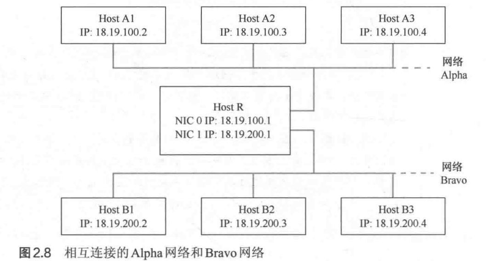
4. MTU 代表什么？什么意思？以太网的 MTU 是什么
 * 最大传输单元，一次传输中最大数据量，1500 字节
5. 介绍一下包分片是如何工作的。假设数据链路层的 MTU 是 1500.
 * 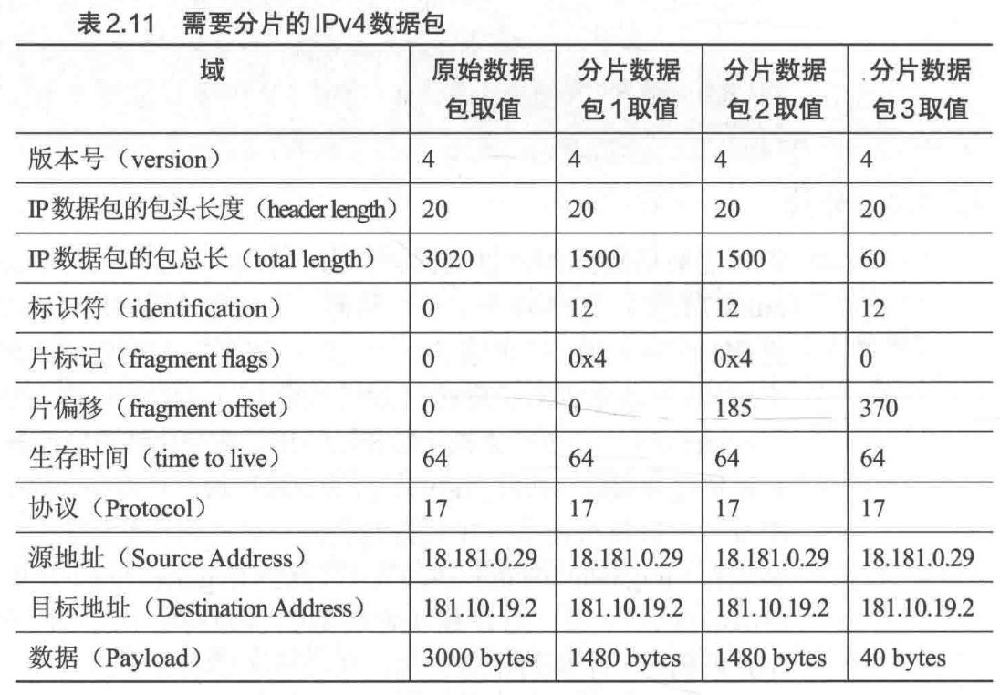
6. 避免 IP 包分片有什么好处。
 * 减少网络上发送的数据量。
 * 丢失分片数据包的概率为 0
7. 不适用分片技术，发送尽可能大的数据包的好处。
 * 提高带宽的利用率，减少头部损耗占比
8. 不可靠的数据传输和可靠的数据有什么区别？
 * 保证数据都按序抵达接收方，更大的头部数据来跟踪每台主机的重要连接状态数据，接收者确认接收到的数据，发送者重新发送没有收到确认消息的数据。
9.  描述一下建立 TCP 握手的流程。交换了什么重要的数据？
 * 序列号，Seqence Number，32bit
 * 确认号，Acknowledgement number，32bit
 * 控制位，Control bit, 9bit
 * 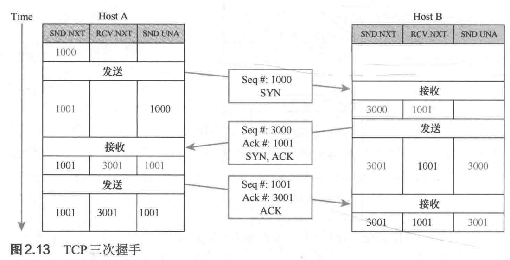
10. 描述一下 TCP 是如何做到可靠数据传输的。
 * TCP 模块必须存储发送出去的每一个字节，直到这个字节已经被接收方确认收到，才能将这个报文段从缓冲区清除。
   * 保证按序到达
     * 最简单就是直接丢弃非期望包，等待重传。
     * 第二个方法，缓存但不确认这个报文，也不转发给应用层。放到缓冲区的合适位置，等前面的报文都到达，再确认。
 * 流量控制，flow control 允许多个未被确认的报文段同时传输提高带宽，避免接收方处理太慢，导致发送方不停重传。
   * 接收窗口 window，接收方提醒发送方可以接收的数据量。
   * 延迟确认，防止多次确认浪费带宽。等 500 ms 或者等下一个数据包，减少一半的 ACK
   * 有办法保护处理速度慢的主机不被淹没，但无法阻止较慢的网络和路由器。
 * 拥塞控制，congestion control
   * 相当于高速公路入口处的红绿灯。
   * 不设置目的主机的窗口大侠，而是根据已确认和丢弃的数据报的数量计算限制本身。
11. 公开可路由的 IP 地址和本地可路由的 IP 地址的区别是什么？
 * 公开可路由 IP，互联网上任意路由器都可以发送数据
 * 本地可路由 IP，NAT 给本地网络中的每台主机分配。
12. NAT 是什么？使用 NAT 有哪些好处，有哪些开销？
 * 网络地址转换 Network address translation
 * 整个子网的主机通过共享的公开 IP 地址连接到互联网
 * 需要配置一个 NAT 网络，给每台主机发分配一个 本地可路由 IP
13. 解释一下客户端时如何使用 NAT 向公开路由的服务器发送数据包并收到响应数据包的。
 * 2.8
14. STUN 时什么？为什么需要 STUN？它是如何工作的？
 * NAT 穿越
   

## 2.1 起源：分组交换

阿帕网络，BBN Report 1822 定义了这个协议集合。演变为互联网，形成一个协议集合，TCP/IP 协议族。

## 2.2 TCP/IP 模型

* 美好又可怕，抽象得极好得独立层，可怕是因为这些抽象往往被协议作者以性能、可扩展性和一些值得做但会引发复杂性的理由破坏。
  * RFC 1122 定义了 4 层。
  * OSI 模型定义了 7 层。
  * 本书游戏开发，使用 5 层。
  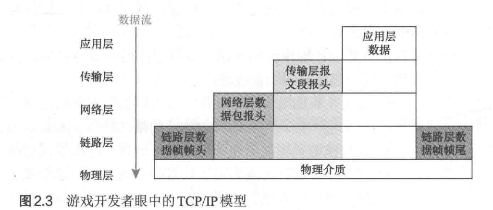

## 2.3 物理层

## 2.4 链路层

* 数据传输单元，`帧`，不可靠
* 职责：
  * ······
* 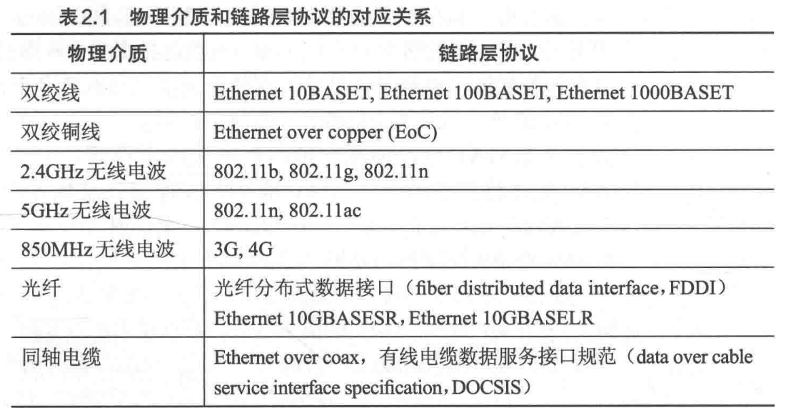
* 以太网，802.3
  * MAC 地址，48 bit 地址，网卡。IEEE 分配，现在已经引入了 64 bit，可以任意修改，已经不可靠。
  * 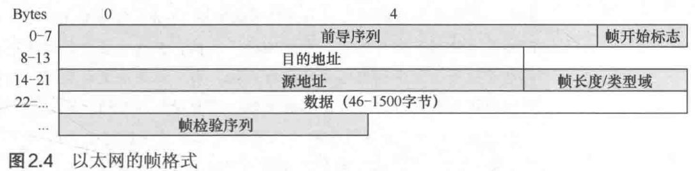

## 2.5 网络层

* 链路层不足：
  * MAC 地址限制了灵活性
  * 不支持将互联网划分成更小的局域网
  * 链路层不支持不同的链路层协议进行主机间的通信

### 2.5.1 IPv4

* IP 地址和数据包结构

   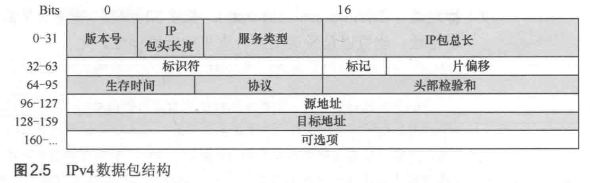

* 直连路由和地址解析协议
  * 链路层需要一些方法来找出 IP 地址对应的 MAC 地址
  * 地址解析协议 ARP，Adress resolution protocol
  * 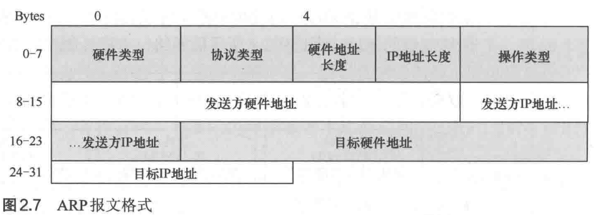
  * 安全漏洞，如果不验证 ARP 信息的真实性，不仅允许了嗅探数据包，还可能导致被窃取的数据包无法到达原来的主机。

* 子网和间接路由
  * 路由器
  * 子网掩码
  * IP 模块中的路由表
  * 默认网络 0.0.0.0/0
  * 回路地址，127.0.0.1，处理为刚收到数据包
  * 255.255.255.255，广播地址
  
* 分片
  * 以太网帧 MTU 1500 个字节，IPv4 包最大传输单元 65535 字节。
  * 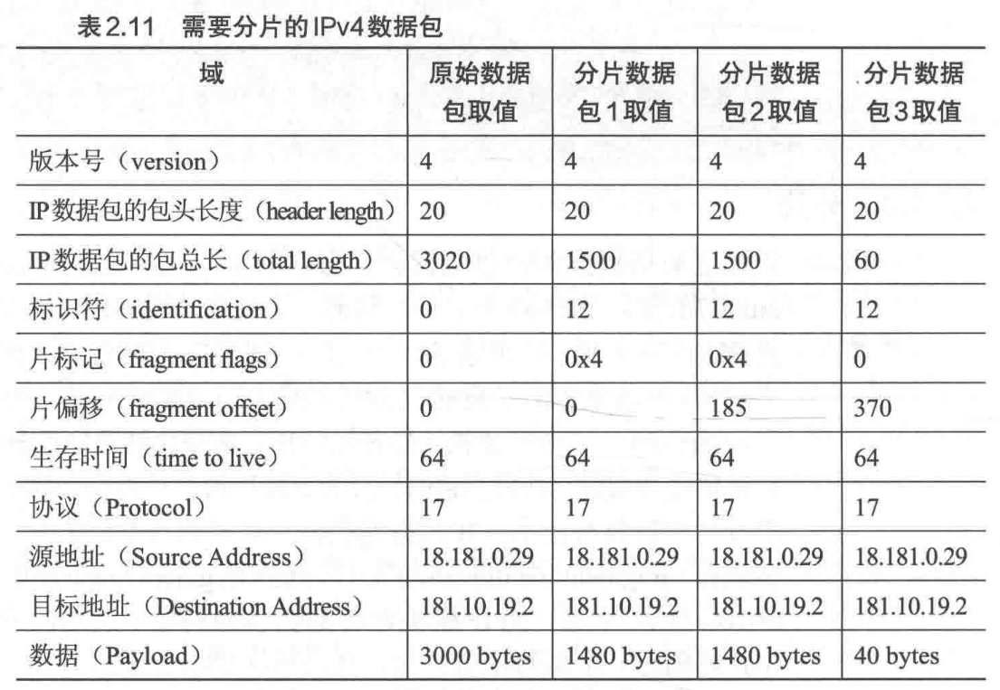
  * Tips
    * 避免分片，1500 字节包括 20 字节 IP 头、IP 数据和任何协议 VPN 或者 IPSec，最好控制在 1300 以内
    * 只发 100 字节效率太低，尽可能接近 1500字节的数据包。

### 2.5.2 IPv6

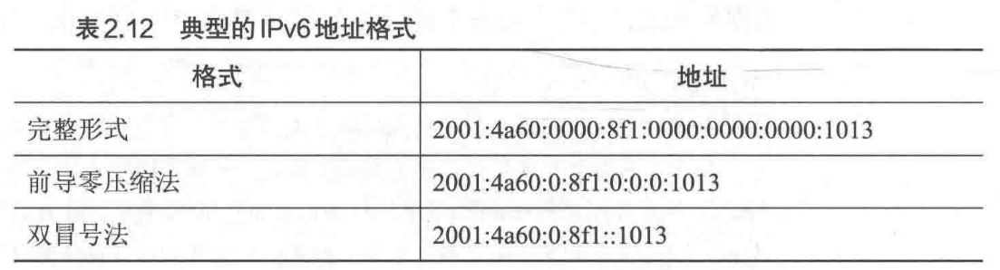

邻居发现协议 NDP，代替了地址解析协议 ARP 和动态主机配置协议 DHCP 的一些功能

## 2.6 传输层

* 解决进程间的通信，引入端口 port 的概念。
* 避免端口争夺，ICANN，IANA 负责端口号的注册
* 0 到 1023 系统端口，49152 到 65535 动态端口。游戏应该使用动态端口。
* 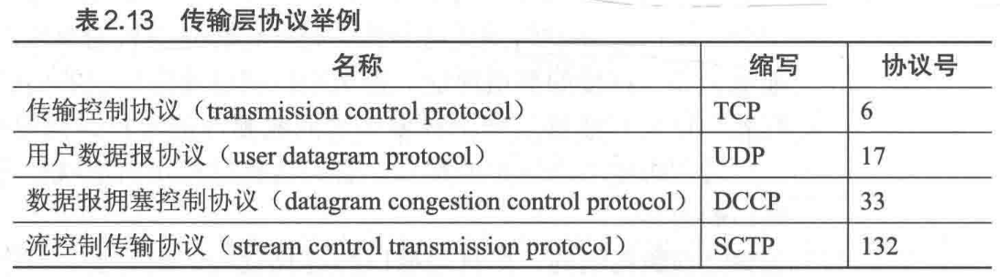

### 2.6.1 UDP

* 用户数据报协议 user datagram protocol，UDP
* 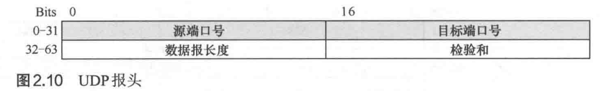
* 非常链家，不提供堵塞网络的流量限制活动，不保证数据顺序传输和准确到达。

### 2.6.2 TCP

* 传输控制协议 transmission control protocol，TCP
  * 建立持久性的连接，提供`可靠`数据流传输
  * TCP 报文段 segment
  * 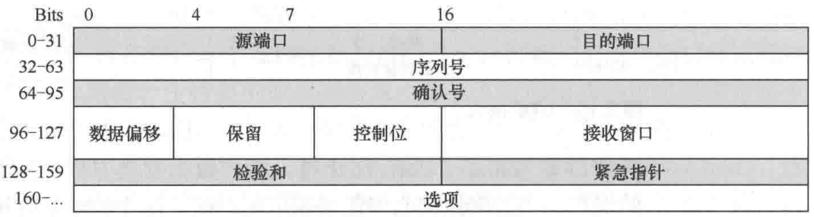

1. 可靠性
   * 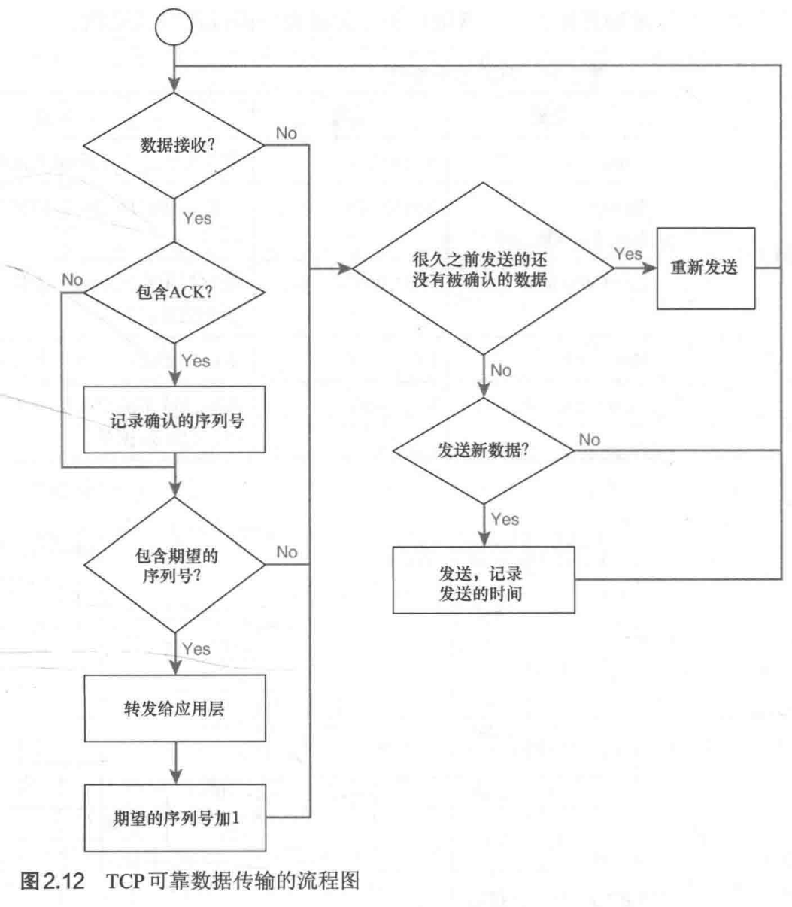

2. 三次握手
   * 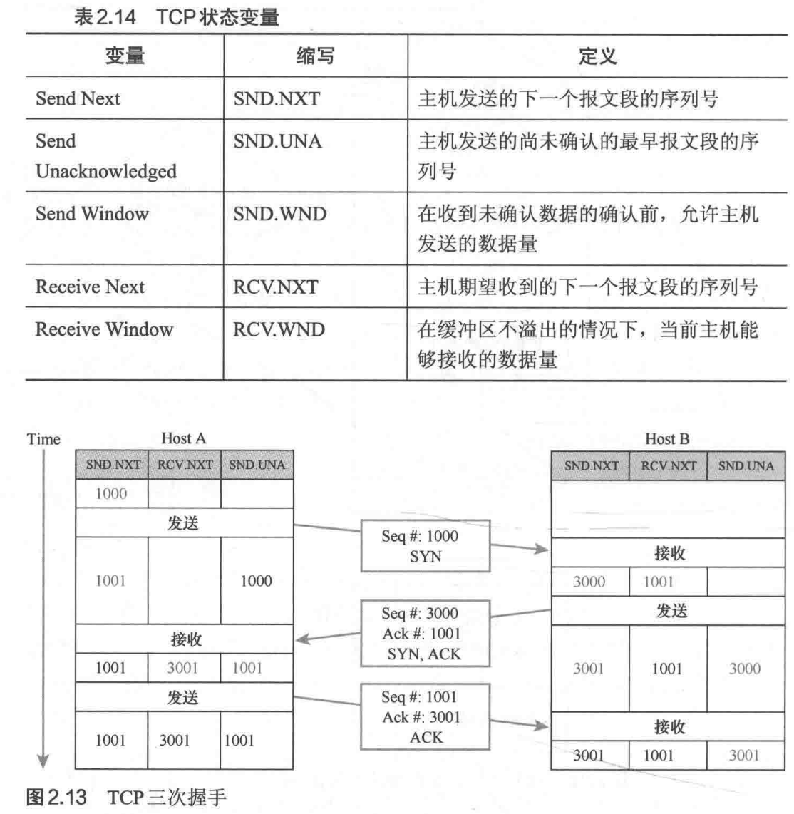
   * 通过小心地发送和确认数据来建立可靠性。

3. 数据传输
   * 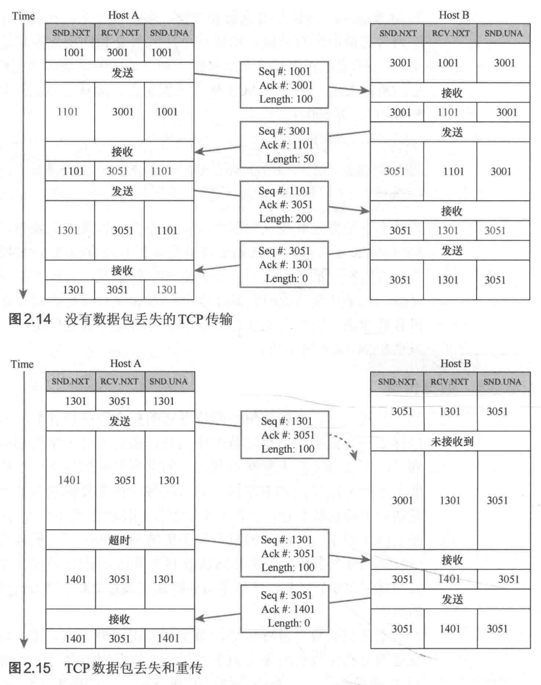
   * RTT，往返时间。
   * 允许多个未确认的报文段同时传输，提高带宽，但要限制报文数量，避免网络拥塞。
   * 流量控制。
   * 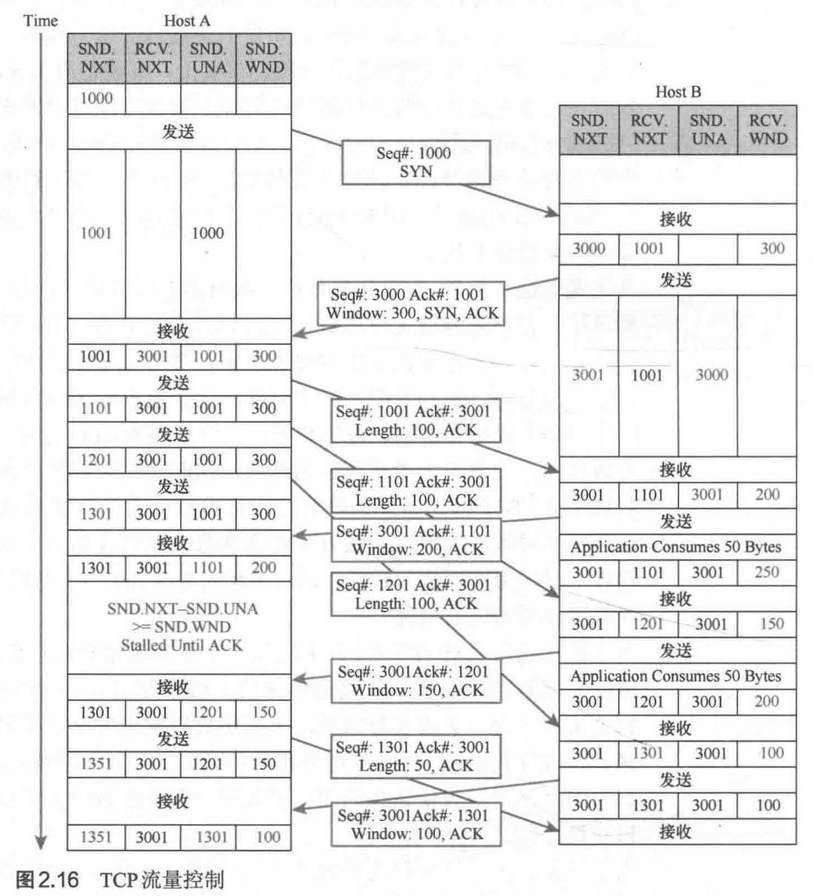
   * $$TCP数据流理论带宽限制 = 带宽限制 * {接收窗口 \over 往返时间}$$
   * 延迟确认，节约带宽减少 ACK。等待 500 ms 或者接收下一个报文段
   * 拥塞控制，AIMD（addtive increase, multiplicative decrease）系统
   * 纳格算法 Nagle's algorithm。游戏玩家克星，减少带宽使用的同时，明显增加了数据发送的延时。
     * 如果一个实时游戏需要向服务器发送少量更新，在有足够更新累加起来填充最大分段大小 MSS 之前，游戏已经运行很多帧了，明显感觉到延迟。
     * 大部分 TCP 实现提供一个选项来禁用这个拥塞控制功能。
  
4. 断开连接
   *  4 次挥手，待所有数据接收完毕确认。

## 2.7 应用层

### 2.7.1 DHCP

   * 动态主机配置协议

### 2.7.2 DNS

   * 域名系统，将域名和子域名翻译为 IP 地址
   * 名称服务器

## 2.8 NAT

* 网络地址转换
  * 整个子网的主机通过共享一个公开 IP 地址连接到互联网。
  * 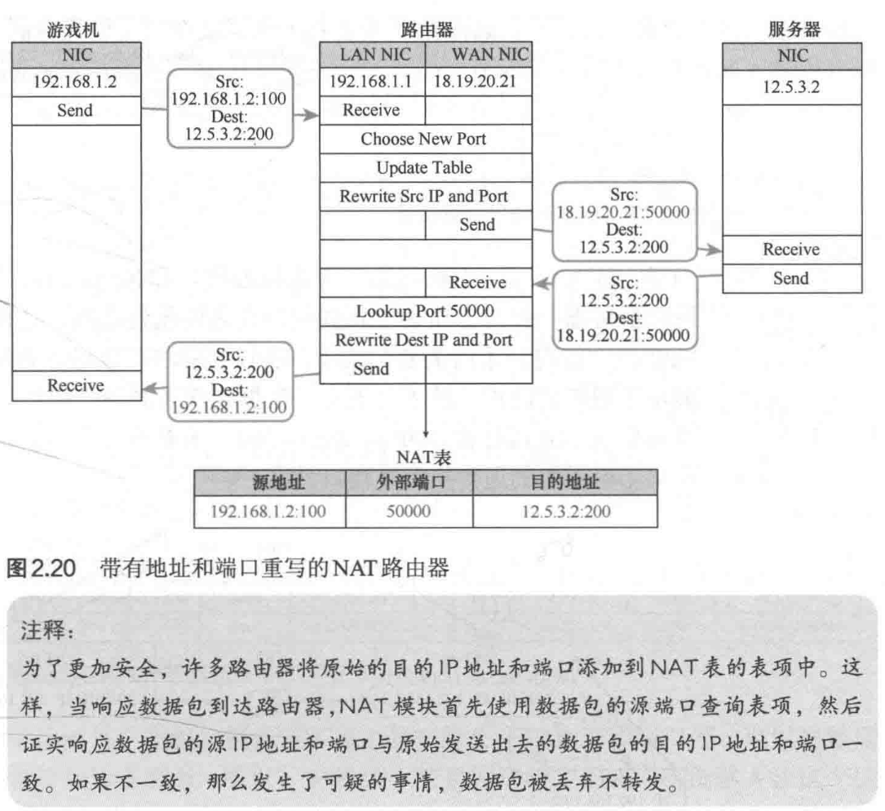
* NAT 穿越
  * 在路由器上手动配置端口转发，不适合强迫玩家完成这一操作。
  * UDP 对 NAT 的简单穿越方式，STUN
    * 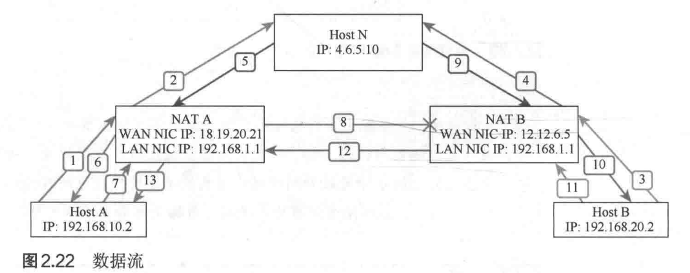
  * TCP 打洞
  * Internet gateway device protocol，IGDP
 

# 第3章 伯克利套接字
## 3.1 创建 Socket
## 3.2 API 操作系统差异
## 3.3 Socket 地址
## 3.4 UDP Socket
  * Bind，Sendto，ReceiveFrom
## 3.5 TCP Socket
  * listen，accept，connect
## 3.6 阻塞和非阻塞 I/O
## 3.7 其它 Socket 选项

# 第4章 对象序列化
## 4.1 序列化的需求

* 在主机间传输类，处理内存布局。
  * 虚方法
  * 字符串的压缩
  * STL 容器不能直接按二进制序列化

## 4.2 流

* 一种数据结构，封装了一组有序的数据元素，允许用户对其进行数据读写。
  * 输出流，输入流
  * 文件流输出流
    * 其它数据结构或者计算机资源
    * 可以封装一个问价，提供顺序存储不同类型的数据到磁盘的方法
  * 网络流
    * 封装一个 socket，提供 send() 和 recv() 封装，专门用于与用户相关的特定数据类型。
* 内存流
  * 封装内存的缓冲区，通常是动态在堆上的缓冲区
  * 非基本类型需要特殊的序列化
  * 缓冲区自动扩展为当前容量的 2 倍，（实际实现一半为 1.5 倍，便于内存碎片复用）
  * 使用智能指针管理动态内存
* 流解决了序列化第一个问题
  * 提供建安方法来创建缓冲区
  * 使用源对象的各个字段的值来填充缓冲区
  * 给远程主机发送这个缓冲区
  * 顺序提取数据
  * 将它们插入到目标对象的合适字段，没有干扰到目标对象任何不应该改变的字段，例如虚函数指针。
* 字节存储次序的兼容性
  * 小端字节序，大端字节序
  * 字节交换函数，不同数据类型，模板函数
* 比特流 
  * 为了省内存，诸 bit 写入
## 4.3 引用数据

* 流可以解决各种各样的基本数据和 POD 数据，但指针或容器引用的间接数据会导致崩溃。
* 内联 inlining 或嵌入 embedding
  * 一个自定义的序列化函数，只写 vector 所包含的数据，不是序列化 vector 本身。
  * read 和 write 可以支持容器或者指针的引用，只要数据完全被序列化的父对象所拥有。
* 链接
  * 给多处引用的对象一个唯一标识符，通过序列化标识符实现对这些对象引用的序列化。
  * 当网络另一端反序列化这些对象时，修复例程可以使用该标志符查找引用对象，并将其插入到相应的成员变量。
  * 链接系统和使用它的系统必须容忍没有映射的 ID，因为数据包可能丢失，引用了尚未发送的对象。
  * 更复杂的系统可以跟踪空链接的成员变量，简单忽略或者反序列化并链接任何可用引用。
## 4.4 压缩

* 稀疏数组压缩
  * 计算长度，并写入，根据长度来读取
* 熵编码 entropy encoding
  * 信息论的一个主题，利用数据的不确定性进行数据压缩。
  * 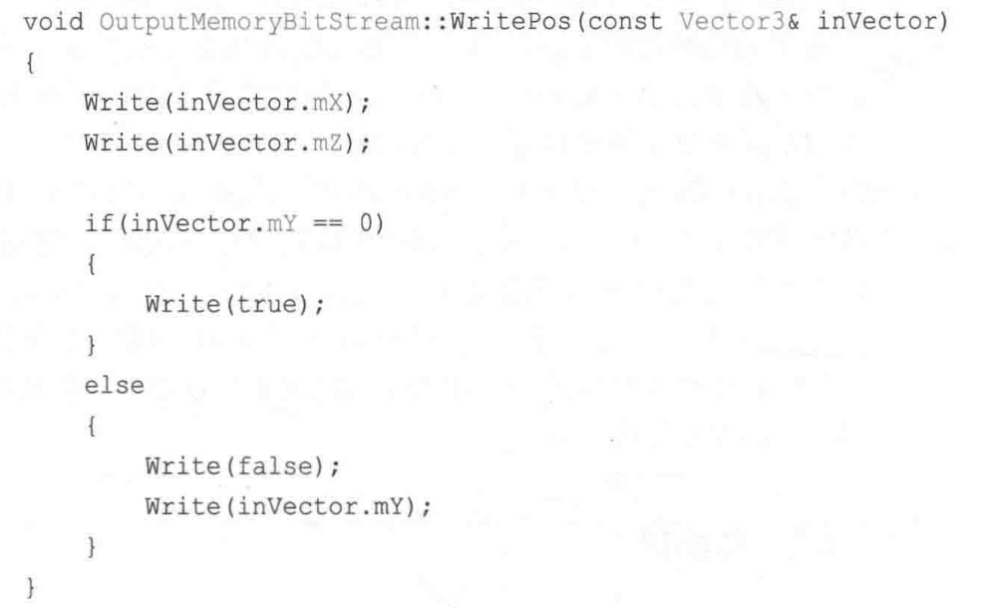
  * 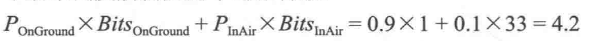
  * 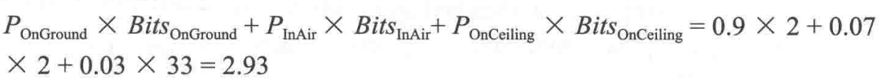
  * 霍夫曼编码，算术编码，gamma 编码，行程编码。
  * 考虑 CPU 性能的分配
* 定点 fixed point
  * 
  * 序列化转换为定点数，然后仅用 16 位来发送。
  * 浮点数和整数的转换计算可能非常昂贵，与所节省的带宽相权衡。
  * 利用游戏特定的信息来使用尽可能少的 bit 进行数据序列化，再次信息论。
* 几何压缩
  * 信息论，只要数据又约束，就可以使用
  * 四元数 quaternion 和变换矩阵，用 4 个浮点数表示三维空间的旋转。
  * 归一化后，所有分量的平方和为 1 。只需要序列化前三个，并使用 1 比特表示最后一个分量的符号。
  * 再结合定点数，意味着在内存中需要 128 位的四元数，用 49 位就可以精确地序列化。
## 4.5 可维护性

* 仅仅考虑带宽效率可能会导致丑陋的代码，需要一些权衡考虑换取代码的可维护性
* 抽象序列化方向
  * Read 和 write 耦合令人头痛，继承和虚函数 Serialize，模板函数提高性能
* 数据驱动的序列化
  * 运行时对象成员取值的数据，C# 和 Java 的反射系统，允许运行时方位类结构
  * C++ 在运行时反射类成员需要自定义一个构建的系统，基本的反射系统并不复杂。清单 4.8
  * 以性能换取可维护性

# 第5章 对象复制

主机之间状态传输的第一步，本章研究一个通用的复制框架，支持远程进程之间游戏时间的对象状态的同步。
* 5.1 世界状态 world state
* 5.2 复制对象
  * 主机之间传输对象状态的行为称为复制 replication
    * 标志数据包位包含对象状态的数据包
    * 唯一标识复制对象
    * 指明被复制对象的类型
  * 为远程主机创建对象需要类标识符
    * 使用 dynamic_cast 通常需要 C++ 的内置 RTTI 是启动状态，游戏中往往是禁止的，因为对于每一个多态类型它都需要额外的存储空间。
    * RTTI 导致游戏对象系统和复制系统相互依赖，耦合没添加一个新的可复制类都需要同时改代码
    * 使用对象创建注册表
  * 对象创建注册表 Object creation registry
    * 将一个类标识符映射到一个函数，并执行它来创建想要的对象。
    * 每个类赋予一个唯一标识符，存储在 KClassID 的静态常数中，每个类使用 GUID 来保证标识符之间不重复。
      * 128 位标识符在类不多的时候没有必要
      * 更好的选择基于类名字的四字符文本
      * 复杂的宏处理通常不推荐，但是可以减少来回复制和粘贴代码所造成错误的机会，修改宏就可以传播到所有类。
    * 在类识别系统合适的位置创建 ObjectCreationRegistry 来报错类标识符到创建函数的映射
      * 从技术上来说并不一定要是单例
      * 仅仅需要保证游戏代码和网络代码能够访问它
    * 这个系统代表了 C++ RTTI 的一个定制版本，在内存使用、类标识符大小和交叉编译器兼容性方面比只使用 C++ 的 typeid 有更多的控制权。
  * 一个数据包包含多个对象
    * 发送与 MTU 尽可能接近的数据包，提高效率
      * 写对象的网络标识符
      * 写对象的类标识符
      * 写对象的序列化数据
* 5.3 朴素的世界状态复制方法
  * 足够小的游戏世界，《雷神之锤》Quake，一个数据包装下
* 5.4 世界状态的变化
  * 世界状态增量 world state delta
    * 创建游戏对象
    * 更新游戏对象
    * 销毁游戏对象
  * 局部对象状态的复制
    * 使用位域来表示序列化属性，标志位
* 5.5RPC 作为序列化对象 remote procedure call，RPC
  * XML-RPC
  * ONC-RPC
  * 为 RPC 创建一个模块化的封装器，和复制系统集成。
* 5.6 自定义解决方案
  * 框架没法满足
  * 快速变化的值，对象复制太笨重浪费过多带宽。

# 第6章 网络拓扑和游戏案例

# 第7章 延迟、抖动和可靠性

# 第8章 改进得延迟处理

# 第9章 可扩展性

# 第10章 安全性

# 第11章 真实世界得引擎

# 第12章 玩家服务

# 第13章 云托管专用服务器